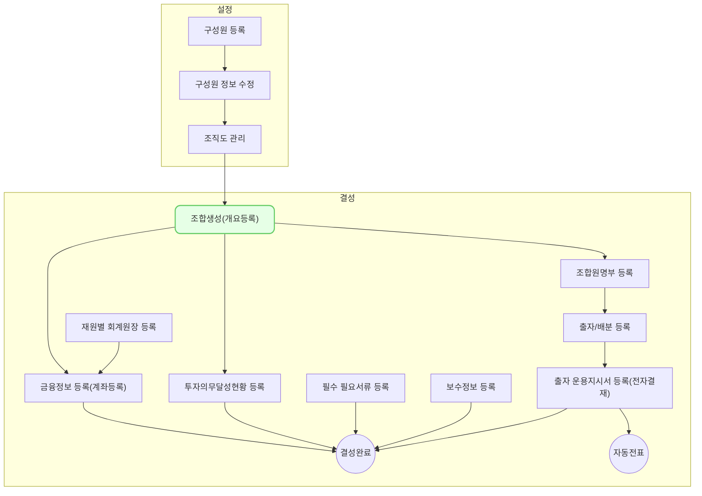

`조합-조합 정보`에서 VCworks를 사용하기위한 조합(펀드)정보를 등록할 수 있습니다.

## 동영상



## 설명

- 조합정보의 우측상단의 신규등록 버튼을 눌러 조합을 생성할 수 있습니다.
- 간단히 조합명과 조합 유형을 선택하면 등록이 완료됩니다.
- 현재 상태는 조합의 결성된 단계가 아니라 조합을 시스템에 등록한 단계입니다.
	- `결성 전` 이라는 표시로서 구별 됩니다.
- 등록 이후에 그리드에서 생성된 항목을 클릭하여 `조합 신규 등록` 에 접근할 수 있게 됩니다.
- 신규 조합 등록시 다음과 같은 5개 항목의 기입이 필요합니다.
	- 조합 정보 개요
	- 투자 의무 달성 현황
	- 조합원 명부
	- 보수 관리 정보
	- 필요 서류
- 여기서는 `조합 정보 개요` 만을 설명합니다.
	- (각 개별 항목에 대한 중요한 점 설)
	
## 자주 묻는 질문

> 필수값을 입력하지 않아도 저장이 되는데 왜 그런거죠?
{: .prompt-tip }

- 필수값은 조합을 `결성` 하기 위해 필요한 값입니다. 
- 각 탭마다 저장은 조합을 결성하기 보다는 현재 정보로 업데이트 하는 단계라고 보시면 되겠습니다.
- 실제로 우측 상단의 `결성 완료`를 누르면 필수 값에 대해 확인을 요청하게 됩니다.

## 선후행 구조도

