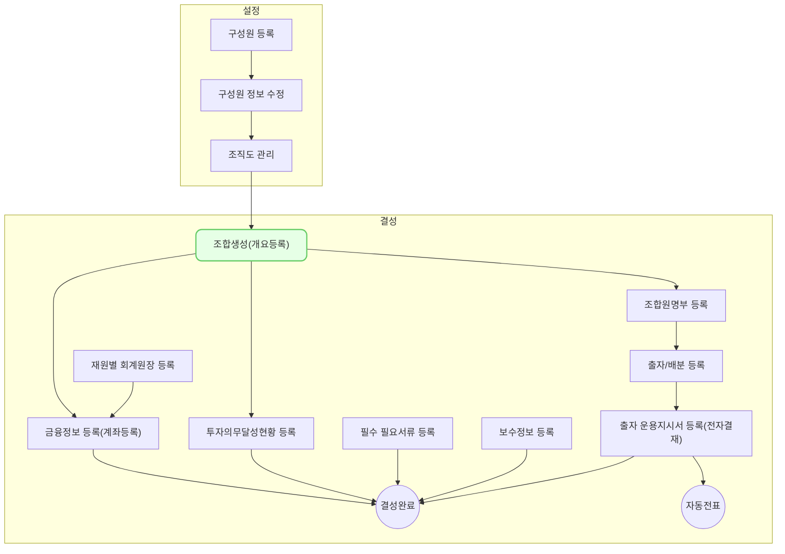

신규조합 추가에서는 신규 조합을 등록하고 조합 기본 정보를 입력하는 방법을 설명합니다.

## 동영상



## 설명

### 조합 신규 등록
신규 조합을 등록하는 방법은 다음과 같습니다.
1. VC Works 에서 **조합 > 조합 정보** 메뉴를 차례대로 클릭해주세요.
2. **[신규 등록]** 버튼을 클릭해주세요.
	- 조합 정보 등록 창이 우측에 출력됩니다.
3. 조합명을 입력하고 조합 유형을 선택해주세요.
4. **[저장]** 버튼을 클릭해주세요.
	- `결성 전` 상태의 신규 조합이 목록에 생성됩니다.
### 조합 기본 정보 입력
신규 조합의 기본 정보를 입력하는 방법은 다음과 같습니다.
1. **조합 정보** 목록에서 앞서 신규 등록한 조합명을 찾아 클릭해주세요.
2. **조합정보** 영역에서 조합 결성에 필요한 기본 정보를 입력하거나 선택해주세요.
	- 조합 규약에 기재된 항목들을 확인 후 입력해주세요.
3. 운용 인력 영역에서 조합 운용 인력을 입력해주세요.
	- 구성원이 등록되지 않은 경우 해당 구성원을 등록 후 운용인력을 선택할 수 있습니다. 
4.  회계감사인 영역에서 회계감사인 정보를 입력해주세요.
	- 회계감사인 거래처가 등록되지 않은 경우 해당 거래처를 등록 후 회계감사인을 선택할 수 있습니다.
5. [저장]을 클릭해주세요.
	- **조합 정보 개요** 탭에서 입력한 내용이 저장됩니다.
## 자주 묻는 질문

> 조합 정보 개요 탭의 필수값 기준이 궁금합니다.
{: .prompt-tip }
- `*`표시된 항목(필수값)은 VC WORKS 내 조합 **[결성 완료]** 버튼을 클릭할 때의 필수 입력 여부를 확인할 때 적용되는 기준입니다.
- `결성 전` 단계에서 각 탭 별로 항목 입력 후 저장 시 필수값을 모두 채울 필요는 없습니다. - 

> 조합 대표 계좌를 등록할 수 없습니다.
{: .prompt-tip }
- 재원별 회계원장을 먼저 등록한 후 조합 금융정보를 등록할 수 있습니다. 재원별 회계원장을 등록하는 방법은 [재원별 회계원장 등록](/posts/fm0010/) 가이드를 참조해주세요.
- 조합 대표 계좌를 등록하는 방법은 [금융정보 등록 - 계좌등록](/posts/fd0009a/) 가이드를 참조해주세요.

> 등록하고자 하는 운용 인력이 목록에 없습니다.
{: .prompt-tip }
- 신규 구성원을 등록한 후 조합의 운용인력을 등록해주세요.
- 구성원을 등록하는 방법은 [구성원 등록](/posts/hr0001/) 가이드를 참조해주세요.

> 등록하고자 하는 회계감사인이 목록에 없습니다.
{: .prompt-tip }
- 신규를 거래처 등록한 후 조합의 회계감사인을 등록해주세요.
- 신규 거래처를 등록하는 방법은 [거래처 관리](posts/se0100) 가이드를 참조해주세요.

## 선후행 구조도

