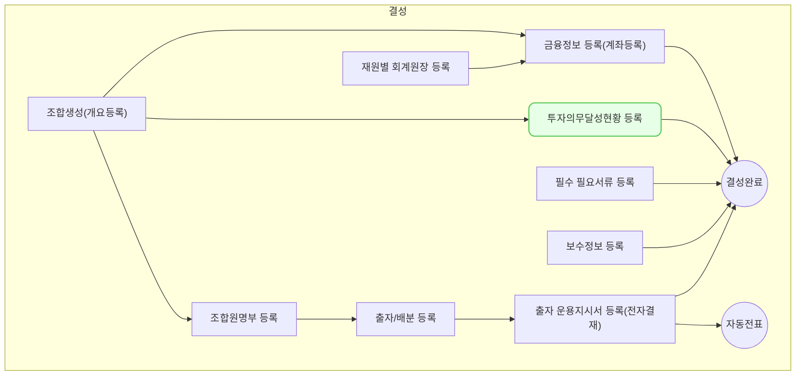

 투자 의무 비율 등록은 개별 조합의 규약 및 벤처투자촉진법에서 규정하고 있는 투자 의무를 VC Works에 등록하는 방법을 설명합니다.
## 동영상



## 설명

### 투자 의무 비율 설정
투자 의무 비율을 등록하는 방법은 다음과 같습니다.
1. VC Works에서 **조합 > 조합 정보** 메뉴를 차례대로 클릭해주세요.
2. 투자 의무 비율 설정을 원하는 조합을 클릭해주세요.
3. **[투자 의무]** 탭을 클릭해주세요.
4. 투자 의무 탭 내 **[투자 의무 설정]** 하위 탭을 클릭해주세요.
5. 우측 [+투자 의무 추가] 버튼을 클릭해주세요.
	- **투자 의무 등록** 창이 우측에 출력됩니다.
6. 투자 의무를 선택해주세요.
	- 조합 규약 또는 벤처투자촉진법에서 규정하고 있는 투자 의무 또는 제한 항목들을 입력해주세요.
	- 투자 의무 순서는 기존 등록 유형에 따라 자동으로 설정됩니다. (수정 가능)
7. 투자 의무명을 입력해주세요.
8. 규약 원문을 입력해주세요.
9. (선택) 해당 조합원을 선택해주세요.
	- 특정 조합원(LP)의 투자 의무인 경우에 해당합니다.
	- 조합원을 선택하려면 조합원 명부에 조합원이 등록되어 있어야 합니다.
10. 투자 의무 조건의 **[+ 조건 추가]** 를 클릭해주세요.
11. 의무 시작일과 종료일을 입력해주세요.
12. 의무 기준과 금액 또는 비율을 입력해주세요.
13. (선택) 규약 내 같은 조항 내 의무 기간 및 의무 금액/비율이 2개 이상인 경우 **[+ 조건 추가]** 를 클릭해 추가 조건을 입력해주세요.
	- 같은 투자 의무이나 여러 조건(조건 1, 조건 2, ...)으로 저장됩니다.
14. [저장] 버튼을 클릭해주세요.
	- 입력한 투자 의무 내용이 저장됩니다.

### 투자 의무 조회
투자 의무 비율을 조회하는 방법은 다음과 같습니다.
1. VC Works에서 **조합 > 조합 정보** 메뉴를 차례대로 클릭해주세요.
2. 투자 의무 비율 설정을 원하는 조합을 클릭해주세요.
3. **[투자 의무]** 탭을 클릭해주세요.
	- 투자 건별 투자 의무 달성 현황 조회 하고자 하는 경우
		- 투자 의무 탭 내 **[투자건별 의무 조회]** 하위 탭을 클릭해주세요.
		- 투자 건별 투자 의무 달성 현황을 조회할 수 있습니다.
	- 특정 투자 의무별 투자 의무 달성 현황을 조회하고자 하는 경우
		- 투자 의무 탭 내 **[투자 의무 설정]** 하위 탭을 클릭해주세요.
		- 투자 의무별 달성률을 조회할 수 있습니다.

## 자주 묻는 질문

> VC Works에 설정된 투자 의무 유형이 궁금합니다.
{: .prompt-tip }
- VC Works에서 설정할 수 있는 투자 의무 조건은 다음과 같습니다.
	- **의무투자**: 벤처투자 촉진에 관한 법률(벤처투자법) 제51조제1항에서 정하는 벤처투자조합의 의무투자를 의미합니다. (현행 출자금액의 40%)
	- **주목적투자**: 조합의 특정 출자자의 출자 목적에 따라 일정 비율 또는 금액을 특정 분야에 의무적으로 투자해야 하는 투자 의무로써 조합 규약 내 명시되어 있습니다.
	- **특수목적투자**: 주목적투자 외 조합 규약 내 별도의 특약 사항으로 명시된 투자 의무로써, 일정 비율 또는 금액을 특약에서 명시한 분야에 의무적으로 투자해야 하는 투자 의무입니다.
	- **구주투자제한**: 비상장 중소기업 및 증권시장에 상장된 법인의 기 발행 주식 등에 대한 투자 한도를 지정하는 의무로써 조합 규약 내 명시되어 있습니다.
	- **해외투자제한**: 조합의 해외 투자 시의 투자 한도를 지정하는 의무로써 조합 규약 내 명시되어 있습니다.
	- **상장주식투자제한**: 벤처투자 촉진에 관한 법률(벤처투자법) 제51조제4항에서 정하는 벤처투자조합의 상장주식 투자 제한을 의미합니다. (현행 출자금액의 20%)
	- **동일기업투자제한**: 동일기업에 대한 투자 한도를 지정하는 의무로써 조합 규약 내 명시되어 있습니다.

## 선후행 구조도

