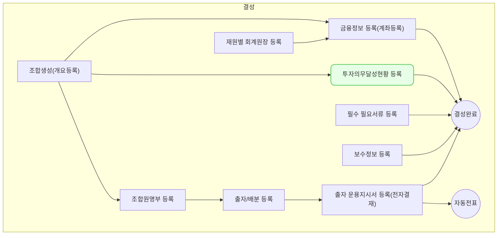

 벤처투자조합은 `의무 비율 규정`을 통해 벤처투자조합이 창업초기기업과 벤처기업에 자금을 집중 투자하도록 유도하고 있습니다. 여기서는 이 의무 비율 규정을 작성하고 조합이 이 규정을 준수하는지 모니터링 할 수 있도록 해줍니다.

## 동영상



## 설명

- 투자의무비율은 의무투자,주목적투자,특수목적투자,구주투자제한,해외투자제한,상장주식투자제한,동일기업투자제한 등 다양한 조건이 있습니다.
- 일반적으로 의무투자조항과 동일기업투자제한이 자주 사용되며 다음과 같은 것들이 있습니다.
	- 결성 후 3년 내 의무투자 비율
		- 업무집행조합원 기준으로 운용중인 총자산의 40% 이상을 창업자, 벤처기업 등에 투자해야 함
	- 조합별 의무투자 비율
		- 각 펀드별 출자납입액의 20% 이상을 창업자, 벤처기업 등에 투자해야 함
		- 전체 벤처투자조합 출자납입액 합계의 40% 이상을 창업자, 벤처기업 등에 투자해야 함
	- 상장기업 투자 제한
		- 전체 출자금액의 20% 이내에서만 상장회사에 투자 가능 (코넥스 제외)
	- 동일기업 투자 한도
		- 동일 기업에 대한 투자는 출자금 총액의 20% 이내로 제한됨
	
## 자주 묻는 질문

> 투자 의무 현황을 입력하면 어떤 이득(업무감소)이 있는 것일까요?
{: .prompt-tip }

답변 작성

## 선후행 구조도

