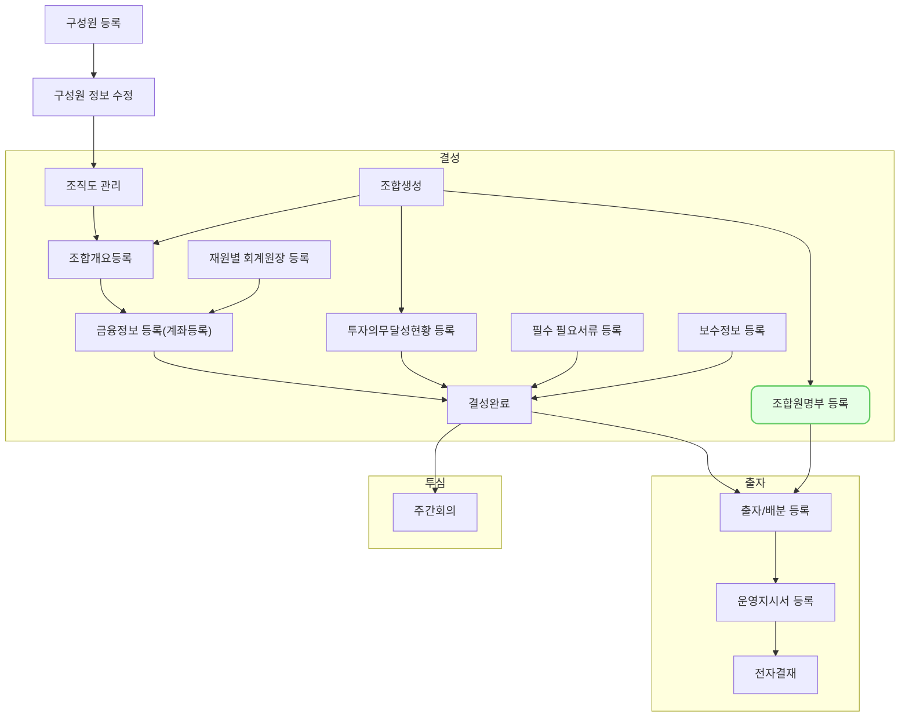

`조합원 명부`는 투자조합의 출자자 정보를 체계적으로 관리하고 조회할 수 있는 핵심 기능입니다. 조합 결성 및 운영에 필수적인 조합원 정보를 효율적으로 관리할 수 있습니다.

## 동영상



## 설명

- 일반적으로 조합원명부는 대량(Bulk) 등록될 가능성이 높으며, 이 경우 조합원 명부내 좌측 상단에 있는 `조합원 추가-조합원 일괄 추가`기능을 활용하여 간편하게 입력할 수 있습니다.
- 여기서는 이해를 돕기 위해 `조합원 개별 추가`를 살펴보겠습니다.
- 기본적으로 등록된 조합은 조합원명의 드롭다운 버튼을 눌러 검색 및 확인할 수 있습니다.
- 또한 없는 조합원의 경우 간편하게 조합원명을 추가할 수 있습니다.
- 조합원은 LP 뿐만 아니라 GP 등 다양한 유형이 될 수 있습니다. 이들의 유형(GP/LP), 기본 정보(이름, 연락처, 주소 등) 입력 한뒤 출자 정보(출자약정액, 출자비율 등) 입력하게 됩니다.
- 만약 분류가 `자펀드/특정금전신탁` 인 경우 우측 상단에 `거래처 등록` 버튼이 활성화 되게 되며, 여기서 빠르게 거래처를 등록할 수 있습니다.
	-  조합원명의 드롭다운 버튼을 눌러 등록할 경우 `거래처`로 취급되지 않고 `조합원`으로 만 취급이 됩니다.
	- `거래처`로 등록되지 않으면 회계처리를 하기 어려워집니다?
- 위 기능은 모금융기관/운용사를 등록 할 때도 활용할 수 있습니다.
	
## 자주 묻는 질문

> 기존에 입력한 조합원이라면 기본 정보는 기존 정보를 불러오면 될것 같은데 왜 매번 새로 입력하나요?
{: .prompt-tip }

- 답변?

> 조합원 명부 출력은 어디서 하나요?
{: .prompt-tip }

- 결성완료 전에는 출력 불가?

> 조합원별 의결권 비율 설정은 어디서 하나요?
{: .prompt-tip }

- (질문이 필요한건지는 모르겠음)

## 선후행 구조도

