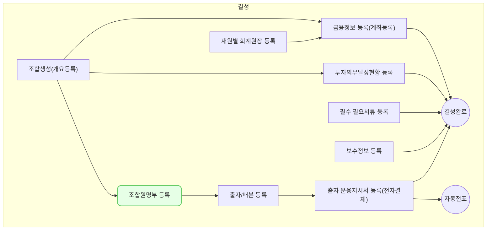

조합원 명부 등록에서는 조합 별 출자자 정보를 등록하는 방법을 설명합니다.

## 동영상



## 설명
### 조합원 일괄 등록
조합원을 일괄로 등록하는 방법은 다음과 같습니다.

> 조합원 등록 전 반드시 조합의 **1좌당 금액**이 입력되어있어야 합니다. 입력 방법은 [신규조합 추가](/posts/fd0001/) 가이드를 참조해주세요.
{: .prompt-info}

#### 등록 대상 선택
1. **조합 > 조합 정보 > 조합원 명부** 메뉴를 차례대로 클릭해주세요.
	- **조합 > 조합원 명부** 메뉴에서도 조합원을 등록할 수 있습니다.
2. **[조합원 추가]** 를 클릭한 후 나오는 목록에서 **[조합원 일괄 추가]** 를 클릭해주세요.
3.  분류 목록에서 조합 및 분류를 선택해주세요.

> 조합원 같은 분류 그룹 단위(개인,법인,자펀드/특정금전신탁,해외법인)로만 일괄 등록이 가능합니다. 
{: .prompt-info}

4. **[행 추가(+)]** 를 클릭하여 등록을 원하는 조합원 수 만큼 행을 추가해주세요.
	- 최초 행 추가 이후 첫 행을 클릭한 후 **[shift + enter]** 단축키를 누르면 편리하게 행을 추가할 수 있습니다.
5. 행 별로 조합원명과 주민등록번호(또는 사업자등록번호)를 입력해주세요.
	- 추가하고자 하는 조합원이 '해외조합원' 또는 '자펀드/특정금전신탁 등'인 경우, 조합원명 목록에서 등록 대상 조합원을 직접 선택 후 **[추가]** 를 클릭해주세요.
	- 등록하고자 하는 해외 조합원 또는 자펀드/특정금전신탁이 거래처로 등록되지 않은 경우 **[거래처 등록]** 을 클릭하여 거래처를 등록할 수 있습니다.
6. [다음] 을 클릭해주세요.
	- **조합원 정보 입력** 화면으로 이동합니다.

#### 조합원 정보 입력 및 담당자 정보 입력
1. **조합원 일괄 추가 - 등록 대상 선택**에서 입력한 조합원 정보가 출력됩니다.
	- 기존에 등록된 조합원을 입력한 경우 해당 조합원의 기본 정보가 자동으로 출력됩니다.
2. 기본 정보, 전문 투자자 정보 및 출자 약정 정보 등을 입력해주세요.
	- 출자 약정 금액 또는 출자 약정 좌수를 입력하면 사전 입력된 조합 1좌당 금액에 의해 좌수 또는 금액이 자동으로 계산됩니다.
	- 조합원이 전문 투자자인 경우 전문 투자자 여부를 '여'로 설정하고 관련 정보를 입력해주세요.
3. **[다음]** 을 클릭해주세요.
	- **담당자 정보 입력** 화면으로 이동합니다.
4. 담당자 정보를 입력합니다.
	- 이미 등록된 조합원 및 LP 담당자가 있는 경우 기존에 등록된 담당자를 선택할 수 있습니다.
5. **[저장]** 을 클릭해주세요.
	- 입력된 조합원 정보가 저장됩니다.

### 조합원 개별 등록
조합원을 개별로 등록하는 방법은 다음과 같습니다.

1. **조합 > 조합 정보 > 조합원 명부** 메뉴를 차례대로 클릭해주세요.
	- **조합 > 조합원 명부** 메뉴에서도 조합원을 등록할 수 있습니다.
2. **[조합원 추가]** 를 클릭한 후 나오는 목록에서 **[조합원 개별 추가]** 를 클릭해주세요.
3. 조합명을 선택해주세요.
	- 조합 > 조합원 명부 메뉴에서 조합원 개별 추가를 선택 경우에만 해당됩니다.
4. **조합원명 목록**을 클릭하여 등록 대상 조합원을 입력 또는 선택해주세요
	- 이미 등록된 조합원이라면 조합원명을 직접 입력 후 선택해주세요. 기존에 등록된 기본 정보가 자동으로 출력됩니다.
	- 신규 등록 조합원이라면 **신규 등록 조합원명 입력**란에 조합원명을 입력하고 **[+추가]** 를 클릭해주세요.
5. 조합원 **분류**를 선택해주세요.
	- 조합원 분류가 '자펀드/특정금전신탁 등'인 경우 모금융기관/운용사를 반드시 선택해주세요. 
	- 모금융기관/운용사가 등록되지 않은 경우 **[거래처 등록]** 을 클릭하여 모금융기관/운용사를 등록할 수 있습니다. 
6. 기본 정보, 전문 투자자 정보, 및 출자 약정 정보 등을 입력해주세요.
	- 조합원이 전문 투자자인 경우 전문 투자자 여부를 '여'로 설정하고 관련 정보를 입력해주세요.
	- 출자 약정 금액 또는 출자 약정 좌수를 입력하면 사전 입력된 조합 1좌당 금액에 의해 좌수 또는 금액이 자동으로 계산됩니다.
7. 조합원 담당자 정보 영역에서 **[+]** 버튼을 클릭 후 LP 담당자 정보를 입력해주세요.
	- 조합원당 여러 명의 담당자 정보를 입력할 수 있으며, 주 담당자 여부를 설정할 수 있습니다.
8. **[저장]** 버튼을 클릭해주세요.
	- 입력한 조합원 정보가 저장됩니다.

## 자주 묻는 질문

> 조합원 등록에서 분류하는 기준의 상세 정보가 궁금합니다. 
{: .prompt-tip }
- 조합원 분류별 정의는 아래와 같습니다.
	- **개인조합원**: 주민등록번호를 입력해야 하는 개인 조합원
	- **일반법인조합원** : 사업자등록번호/고유번호를 입력해야 하는 법인/타 조합 조합원
	- **자펀드/특정금전신탁** 등 : 모금융기관이 있어 별도의 사업자등록번호가 없는 조합원
	- **해외조합원**: 해외 법인으로써 대한민국의 사업자등록번호가 없는 조합원

## 선후행 구조도

