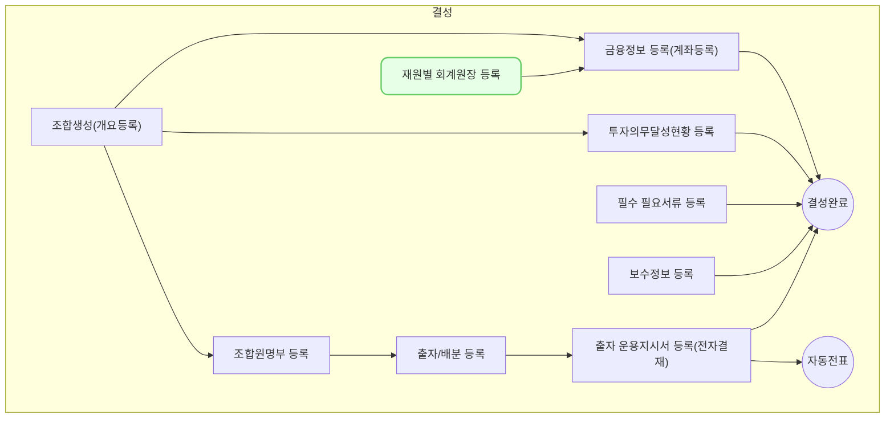

재원별 회계원장 등록(fm0010)에서는 1개의 재원에 여러개의 회계 원장을 사용하도록 설정할 수 있습니다. (Multi Ledger)

## 동영상



## 설명

- 재원별 회계원장 등록(fm0010)은 `회계/재무 > 기본 정보 설정 > 재원별 회계원장`을 통해서 접근 가능합니다.
- VC웍스는 1개의 재원이 여러개의 회계원장을 사용할 수 있게 하여, 한 시스템 내에서 1개의 조합에 대해 K-GAAP, IFRS(자체 평가금액), IFRS(산업은행 평가금액), IFRS(국민연금 평가금액) 등 다양한 방식으로 결산을 할 수 있도록 지원하고 있습니다.
- 위와 같은 사례는 아래와 같은 방식으로 등록하여 사용할 수 있습니다.
	- 아래의 경우 이해를 돕기 위해 매칭된 회계기준을 모두 작성하였으나, 실제로는 K-GAAP, IFRS 두 가지 기준을 등록하고 IFRS는 모두 동일하게 사용하면 됩니다.

| 회계기준   | 회계원장          |
| ------ | ------------- |
| K-GAAP | 조합(K-GAAP)    |
| IFRS   | 조합(IFRS)      |
| IFRS   | 조합(IFRS-산업은행) |
| IFRS   | 조합(IFRS-국민연금) |
> 재원별 회계원장 등록(fm0010)을 하기 위해서는 아래의 사전 조건이 충족 되어야 합니다.
> 1. **재원이 등록되어 있을 것**
> 2. **회계기준 및 회계원장이 등록되어 있을 것**
{: .prompt-tip }

1. 회계 원장을 등록하고자 하는 재원의 행을 클릭합니다.
	- 최근에 등록된 재원이 상단에 표시됩니다.
2. 재원별 회계원장 등록 드로어가 열리면, 우측 상단의 [수정] 버튼을 클릭합니다.
3. [회계기준 및 회계원장(fm0009)](https://guide.vcworks.kr/posts/fm0009/) 메뉴에서 등록한 회계원장들이 나오며, 이 중 사용할 회계 원장의 토글을 클릭하여 `여(초록색 상태)`로 만듭니다.
	- 조합의 경우 최소 1개 이상의 회계원장을 설정해야 계좌를 등록하고 조합을 결성완료 처리 할 수 있습니다.
4. 제일 하단 `메인 회계원장` 항목에서 사용할 회계 원장 중 메인으로 설정할 회계원장을 선택합니다.
	- `메인 회계원장`은 상위에서 `여(초록색 상태)`로 설정한 회계 원장 중에서만 선택할 수 있습니다.
5. `메인 회계원장`까지 선택을 완료 했으면 [저장] 버튼을 클릭합니다.
6. 재원별 회계원장 등록을 완료했습니다.

## 자주 묻는 질문

> 펀드 결성 후 회계원장이 추가되거나, 더 이상 사용하지 않고 싶으면 어떻게 처리되나요?
{: .prompt-tip }

- 회계원장이 추가되는 경우 언제든지 재원별 회계원장 등록(fm0010) 에서 추가로 등록하여 사용 가능합니다.

## 선후행 구조도

