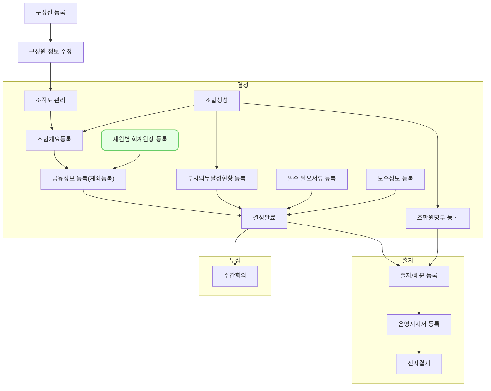

`회계/재무-기본 정보 설정 -재원별 회계원장`는 투자 재원을 효과적으로 관리하고 회계 처리를 정확하게 하기 위해 필요한 기능입니다. 각 재원별로 K-GAAP, IFRS 등 별도의 회계원장을 등록하여 관리할 수 있도록 합니다. (Multi Ledger)

## 동영상



## 설명

- `조합 - 조합 정보 - 대표 계좌 - 계좌 등록하기` 나 `회계/재무-기본 정보 설정 -재원별 회계원장` 을 통해 접근할 수 있으며 표시된 목록에서 설정하고자 하는 조합을 선택합니다.
- 조합을 선택하면 스위치를 통해 on-off 할 수 있으며, 최소 1개 이상은 on이 되어 있어야 합니다.
- 마지막에 메인 회계원장을 선택하신 뒤 저장하시면 절차가 마무리 됩니다.
- 회계원장별 계정과목 체계 등은 다른 곳에서 더 상세하게 설정 가능합니다.

## 자주 묻는 질문

> 펀드 결성 후 회계원장이 추가(on)되거나, 제거(off)되면 어떻게 처리되나요?
{: .prompt-tip }

- 답변

## 선후행 구조도

