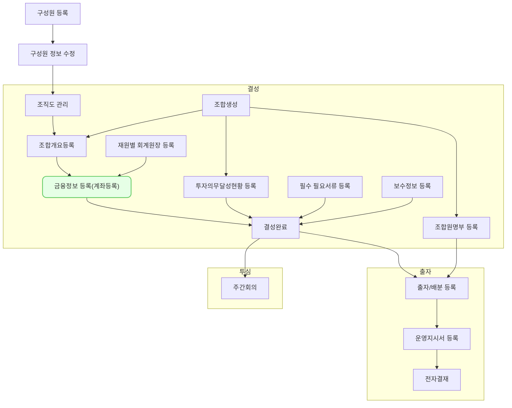

벤처캐피탈의 효율적인 자금 관리를 위해 회사 및 펀드의 계좌 정보를 등록하고 관리하는 기능입니다. `조합 - 조합 정보 - 대표 계좌 - 계좌 등록하기` 를 통해 접근 가능합니다.

## 동영상



## 설명

- 계좌등록을 하기 위해서는 우선 조합(재원)의 대표 회계원장이 설정되어 있어야 합니다. 이는 `재원별 회계원장`에서 등록 가능합니다.
- 대표 회계원장이 선택 되면 해당 유형에 맞는 계정 과목을 각각 설정할 수 있습니다.
- 금융기관 및 지점 정보는 DB에 (어떠한 내용이 저장되어 있는지 상세 기술) 저장되어 있으며
- 계좌번호를 입력하고 사용여부를 활성화하고 저장하여 사용 가능합니다.
	
## 자주 묻는 질문

> 금융기관이 없으면 어떻게 하죠?

> 왜 통화에 KRW 이 기본값이 아닌가요?

> 하나의 펀드(조합)에 여래 개의 계좌를 등록할 수는 없나요?

> 등록된 계좌 정보는 어디에 활용되나요?

## 선후행 구조도

