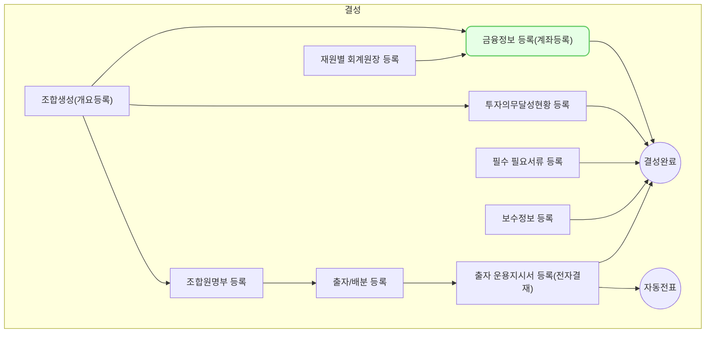

금융정보 등록 - 계좌등록(fd0009)에서는 재원별로 계좌를 등록하고 관리할 수 있습니다. 또한 회계원장별로 계정을 설정하여 추후 계좌 별 잔액을 확인할 수 있습니다.
## 동영상



## 설명

- 금융정보 등록 - 계좌등록(fd0009)은 `회계/재무 > 자금 관리 > 금융 정보 관리` 또는 `조합 > 조합 정보 > 조합 정보 개요 > 대표 계좌 > 계좌 등록하기` 를 통해서 접근 가능합니다.
- 하나의 재원/회계원장/계정과목 등에 여러개의 계좌를 입력할 수 있습니다.

> 금융정보 등록 - 계좌등록(fd0009)을 하기 위해서는 아래의 사전 조건이 충족 되어야 합니다.
> 1. **재원**이 등록되어 있을 것
> 2. **회계기준 및 회계원장**이 등록되어 있을 것
> 3. **재원별 회계원장**이 등록되어 있을 것
{: .prompt-tip }

1. 우측 상단의 [신규 등록] 버튼을 클릭합니다.
2. 금융정보 등록 드로어가 열리면, 계좌 정보를 입력합니다.
	- **사용 여부**: 등록할 계좌의 사용 여부를 선택
	* **재원**: 등록할 계좌의 예금주에 해당하는 재원 선택
	* **회계원장 및 계정과목 선택**: 위에서 선택한 재원과 연결된 모든 회계원장별 계정과목 선택
		* 해당 계정과목 입력시 관리항목으로 등록중인 계좌가 보여집니다.
	- **금융기관**: 등록할 계좌의 금융기관 선택
		- 추후 벤처넷 연결을 위해 벤처넷에서 관리중인 금융기관과 지점 정보가 셋팅되어 있습니다.
	- **지점명**: 위에서 선택한 금융기관의 해당 지점 선택
		- 추후 벤처넷 연결을 위해 벤처넷에서 관리중인 금융기관과 지점 정보가 셋팅되어 있습니다.
	- **계좌번호**: `-` 포함하여 자유롭게 입력
	- **통화**: 등록할 계좌의 통화 선택
	- **개설일**: 등록할 계좌의 개설일 입력
	- 만기일: 등록할 계좌의 만기일이 존재하는 경우 입력
	- 이자율: 등록할 계좌의 이자율이 존재하는 경우 입력
	- 적요:  등록할 계좌의 메모 사항 입력
	- 통장사본 업로드: 등록할 계좌의 통장사본을 관리하고자 하는 경우 업로드
3. 계좌 정보 입력을 완료 했으면 [저장] 버튼을 클릭합니다.
4. 신규 계좌 등록을 완료했습니다.

## 자주 묻는 질문

> 계좌를 삭제하려면 어떻게 해야하나요?
{: .prompt-tip }
- 해당 계좌가 연결된 수많은 과거 전표 및 운용지시서의 이력관리 때문에 삭제기능은 제공하지 않습니다.
- 해당 계좌를 더 이상 사용하지 않는 경우 사용여부를 `부`로 변경해 주세요.
- 그럼에도 불구하고 삭제가 필요한 경우 we@dkdk.kr 로 요청 부탁드립니다.

> 등록된 계좌 정보는 어디에 활용되나요?
{: .prompt-tip }
- 전표 입력시 연결된 회계원장/계정과목을 입력하는 경우 관리항목으로 등록된 계좌들이 노출됩니다.
	- 전표들의 합계로 계좌잔액을 관리할 수 있습니다. (계좌 잔액 조회(fm0020))
- 조합의 대표계좌로 등록 된 경우 운용지시서와 연결됩니다.

## 선후행 구조도

