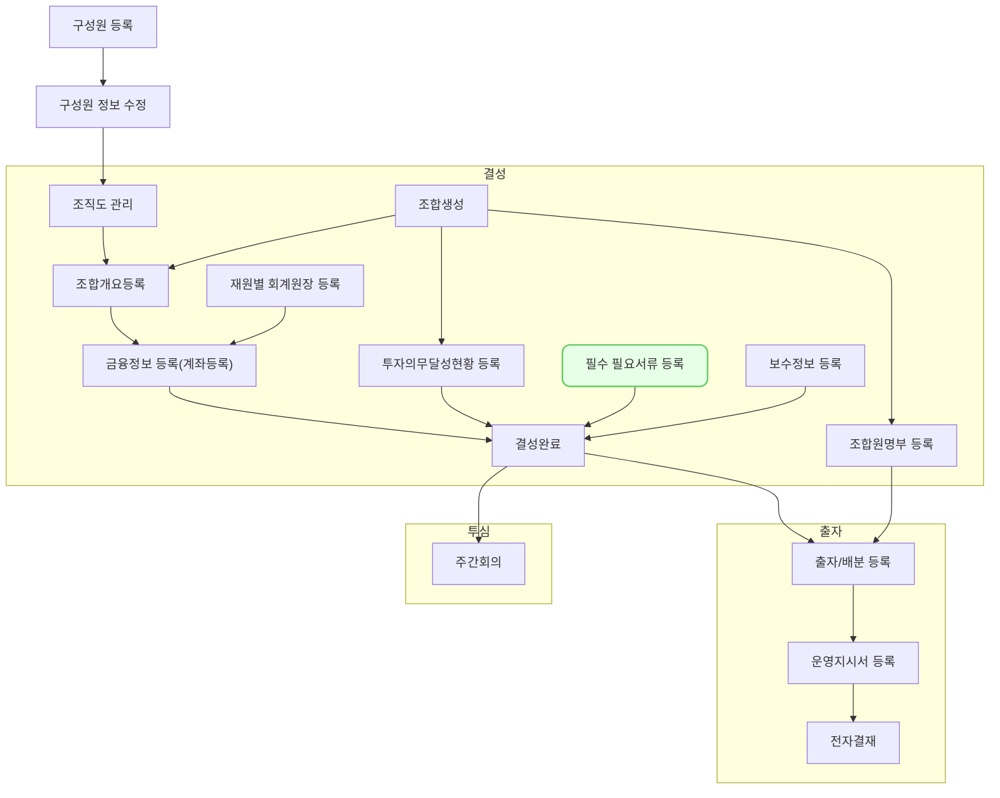

필수 필요서류 등록은 벤처투자 과정에서 요구되는 핵심 문서들을 체계적으로 관리하기 위한 기능입니다. 이를 통해 투자 프로세스의 효율성과 투명성을 높일 수 있습니다.

## 동영상



## 설명

-  필요서류는 조합 운영 단계에 따라 변동되며 해당 단계에 맞는 서류를 필수값으로 요청 받습니다.
- 파일형식 정보를 작성, 파일 용량 정보를 작성
- 이력관리가 되나??
- 사용자 접근 관리가 어떻게 되는지 작성

## 자주 묻는 질문

> 첨부파일 내용을 검색할 수 있나요?
{: .prompt-tip }

## 선후행 구조도

