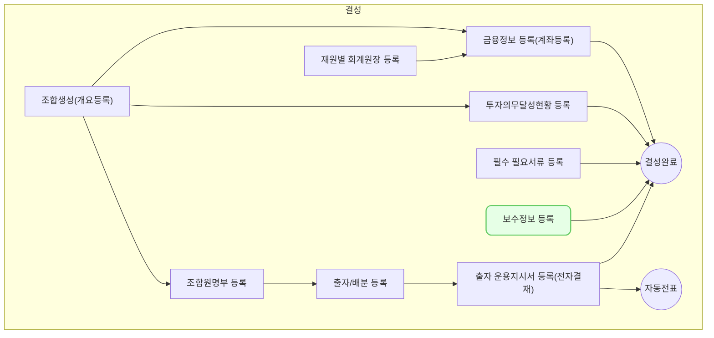

보수 관리 화면은 벤처캐피털 회사의 관리보수 및 성과보수를 효율적으로 관리하기 위한 기능을 제공합니다. 투자조합의 규모와 운용 단계에 따른 적절한 보수 산정 및 지급을 지원합니다.

## 동영상



## 설명
보수 관리 정보 등록에서는 조합의 보수 사항(관리 보수, 성과 보수, 수탁 보수, 기타 보수)를 등록하는 방법을 설명합니다.
### 조합 보수 등록

조합 보수를 등록하는 방법은 다음과 같습니다.

1. VC Works에서 **조합 > 조합 정보** 메뉴를 차례대로 클릭해주세요.    
2. 보수 등록을 원하는 조합을 찾아 클릭해주세요.    
3. **[필요 서류]** 탭을 클릭해주세요.    
    - 조합 상태가 `운용 중`인 경우 **필요 서류** 화면에서 **[수정]** 버튼을 클릭해주세요.        
4. 입력을 원하는 보수 영역의 **[+조건 추가]** 를 클릭해주세요.    
    - 보수 조건을 입력할 수 있는 카드가 출력됩니다.        
5. 보수 유형별 상세 조건을 입력해주세요.    
    - 관리보수        
        - 시작일과 종료일을 입력해주세요.            
        - 관리보수의 산정 기준 금액을 선택해주세요.            
        - 금액 규모에 따라 다른 보수율을 적용하는 경우 금액 구간 여부를 '있음'으로 선택해주세요.            
        - 보수율과 지급시기를 입력해주세요.            
    - 성과보수        
        - 성과보수의 산정 기준 지표와 비율 및 충족 조건을 입력해주세요.            
        - 금액 규모에 따라 다른 보수율을 적용하는 경우 금액 구간 여부를 '있음'으로 선택해주세요.            
        - 기준 금액과 보수율을 입력해주세요.            
    - 수탁보수        
        - 수탁보수의 산정 기준 금액을 선택해주세요.            
        - 금액 규모에 따라 다른 보수율을 적용하는 경우 금액 구간 여부를 '있음'으로 선택해주세요.            
        - 보수율과 지급 시기를 입력해주세요.            

## 자주 묻는 질문

> 입력한 내용에 따라 조합의 보수가 자동으로 계산되는지 궁금합니다.  
 {: .prompt-tip }
- 현재 VC Works에서 조합의 보수를 자동으로 계산하는 기능을 지원하지 않습니다.

## 선후행 구조도

