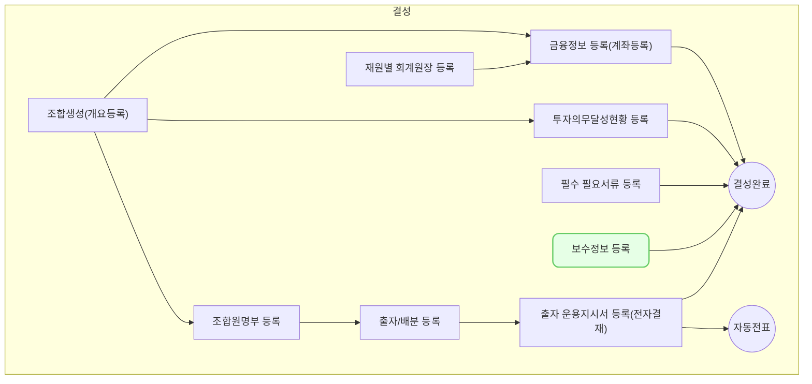

보수 관리 화면은 벤처캐피털 회사의 관리보수 및 성과보수를 효율적으로 관리하기 위한 기능을 제공합니다. 투자조합의 규모와 운용 단계에 따른 적절한 보수 산정 및 지급을 지원합니다.

## 동영상



## 설명

아래 비즈니스에 관한 내용을 좀더 추가하는 게 좋을 것

-  관리보수 계산
	- 투자 약정 총액 또는 투자잔액 기준 보수율 적용
	- 펀드 생애주기별 차등 보수율 설정
	- 분기/반기/연간 단위 보수 계산
- 성과보수 산정
	- 기준수익률 초과 수익에 대한 성과보수 계산
	- Catch-up, Hurdle rate 등 다양한 방식 지원
	- 조합 청산 시 최종 성과보수 정산
- 보수 지급 관리
	- 지급 스케줄 관리 및 알림 기능
	- 실제 지급 내역 기록
	- 관련 회계 처리 연동
- 보고서 생성
	- LP 보고용 보수 내역 보고서
	- 내부 관리용 보수 현황 리포트

## 자주 묻는 질문

> 관리보수와 성과보수의 차이는 무엇인가요?
{: .prompt-tip }

- 관리보수는 펀드 운용에 대한 기본 보수로 주로 투자약정액이나 투자잔액 기준으로 계산됩니다. 성과보수는 기준수익률을 초과한 수익에 대해 추가로 받는 보수입니다.

> 보수 계산 시 주의할 점은 무엇인가요?
{: .prompt-tip }

- 각 펀드의 규약에 명시된 보수 계산 방식을 정확히 적용해야 합니다. 또한 투자잔액 변동이나 환율 변동 등 보수에 영향을 주는 요소들을 반영해야 합니다.

## 선후행 구조도

