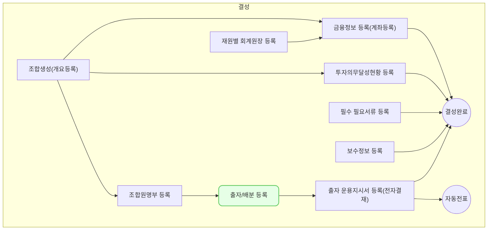

`조합-출자/배분` 출자 배분 등록 화면은 벤처투자조합의 출자금 배분 내역을 등록하고 관리하기 위한 핵심 기능입니다. 이를 통해 조합원별 출자 현황과 배분 내역을 체계적으로 관리할 수 있습니다. 여기서는 조합 결성 과정임으로 출자만을 다룹니다.

## 동영상



## 설명

출자와 배분의 차이점은 다음과 같습니다:

1. 출자 (Capital Contribution)
    - 정의: 조합원이 벤처투자조합에 자금을 납입하는 것
    - 방향: 조합원 → 조합
    - 목적: 투자 자금 조성
    - 시기: 주로 조합 결성 시 또는 약정된 일정에 따라 이루어짐
2. 배분 (Distribution)
    - 정의: 조합이 투자 수익 또는 회수 자금을 조합원에게 돌려주는 것
    - 방향: 조합 → 조합원
    - 목적: 투자 수익 실현 또는 조합 청산
    - 시기: 투자금 회수 후 또는 정기적으로 이루어질 수 있음

주요 차이점:

- 자금 흐름의 방향이 정반대입니다.
- 출자는 조합의 자산을 증가시키지만, 배분은 감소시킵니다.
- 출자는 의무사항이지만, 배분은 투자 성과에 따라 달라질 수 있습니다.
- 회계처리 및 세무처리가 다릅니다.

## 자주 묻는 질문

> 출자금 일부만 납입된 경우 어떻게 처리하나요?
{: .prompt-tip }

- 실제 납입된 금액만 입력하고, 미납 금액은 별도로 관리됩니다. 추후 추가 납입 시 해당 내역을 추가로 등록하면 됩니다. (맞나?)

## 선후행 구조도

