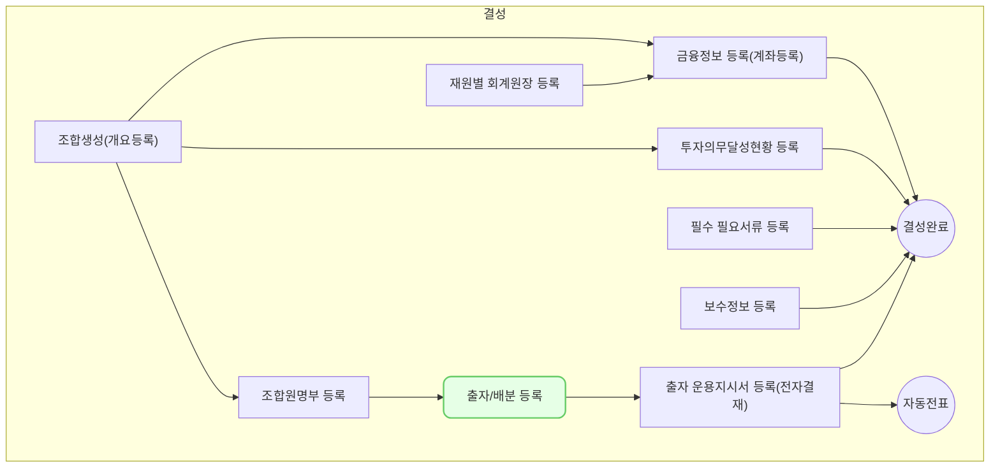

출자 등록에서는 조합의 출자/배분을 등록하고 수정하는 방법을 설명합니다.

## 동영상



## 설명

### 출자 등록
출자를 등록하는 방법은 다음과 같습니다.

1. VC Works에서 **조합 > 출자/배분** 메뉴를 차례대로 클릭해주세요.
	- 결성 후 운용 중 조합의 경우 **조합 > 조합 정보** 메뉴의 **출자/배분** 탭에서도 확인할 수 있습니다.
1. **[신규 등록]** 버튼을 클릭해주세요.
	- 출자/배분 등록 창이 우측에 출력됩니다.
2. 구분을 '출자'로 선택하고 원하는 출자 유형을 선택해주세요.
3. 출자 기준일과 조합명을 선택해주세요.
	- 설립출자의 경우 기준일을 결성일로 설정해주세요.
4. [다음] 버튼을 클릭해주세요.
	- **출자 등록** 화면으로 이동합니다.
5. 조합원별 출자 금액을 입력해주세요.
	- 멀티클로징으로 출자하는 조합원이 포함된 경우 '멀티클로징 여부'를 선택해주세요. 
6. 입력한 금액을 확인 후 **[저장]** 을 클릭해주세요.
	- 입력한 출자 내용이 저장됩니다.

### 출자 수정
출자를 수정하는 방법은 다음과 같습니다.
1. VC Works에서 **조합 > 출자/배분** 메뉴를 차례대로 클릭해주세요.
	- 결성 후 운용 중 조합의 경우 **조합 > 조합 정보** 메뉴의 **출자/배분** 탭에서도 확인할 수 있습니다.
2. 수정을 원하는 출자 내역을 찾아 클릭해주세요.
3. **[수정]** 버튼을 클릭해주세요.
4. 수정을 원하는 조합원의 출자 금액을 클릭 후 금액을 수정해주세요.
5. **[저장]** 버튼을 클릭해주세요.
	- 수정한 출자 내용이 저장됩니다.

> 운용지시서가 생성된 조합원의 출자 납입 건은 수정할 수 없습니다. 연결된 운용지시서를 삭제 후 수정해주세요.
{: .prompt-info }

### 배분 등록
배분을 등록하는 방법은 다음과 같습니다.
1. VC Works에서 **조합 > 출자/배분** 메뉴를 차례대로 클릭해주세요.
	- 결성 후 운용 중 조합의 경우 **조합 > 조합 정보** 메뉴의 **출자/배분** 탭에서도 확인할 수 있습니다.
2. **[신규 등록]** 버튼을 클릭해주세요.
	- 출자/배분 등록 창이 우측에 출력됩니다.
3. 구분을 '배분'으로 선택하고 원하는 배분 유형을 선택해주세요.
4. 배분 기준일과 조합명을 선택해주세요.
	- 선택한 기준일에 따라 다음 화면에서 조합원 출자 잔액 및 지분율이 출력됩니다.
5. [다음] 버튼을 클릭해주세요.
	- **배분 등록** 화면으로 이동합니다.
6. 배분 유형을 선택하고 배분 원금 총액 및 배분 수익 총액을 입력해주세요.
	- 조합원 지분율에 따라 입력한 배분 원금 총액 및 배분 수익 총액이 자동으로 계산됩니다.
	- 배분 원금 및 수익을 사용자가 수동으로 수정할 수 있습니다.
7. 성과보수 지급액과 배분조정(초과인센티브)를 입력해주세요
	- 성과보수 지급액 / 배분조정금액은 앞서 입력한 배분 수익 총액과 별도로 계산됩니다.
8. 입력한 금액을 확인 후 **[저장]** 을 클릭해주세요.
	- 입력한 배분 내용이 저장됩니다.
### 배분 수정
배분을 수정하는 방법은 다음과 같습니다.
1. VC Works에서 **조합 > 출자/배분** 메뉴를 차례대로 클릭해주세요.
	- 결성 후 운용 중 조합의 경우 **조합 > 조합 정보** 메뉴의 **출자/배분** 탭에서도 확인할 수 있습니다.
2. 수정을 원하는 배분 내역을 찾아 클릭해주세요.
3. **[수정]** 버튼을 클릭해주세요.
4. 수정을 원하는 조합원의 배분 금액을 클릭 후 금액을 수정해주세요.
5. **[저장]** 버튼을 클릭해주세요.
	- 수정한 배분 내용이 저장됩니다.

> 운용지시서가 생성된 조합원의 배분 건은 수정할 수 없습니다. 연결된 운용지시서를 삭제 후 수정해주세요.
{: .prompt-info }

### 출자/배분 운용지시서 등록
출자/배분 운용지시서를 등록하는 방법은 다음과 같습니다.
1. VC Works에서 **조합 > 출자/배분** 메뉴를 차례대로 클릭해주세요.
	- 결성 후 운용 중 조합의 경우 **조합 > 조합 정보** 메뉴의 **출자/배분** 탭에서도 확인할 수 있습니다.
2. 운용지시서 생성을 원하는 출자/배분 내역을 찾아 클릭해주세요.
3. 출자/배분 상세 화면에서 운용지시서 생성을 원하는 행의 체크박스를 클릭해주세요.
4. 우측 상단의 **[운용지시서]** 버튼을 클릭해주세요.
5. 운용지시일과 기타 기재사항을 입력해주세요.
6. 입출금내역을 입력해주세요.
	- 조합원명부에 은행 및 계좌번호가 등록된 경우 송금은행 및 계좌번호가 자동으로 표시됩니다.
	- 처리요청일은 사용자가 입력한 출자/배분 기준일이 기본값으로 표시됩니다.
	- 배분의 경우 배분/성과보수/초과인센티브에 따라 입출금내역이 분리되어 표시됩니다.
7. **[저장]** 버튼을 클릭해주세요.
	- 입력한 운용지시 내용이 저장됩니다.
	- 출자/배분 상세 화면의 **'운용지시서'** 열에 생성된 운용지시서의 바로가기가 표시됩니다.

> 생성된 운용지시서의 결재가 승인된 이후 출자 증서 번호가 자동으로 생성됩니다.
{: .prompt-info }

## 자주 묻는 질문
> 설립출자금과 추가출자금 분류 기준이 궁금합니다.
{: .prompt-tip }
- 설립출자금: 출자 등록 시점에 조합에 등록된 모든 조합원이 출자 금액을 납입해야 합니다.
- 추가출자금: 출자 등록 시점에 조합에 등록된 조합원 중 추가 출자의 대상이 되는 조합원들만 선택하여 등록할 수 있습니다.

> 멀티클로징 여부에 따라 출자 금액 입력 기준이 변경되는지 궁금합니다.
{: .prompt-tip }
- 멀티클로징으로 추가 출자를 통해 참여하는 조합원이 LAC(Late Admission Charge)를 출자금과 함께 납입하는 경우 LAC는 출자 이행 금액에 포함되지 않습니다. 출자 등록 시 해당 금액을 제외하고 입력해주시기 바랍니다.

> 실배분금액(세전) 및 실배분금액(세후)의 계산 로직을 알고 싶습니다.
{: .prompt-tip }
- 실배분금액(세전) 계산식
	- 배분 원금 + 배분 수익 + 성과보수 지급액 + (배분조정) 값
- 실배분금액(세후) 계산식
	- 실배분금액(세전) - 소득세 - 법인세 - 주민세 값
## 선후행 구조도

