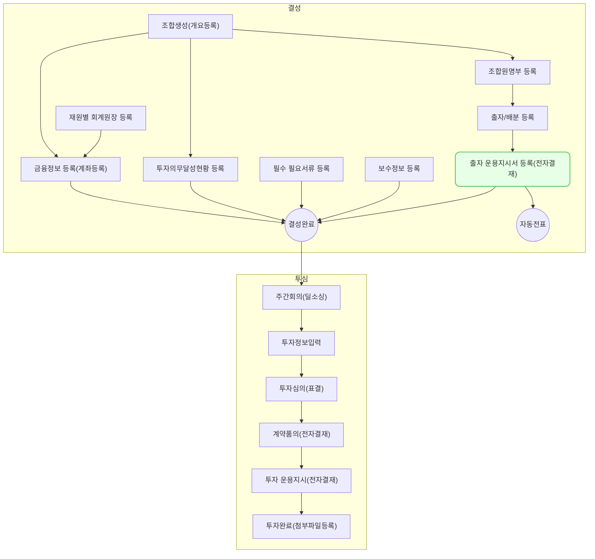

운용지시-출자운용지시서 상신에서는 VC Works에 등록한 출자 내역을 기반으로 운용지시서를 생성하는 방법과 생성된 운용지시서에 대한 전자결재를 상신하는 방법을 설명합니다.
## 동영상



## 설명

### 출자 운용지시서 생성
1. VC Works에서 **조합 > 출자/배분** 메뉴를 차례대로 클릭해주세요.
	- 결성 후 운용 중 조합의 경우 **조합 > 조합 정보** 메뉴의 **출자/배분** 탭에서도 확인할 수 있습니다.
2. 출자 운용지시서 생성을 원하는 출자 내역을 찾아 클릭해주세요. 
3. **출자 상세** 화면에서 출자 운용지시서 생성을 원하는 조합원에 대하여 체크박스를 클릭해주세요.
4. **[운용지시서]** 버튼을 클릭해주세요.
5. **운용지시서 등록** 화면에서 담당자, 운용지시일 및 기타 기재사항을 입력해주세요.
6. 입출금내역 영역에서 처리요청일을 입력해주세요.
7. 필요 시 **[파일 선택]** 을 클릭하여 첨부파일을 업로드해주세요.
8. **[저장]** 을 클릭해주세요.
	- 입력한 운용지시서 내용이 저장됩니다.

### 운용지시서 전자결재 등록
1. VC Works에서 **투자/회수 > 운용지시서** 메뉴를 차례대로 클릭해주세요.
2. 전자결재 생성을 원하는 운용지시서를 클릭해주세요.
3. 운용지시서 상세 화면에서 **[전자결재]** 버튼을 클릭해주세요.
4. 결재선을 지정하고 **[결재 요청]** 을 클릭해주세요.
> **출자 상세**에서도 출자 운용지시서를 확인할 수 있습니다.  
	   - VC Works에서 **조합 > 출자/배분** 메뉴를 차례대로 클릭해주세요. 
		   - 결성 후 운용 중 조합의 경우 **조합 > 조합 정보** 메뉴의 **출자/배분** 탭에서도 확인할 수 있습니다. 
	   - 출자 운용지시서 전재 결재 생성을 원하는 출자 내역을 찾아 클릭해주세요.  
	   - 전자결재 생성을 원하는 출자 내역의 [↗운용지시서] 버튼을 클릭해주세요. 
{: .prompt-info }
## 자주 묻는 질문

> 운용지시서 결재 승인 완료 후 출자 내용 수정이 필요할 때 처리 방법이 궁금합니다.
{: .prompt-tip }
- 현재 승인이 정상적으로 완료된 출자 건은 수정할 수 없습니다.
- 전자 결재가 진행 중인 건의 출자 수정 방법은 다음과 같습니다.
	- 해당 운용지시서의 품의를 **반려** 처리한 후 **운용지시서 상세** 화면에서 **[더보기]** 를 클릭 후 **[삭제]** 를 클릭하여 운용지시서를 삭제해주세요.
	- 관련 운용지시서가 삭제된 경우 출자 상세 내역을 다시 수정할 수 있습니다.

## 선후행 구조도

