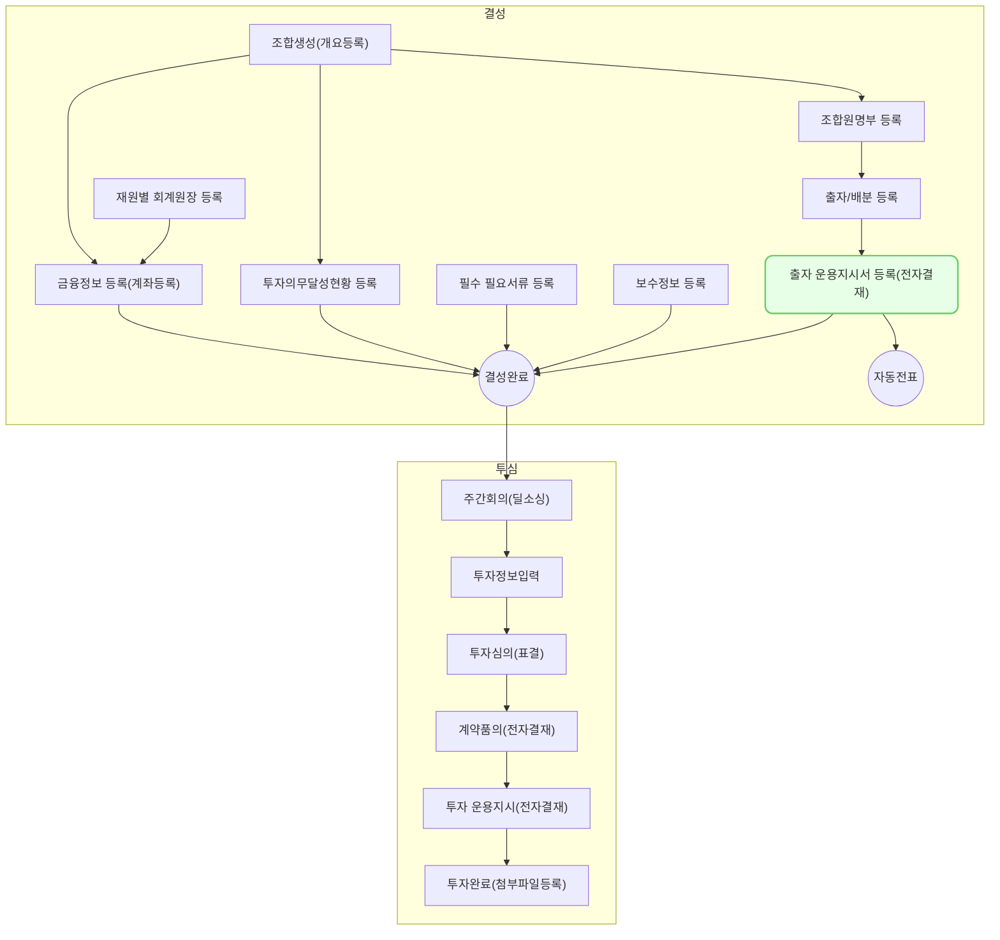

운용지시서는 펀드 운용사가 수탁은행에 자금 집행을 지시하는 중요한 문서입니다. 정확하고 효율적인 운용지시서 작성은 펀드 운용의 핵심 요소입니다. 여기서는 출자운용지시서(`조합-출자/배분-조합선택-조합원선택-운용지시서작성`)를 살펴보겠습니다.

출자 운용지시서의 전자결재는 펀드 운용의 투명성과 효율성을 높이기 위해 필요한 프로세스입니다. 이를 통해 출자금 납입 및 운용에 대한 의사결정을 체계적으로 관리할 수 있습니다. 앞서 출자 운용지시가 발생하면 자동적으로 전자결재 문서가 생성되어 상신되며 여기서는 이를 `결재/합의` 하는 과정을 설명합니다.

## 동영상



## 설명

- 출자 운용지시서는 운용지시서의 정형화된 한 형태입니다.
- 여기에 관련된 상세 정보를 기입 함
-  운용지시서와 전자결재의 차이점에 대해서 기입 함
	- 운용지시서를 별도로 전재결재를 태울 필요 없이 프로세스를 진행하면 바로 결재로 타진다는 내용

- 운용지시서 작성
    - 출자금 납입 요청 내용 입력
    - 투자 대상 및 금액 명시
    - 첨부 서류 업로드 (투자조건체크리스트, 의무기재사항확인서 등)
- 결재선 지정
    - 내부 결재 규정에 따른 결재자 선택
    - 참조자 지정 기능
- 결재 진행
    - 결재자별 승인/반려 처리
    - 의견 작성 기능
    - 결재 현황 실시간 조회
- 결재 완료 후 처리
    - 수탁은행 통보 및 자금 이체 요청
    - 회계 시스템 연동 (전표 생성)
    - 운용지시 이력 관리

## 자주 묻는 질문

>운용지시는 왜? 필요한가요?
{: .prompt-tip }

- 운용지시가 필요한 이유는 다음과 같습니다:
	1. 자금 관리의 투명성
		- 조합의 자금은 수탁회사(은행)에 보관됨
		- 운용지시를 통해 자금 이동의 정당성과 투명성 확보
	2. 법적 요구사항 준수
		- 벤처투자 촉진에 관한 법률에 따른 요구사항
		- 업무집행조합원(GP)과 자금보관기관 간의 역할 분리
	3. 출자금 납입 확인
		- 조합원의 출자금 납입 사실을 공식적으로 확인
		- 납입 시기와 금액의 정확성 보장
	4. 회계 및 세무 처리의 근거
		- 출자금 납입에 대한 공식 기록으로 활용
		- 향후 회계감사 및 세무조사 시 증빙자료로 사용
	5. 조합원 권리 보호
		- 정확한 출자 내역에 따른 조합원의 권리 보장
		- 의결권 및 수익 배분의 기준 제공
	6. 펀드 운용의 시작점
		- 출자금 납입 확인은 실제 펀드 운용의 시작을 의미
		- 투자 집행을 위한 기본 조건 충족

> 출자는 돈을 입금 받는 건데 왜 운용지시를 하나요?
{: .prompt-tip }

- 이유 작성

> 결재가 완료된 후 수정이 필요한 경우 어떻게 해야 하나요?
{: .prompt-tip }

- 대응 되나?

## 선후행 구조도

