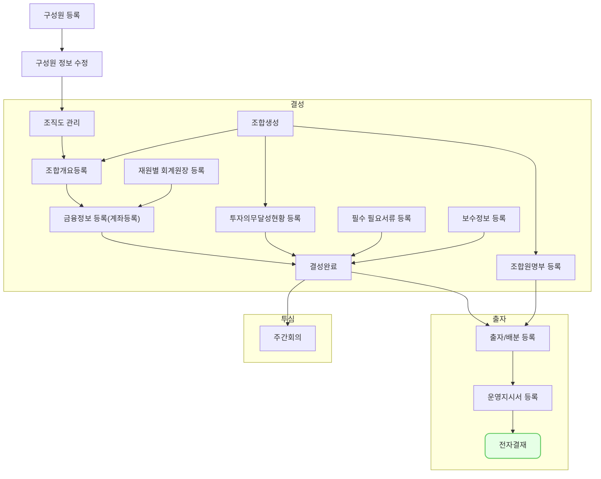

출자 운용지시서의 전자결재는 펀드 운용의 투명성과 효율성을 높이기 위해 필요한 프로세스입니다. 이를 통해 출자금 납입 및 운용에 대한 의사결정을 체계적으로 관리할 수 있습니다. 앞서 출자 운용지시가 발생하면 자동적으로 전자결재 문서가 생성되어 상신되며 여기서는 이를 `결재/합의` 하는 과정을 설명합니다.

## 동영상



## 설명

- 운용지시서 작성
    - 출자금 납입 요청 내용 입력
    - 투자 대상 및 금액 명시
    - 첨부 서류 업로드 (투자조건체크리스트, 의무기재사항확인서 등)
- 결재선 지정
    - 내부 결재 규정에 따른 결재자 선택
    - 참조자 지정 기능
- 결재 진행
    - 결재자별 승인/반려 처리
    - 의견 작성 기능
    - 결재 현황 실시간 조회
- 결재 완료 후 처리
    - 수탁은행 통보 및 자금 이체 요청
    - 회계 시스템 연동 (전표 생성)
    - 운용지시 이력 관리

## 자주 묻는 질문

> 결재가 완료된 후 수정이 필요한 경우 어떻게 해야 하나요?
{: .prompt-info }

- 대응 되나?

## 선후행 구조도

