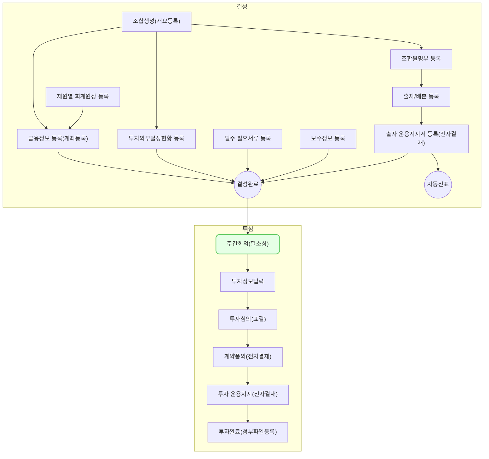

주간 회의는,
각 담당자 별로 종속된, 검토 중이거나 심의 중인 투자건, 포트폴리오 등 
담당 투자 현황을 공유하고 회의 내용을 기록하기 위해 만들어진 기능 입니다.

## 동영상



## 설명
1. 주간 회의에서 조회 되어지는 투자 정보들은 현재 로그인한 계정이 투자심의, 포트폴리오 각각에서 담당자로 지정된 경우에 자동으로 조회 되어집니다.
2. 주간 회의는 기본적으로 기록을 위한 목적이지만, 편의를 위해서 신규 검토 회사를 등록하거나 투자 검토를 중단하는 기능을 제공하고 있습니다.

## 자주 묻는 질문

> 투자 건의 담당자가 변경된 경우, 주간 회의에서 조회 되어지는 정보도 바뀌나요?
{: .prompt-tip }

- 네, 종속된 담당자 정보를 바탕으로 조회 되어지기 때문에, 조회 정보가 바뀔 수 있습니다.

## 선후행 구조도

