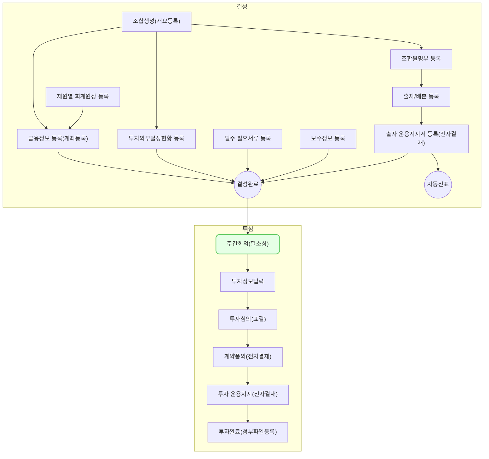

투자 심의 - 주간 회의에서는 주간 회의를 등록 및 조회하고 주간 회의를 검색하는 방법을 설명합니다.
## 동영상



## 설명

### 주간 회의 등록

주간 회의를 등록하는 방법은 다음과 같습니다.

1. **투자/회수 > 주간 회의 > 주간 회의** 메뉴를 차례대로 클릭해주세요.
2. **[신규 등록]** 버튼을 클릭해주세요.
	- **주간 보고 등록** 화면으로 이동합니다.
3. 보고자와 보고일을 선택해주세요.
	- 보고자는 로그인한 사용자의 구성원명이 기본값으로 설정됩니다.
4. **[이전 보고 불러오기]** 버튼을 클릭하면 보고일 이전에 작성한 보고 항목을 불러올 수 있습니다.
5. 아래 **보고 항목별 작성 방법**을 참고하여 보고를 작성해주세요.
6. 보고 작성 완료 후 **[저장]** 버튼을 클릭해주세요.

> 본문 작성 시 아래와 같은 마크다운 문법 적용이 가능합니다.
	- `Ctrl + B` : 글씨체 굵게
	- `-` : 불렛 포인트 생성
	- `>` : 인용문 작성
	- `#` , `##`, `###` : 제목 생성
{: .prompt-info }

### 보고 항목별 작성 방법
보고 항목에 따라 아래 유형의 보고를 자유롭게 작성할 수 있습니다.

#### 투자 보고
투자 보고는 회사 단위로 투자 심의 단계의 회사에 대한 보고를 작성할 수 있습니다. 작성 방법은 다음과 같습니다.
1. 신규 검토 회사를 등록하는 방법
	 - 투자 보고 화면에서 **[보고 항목 추가]** 버튼 또는 화면 하단 **[+]** 버튼을 클릭해주세요.
		 - 우측에 **투자 회사 검토 등록** 창이 출력됩니다.
	 - **회사명** 에서 보고 하려는 회사를 선택해주세요.
		 - 목록에 없는 새로운 회사를 추가하려면 목록 하단에 **[+등록]** 버튼을 클릭해주세요.
	 - **회사 유형** 및 **주요 제품/서비스** 를 입력해주세요.
	 - **투자 라운드** 를 선택해주세요.
		 - 투자 라운드를 선택 후 투자 라운드 상세를 선택해주세요. 
		 - (예) 투자 라운드를 'Series A'로 선택 후 투자 라운드 상세를 'Pre' 로 선택한 경우에는 Pre A 단계가 적용됩니다.
	 - **비즈니스 분야** 를 선택해주세요.
		 - 직접 검색하거나 목록에서 직접 선택할 수 있습니다.
	 - (선택) **보유 기술 분류** 를 선택해주세요.
		 - 직접 검색하거나 목록에서 직접 선택할 수 있습니다.
	 - (선택) **테마 분류** 를 선택해주세요.
		 - 테마 목록에서 여러 테마를 선택할 수 있습니다. (최대 5개 선택 가능)
	 - **[저장]** 을 클릭해주세요.
		 - 입력한 회사가 투자 검토 보고에 추가됩니다.

2. 기존에 보고한 회사 또는 투자 심의 중인 회사의 경우 화면에 나열된 보고 카드 중 보고를 입력하고자 하는 회사의 전주 실적 및 금주 계획을 입력해주세요.

3. 보고 회사에 대한 정보를 수정하려면 **[회사 정보 수정]** 을 클릭해주세요.
	- 미팅 단계의 회사 정보(회사명, 주요 제품/서비스 등)를 수정할 수 있습니다.\

4. 보고 회사에 대한 투자 검토를 중단하시려면 **[검토 중단]** 을 클릭해주세요.
	- 검토 중단 사유를 입력하고 **[검토 중단]** 을 클릭하면 해당 회사는 `Drop` 처리되며 추가 검토가 중단됩니다. 

#### 사후관리 보고
사후관리 보고는 투자 납입 이후 단계의 포트폴리오에 대한 사후 관리 보고를 작성할 수 있습니다. 작성 방법은 다음과 같습니다.
1. 신규 편입 포트폴리오를 추가하는 방법
	- 사후관리 보고 화면에서 **[보고 항목 추가]** 버튼을 클릭해주세요.
		- 우측에 **보고 대상 포트폴리오 선택** 창이 출력됩니다.
	- 포트폴리오 에서 보고하려는 회사를 선택해주세요.
		- 포트폴리오에 편입된 회사 중 담당심사역이 보고자 본인인 목록이 표시됩니다.
	- **[등록]** 을 클릭해주세요.
		- 선택한 포트폴리오가 사후관리 보고에 추가됩니다.
2. 기존에 보고한 포트폴리오인 경우 화면에 나열된 보고 카드 중 보고를 입력하고자 하는 포트폴리오의 전주 실적 및 금주 계획을 입력해주세요.

#### 일반 보고
일반 보고는 투자 및 사후관리 보고 외 회사 일정, 펀드 및 회사 현황 등 기타 사항에 대한 보고를 작성할 수 있습니다. 작성 방법은 다음과 같습니다.
1. 기존 구분을 수정하는 방법
	- VC Works 주간 회의 일반 보고는 펀드 / 회사 / 일정 / 기타 분류를 기본 제공합니다.
	- 구분 변경을 원하는 경우 각 구분 란에 입력된 항목을 수정할 수 있습니다.
2. 신규 구분을 추가하는 방법
	- 일반 보고 화면에서 **[보고 항목 추가]** 버튼 또는 화면 하단 **[+]** 버튼을 클릭해주세요.
		- 화면 가장 아래 새로운 일반 보고 카드가 출력됩니다.
	- 구분 란에 입력하고자 하는 구분명을 입력해주세요.
3. 화면에 나열된 보고 카드 중 보고를 입력하고자 하는 영역의 전주 실적 및 금주 계획을 입력해주세요.

### 주간 회의 조회
주간 회의를 조회하는 방법은 다음과 같습니다.
1. VC Works 에서 **투자/회수 > 주간 회의 > 주간 회의** 메뉴를 차례대로 클릭해주세요.
2. 조회를 원하는 시작일과 종료일을 선택하고 [Enter] 키를 눌러 주십시오.
	- 조회 기간에 맞는 주간 회의 목록이 출력됩니다.
3. 조회를 원하는 주간 회의 행을 클릭해주세요.
4. **주간 보고 상세** 화면에서 **[←이전 보고]** 와 **[다음 보고→]** 버튼을 클릭해 보고자 간 조회 화면을 이동할 수 있습니다.

### 주간 회의 검색
주간 회의를 검색하는 방법은 다음과 같습니다.
1. VC Works 에서 **투자/회수 > 주간 회의 > 주간 회의 검색** 메뉴를 차례대로 클릭해주세요.
2. 아래 기준에 따라 주간 회의를 검색할 수 있습니다.
	- 기간 단위 검색
		- 조회를 원하는 시작일과 종료일을 선택하고 [Enter] 키를 눌러 주십시오.	
	- 키워드 단위 검색
		- 검색 창에 검색하고자 하는 항목을 입력하고 **[Enter]** 키를 눌러 주십시오. 
3. 검색 내역을 클릭하면 연결된 **주간 보고 상세** 화면으로 이동합니다.

## 자주 묻는 질문

> 기존에 검토를 중단하였던 회사를 재검토할 수 있는지 궁금합니다.
{: .prompt-tip }
- **투자 보고** 화면에서 **[보고 항목 추가]** 를 클릭해주세요.
- **회사명** 목록에서 기존에 검토를 중단하였던 회사를 검색 후 선택해주세요.
- 그 외 필요 정보를 입력한 후 **[저장]** 버튼을 클릭해주세요. 

> 보고 작성 시 회사 또는 일반 보고 정렬 순서를 변경할 수 있는지 궁금합니다.
{: .prompt-tip }
- **주간 보고 등록** 또는 **주간 보고 상세**의 수정 화면에서 순서 변경을 원하는 보고 카드의 체크 박스를 클릭해주세요.
- 순서를 위로 변경하시려면 **[ᐱ]** 버튼을 눌러주세요.
- 순서를 아래로 변경하시려면 **[ᐯ]** 버튼을 눌러주세요.
- 순서를 변경한 후 **[저장]** 버튼을 클릭해주세요.

## 선후행 구조도

