투자 심의는,
투자 심의가 결정된 회사에 대해서 투자 단계 별로 필요한 정보를 기입하고, 기록하기 위한
목적의 모듈 입니다. 

'투자 정보 입력'은
투자 심의가 결정된 **투자 업체 정보** 및 **투자 정보**를 등록하기 위한 투자 심의의 첫번째 과정 입니다.
해당 기능에서 #주간회의 를 통해 등록된 업체를 이어서 등록 또는 신규 등록이 가능합니다.

## 동영상



## 설명

**신규 투자 업체 등록**은 아래의 과정을 통해 등록이 가능합니다.
1. [투자 심의] 메뉴로 진입, 
2. 우측 상단의 [투자 업체 등록] 버튼 클릭  
3. 화면 우측에서 입력 창이 표시되면, 필수 정보 입력 후 [저장] 클릭
4.  메인 메뉴 'IR' 열에 등록한 업체가 표시된 것을 확인

신규 투자 업체의 등록이 완료 되었다면, **투자 업체 정보**입력이 필요 합니다.
투자 업체 정보 입력은 아래의 과정을 통해 입력이 가능합니다.
1. [투자 심의]메뉴 진입
2. 등록한 투자 업체의 [카드[^card]]를 클릭
3. [회사정보] 탭 이동
4. [수정] 클릭

**투자 업체 정보**란 아래의 내용을 포함하며, [회사정보] 탭 에서 입력이 가능합니다.

1. 회사정보
	 회사명, 설립일, 대표자명, 사업자등록번호, 법인등록번호 등 외 다수

2. 발행 주식 개요
	 투자 전 총 발행 주식 수, 투자 후 총 발행 주식 수

3. 주요연락처
	 투자업체 구성원의 이름, 직책, 이메일, 휴대폰번호, 회사전화번호

4. 주요 주주
	 주주명, 운용사명, 보유 주식 수(보통주, 우선주), 희석 전후 보유 주식 수 및 지분율

5. 재무제표
	 요약 재무상태표, 요약 손익계산서

**투자 정보**란 아래의 내용을 포함하며, [투자정보]탭 에서 입력이 가능합니다.

1. 투자 조건
	1. 재원 조합 정보, 투자 유형, 투자 통화, 투자 금액, 투자 단가, 주식 수, 신주/구주
	2. 기타 투자 조건

2. 공동 투자 조건
	1. 공동투자자명, 투자 유형, 신주/구주
	2. 투자 통화, 주식 수 , 투자 단가

3. 계약 정보
	1. 계약일, 납입일

4. 투자 라운등 정보
	1. 투자 단계(Seed, Series A 등등)
	2. 세부 투자 단계(Pre, Bridge)
	3. 기업가치(Pre)
	4. 기업가치(Post)

5. 기타 투자정보
	1. EXIT 계획
	2. 투자금 사용용도
	3. 의무불이행에 따른 제재 관련 이자율
	4. 투자금 사용용도 위반시 제재 방안

## 자주 묻는 질문

> 질문1. [회사정보]탭에서 필수로 입력해야 하는 항목이 있나요?
{: .prompt-tip }

- '회사명'이 있으며, [주요 주주]섹션[^섹션]에서 추가해서 입력한 경우 필수로 전환됩니다.

> 질문2. [투자정보]를 반드시 미리 입력해야 하나요?
{: .prompt-tip }

- [투자 정보]를 나중에 입력해도 단계 이동은 가능 합니다. 단, 이후의 [예비투자심의] 단계에서 조회가 필요한 정보를 [투자 조건]섹션 에서 가져오기 때문에 진행에 차질이 생길 수 있습니다.

## 선후행 구조도

```mermaid
flowchart TD

    subgraph 투자심의["투심"]
        wr0003["주간회의(딜소싱)"]
        vs0003["투자정보입력"]
        vs0006["투자심의(표결)"]
        ed0001a["계약품의(전자결재)"]
        oi0003["투자 운용지시(전자결재)"]
        vs0009["투자완료(첨부파일등록)"]

        
        %% fd0000 --> wr0003
        wr0003 --> vs0003
        vs0003 --> vs0006
        vs0006 --> ed0001a
        ed0001a --> oi0003
        oi0003 --> vs0009

    end

    %% 셋팅 --> 결성
    
click hr0001 "{% post_url 2024-07-02-hr0001 %}" " "
click hr0002 "{% post_url 2024-07-02-hr0002 %}" " "
click hr0007 "{% post_url 2024-07-02-hr0007 %}" " "
click se0005 "{% post_url 2024-07-02-se0005 %}" " "
click se0003 "{% post_url 2024-07-03-se0003 %}" " "
click fd0001 "{% post_url 2024-07-04-fd0001 %}" " "
click fd0010 "{% post_url 2024-07-04-fd0010 %}" " "
click fd0011 "{% post_url 2024-07-04-fd0011 %}" " "
click fm0010 "{% post_url 2024-07-04-fm0010 %}" " "
click fd0009a "{% post_url 2024-07-05-fd0009a %}" " "
click fd0013 "{% post_url 2024-07-05-fd0013 %}" " "
click fd0012 "{% post_url 2024-07-06-fd0012 %}" " "
click fd0006 "{% post_url 2024-07-07-fd0006 %}" " "
click oi0002 "{% post_url 2024-07-07-oi0002 %}" " "
click wr0003 "{% post_url 2024-07-09-wr0003 %}" " "
click vs0003 "{% post_url 2024-07-10-vs0003 %}" " "
click vs0006 "{% post_url 2024-07-11-vs0006 %}" " "
click ed0001a "{% post_url 2024-07-12-ed0001a %}" " "
click oi0003 "{% post_url 2024-07-13-oi0003 %}" " "
click vs0009 "{% post_url 2024-07-14-vs0009 %}" " "
click pm0001 "{% post_url 2024-07-15-pm0001 %}" " "
click pm0004 "{% post_url 2024-07-16-pm0004 %}" " "
click fm0002 "{% post_url 2024-07-17-fm0002 %}" " "
click ex0001 "{% post_url 2024-07-18-ex0001 %}" " "
click oi0001 "{% post_url 2024-07-19-oi0001 %}" " "
click ex0007 "{% post_url 2024-07-20-ex0007 %}" " "
click ex0009 "{% post_url 2024-07-21-ex0009 %}" " "
click ex0009a "{% post_url 2024-07-22-ex0009a %}" " "
click fm0002a "{% post_url 2024-07-23-fm0002a %}" " "

style vs0003 fill:#e6ffe6,stroke:#66cc66,stroke-width:2px,rx:10,ry:10,color:#333333,fontColor:#333333

```

###각주
[^card] 투자심의 메인 화면 리스트를 '칸반보드'라 부르며 각 컨텐츠를 **카드**라고 호칭하고 있습니다. 
[^섹션]입력 항목의 그룹을**섹션** 이라고 호칭하고 있습니다.