투자 심의는,
투자 심의가 결정된 회사에 대해서 투자 단계 별로 필요한 정보를 기입하고, 기록하기 위한
목적의 모듈 입니다. 

'투자 정보 입력'은
투자 심의가 결정된 **투자 업체 정보** 및 **투자 정보**를 등록하기 위한 투자 심의의 첫번째 과정 입니다.
해당 기능에서 [주간회의](https://guide.vcworks.kr/posts/wr0003/) 를 통해 등록된 업체를 이어서 등록 또는 신규 등록이 가능합니다.

## 동영상



## 설명

> 투자정보를 입력하기 위해서는 아래의 조건이 충족 되어야 합니다.
> 1. **[투자업체 등록]**
{: .prompt-tip }

### 1. 신규 투자 업체 등록
**신규 투자 업체 등록**은 아래의 과정을 통해 등록이 가능합니다.
1. 투자/회수 > 투자 심의 메뉴 클릭하여 [**투자심사 목록**]으로 이동
2. 우측 상단의 [**투자 업체 등록**] 버튼 클릭 
3. 화면 우측에서 입력 창이 표시되면, 필수 정보 입력 후 [**저장**] 클릭

> [!NOTE]
> [주간회의](https://guide.vcworks.kr/posts/wr0003/)에서 추가한 업체의 경우 [회사명] 클릭 시, 선택 목록에 표시가 됩니다.

1.  저장 후, 투자심사 목록에서 'IR' 열에 등록한 업체가 표시된 것을 확인 하실 수 있습니다.

### 2. 투자 업체 정보 입력
신규 투자 업체의 등록이 완료 되었다면, 투자 업체 정보입력이 필요 합니다.
**투자 업체 정보 입력**은 아래의 과정을 통해 입력이 가능합니다.
1. [투자 심의]메뉴 진입
2. 등록한 투자 업체의 **카드[^card]** 클릭
3. [회사정보] 탭 이동
4. [수정] 클릭
5. 입력 가능한 정보의 입력
6. [저장] 클릭
7. **완료**

### 3. 투자 정보 입력
투자 업체 정보입력이 완료 되었다면,  투자 정보의 입력이 필요 합니다.
**투자 정보 입력**은 아래의 과정을 통해 입력이 가능합니다.
1. [투자 심의]메뉴 진입
2. 등록한 투자 업체의 **카드[^card]** 클릭
3. [투자정보] 탭 이동
4. [수정] 클릭
5. 입력 가능한 정보의 입력

> [!NOTE]
> IR 단계에서 모든 항목의 입력은 불요 하지만, 추후에 단계를 진행함에 있어서 **투자조건** , **계약정보** , **투자 라운드 정보** 3개의 섹션은 필수 입력항목으로 전환 됩니다.

1. [저장] 클릭
2. **완료**

## 자주 묻는 질문

> 질문1. [회사정보]탭에서 필수로 입력해야 하는 항목이 있나요?
{: .prompt-tip }

- '회사명'이 있으며, [주요 주주] **섹션[^섹션]** 에서 추가해서 입력한 경우 필수로 전환됩니다.

> 질문2. [투자정보]를 반드시 미리 입력해야 하나요?
{: .prompt-tip }

- [투자 정보]를 나중에 입력해도 단계 이동은 가능 합니다. 단, 이후의 [예비투자심의] 단계에서 조회가 필요한 정보를 [투자 조건]섹션 에서 가져오기 때문에 진행에 차질이 생길 수 있습니다.

> 질문3. 계약 품의 승인 또는 운용지시서 생성 이후 투자 조건을 수정하고 싶습니다.
{: .prompt-tip }

- IR~납입 단계에서 투자 심의 데이터를 수정하면 자동으로 기존 계약 품의 및 운용지시서를 취소 처리하고 변경된 내용이 반영된 계약 품의 및 운용지시서를 등록할 수 있습니다.
- 수정 사항 발생 시 계약품의 승인 취소 알림이 전송됩니다.
- 투자 조건이 수정된 경우 기존 가결된 본투자심의는 수동으로 재개최할 수 있습니다.

## 선후행 구조도

```mermaid
flowchart TD

    subgraph 투자심의["투심"]
        wr0003["주간회의(딜소싱)"]
        vs0003["투자정보입력"]
        vs0006["투자심의(표결)"]
        ed0001a["계약품의(전자결재)"]
        oi0003["투자 운용지시(전자결재)"]
        vs0009["투자완료(첨부파일등록)"]

        
        %% fd0000 --> wr0003
        wr0003 --> vs0003
        vs0003 --> vs0006
        vs0006 --> ed0001a
        ed0001a --> oi0003
        oi0003 --> vs0009

    end

    %% 셋팅 --> 결성
    
click hr0001 "{% post_url 2024-07-02-hr0001 %}" " "
click hr0002 "{% post_url 2024-07-02-hr0002 %}" " "
click hr0007 "{% post_url 2024-07-02-hr0007 %}" " "
click se0005 "{% post_url 2024-07-02-se0005 %}" " "
click se0003 "{% post_url 2024-07-03-se0003 %}" " "
click fd0001 "{% post_url 2024-07-04-fd0001 %}" " "
click fd0010 "{% post_url 2024-07-04-fd0010 %}" " "
click fd0011 "{% post_url 2024-07-04-fd0011 %}" " "
click fm0010 "{% post_url 2024-07-04-fm0010 %}" " "
click fd0009a "{% post_url 2024-07-05-fd0009a %}" " "
click fd0013 "{% post_url 2024-07-05-fd0013 %}" " "
click fd0012 "{% post_url 2024-07-06-fd0012 %}" " "
click fd0006 "{% post_url 2024-07-07-fd0006 %}" " "
click oi0002 "{% post_url 2024-07-07-oi0002 %}" " "
click wr0003 "{% post_url 2024-07-09-wr0003 %}" " "
click vs0003 "{% post_url 2024-07-10-vs0003 %}" " "
click vs0006 "{% post_url 2024-07-11-vs0006 %}" " "
click ed0001a "{% post_url 2024-07-12-ed0001a %}" " "
click oi0003 "{% post_url 2024-07-13-oi0003 %}" " "
click vs0009 "{% post_url 2024-07-14-vs0009 %}" " "
click pm0001 "{% post_url 2024-07-15-pm0001 %}" " "
click pm0004 "{% post_url 2024-07-16-pm0004 %}" " "
click fm0002 "{% post_url 2024-07-17-fm0002 %}" " "
click ex0001 "{% post_url 2024-07-18-ex0001 %}" " "
click oi0001 "{% post_url 2024-07-19-oi0001 %}" " "
click ex0007 "{% post_url 2024-07-20-ex0007 %}" " "
click ex0009 "{% post_url 2024-07-21-ex0009 %}" " "
click ex0009a "{% post_url 2024-07-22-ex0009a %}" " "
click fm0002a "{% post_url 2024-07-23-fm0002a %}" " "

style vs0003 fill:#e6ffe6,stroke:#66cc66,stroke-width:2px,rx:10,ry:10,color:#333333,fontColor:#333333

```

[^card] 투자심의 메인 화면 리스트를 '칸반보드'라 부르며 각 컨텐츠를 **카드**라고 호칭하고 있습니다. 
[^섹션] 입력 항목의 그룹을**섹션** 이라고 호칭하고 있습니다.