**예비 투자심의** , **본 투자심의**는,
투자 의사결정 기구인 투자심의 의결의 결과를 기록하기 위한 기능 입니다.
현재 VCWORKS에서는 위 각각의 기능을 투자 심의 단계로서 제공하고 있습니다.

**예비 투자심의** , **본 투자심의**는, 각각
[예비투자심의],  [본투자심의]탭 메뉴의 화면을 통해서 진행이 가능합니다.
## 동영상



## 설명

### 예비투자 심의

> 예비투자심의 기능을 사용하기 위해서는 아래의 사전 조건이 충족 되어야 합니다.
> 1. **[예비투자심의] 단계 일것**
> 2. **[투자정보]탭내 투자조건 기입**
{: .prompt-tip }
### 1. 예비투자심의 개최
위 조건이 충족된 경우, 아래의 과정을 통해
**예비투자심의의 개최**가 가능합니다.

1. [예비투자심의]탭으로 이동
2. [예비투자심의 개최]버튼 클릭
3. [수정] 클릭
4. [개최 일시], [장소], [참석자]항목 확인 및 수정
5. [심의 개최] 클릭
6. [안건명]입력 및 확인
7. [투표 요청] 클릭
8. **개최 완료**

### 2. 의견 등록
개최가 완료된 후, 아래의 과정을 통해
**의견 등록**이 가능합니다.

1. [의견 등록] 클릭
2. 의견 등록 입력 창내 각 투표자 별, 찬반 의견 입력 
3. [저장] 클릭
4. **의견등록 완료**

### 3. 표결 종료
의견 등록 완료 후, 아래의 과정을 통해
**표결 종료**가 가능합니다.

1. [표결 종료] 클릭
2. 안내 모달에서 [표결 종료] 클릭
3. **표결 완료**

### 4. 결과 등록
표결 종료 후, 아래의 과정을 통해
**가결/부결에 대한 결과 등록**이 가능합니다.

1. [결과 등록] 클릭
2. 안내 모달에서 [가결] 또는 [부결] 클릭
3. **결과등록 완료**

예비투자 심의

### 본투자심의

> 본투자심의 기능을 사용하기 위해서는 아래의 사전 조건이 충족 되어야 합니다.
> 1. **[본투자심의] 단계 일것**
{: .prompt-tip }
#### 1. 본투자심의 개최
위 조건이 충족된 경우, 아래의 과정을 통해
**본투자심의의 개최**가 가능합니다.

1. [본투자심의]탭으로 이동
2. [본투자심의 개최]버튼 클릭
3. [수정] 클릭
4. [개최 일시], [장소], [참석자]항목 확인 및 수정
5. [심의 개최] 클릭
6. [안건명]입력 및 확인
7. [투표 요청] 클릭
8. **개최 완료**
#### 2. 의견 등록
개최가 완료된 후, 아래의 과정을 통해
**의견 등록**이 가능합니다.

1. [의견 등록] 클릭
2. 의견 등록 입력 창내 각 투표자 별, 찬반 의견 입력 
3. [저장] 클릭
4. **의견등록 완료**
#### 3. 표결 종료
의견 등록 완료 후, 아래의 과정을 통해
**표결 종료**가 가능합니다.

1. [표결 종료] 클릭
2. 안내 모달에서 [표결 종료] 클릭
3. **표결 완료**
#### 4. 결과 등록
표결 종료 후, 아래의 과정을 통해
**가결/부결에 대한 결과 등록**이 가능합니다.

1. [결과 등록] 클릭
2. 안내 모달에서 [가결] 또는 [부결] 클릭
3. **결과등록 완료**

## 자주 묻는 질문

> 예비투자심의의 개최는 필수가 아닌가요?
{: .prompt-tip }

- 여러가지 상황을 고려하여, 단계 이동을 위한 필수로 설정되어 있지는 않습니다.

> 개최를 취소하고, 다시 재개최 할 수 있나요?
{: .prompt-tip }

- [표결 종료]를 시행하지 않은 상태에서는 가능 합니다. 만약, 표결을 종료한 상태라면 취소는 불가 합니다.

> 투자심의를 개최했는데 아무런 정보가 없는 빈 테이블이 표시 됩니다.
{: .prompt-tip }

- [투자정보]탭에서 [투자 조건]이 입력되지 않은 상황일 가능성이 높습니다. 투자심의는 투자조건내 등록된 재원별로 표시가 되며, 참석자 또한 각 재원내 담당자 정보가 자동으로 기입 됩니다.

> 의견 등록을 위해 매번 로그인이 필요한게 번거롭습니다. 이메일을 통해 바로 입력할수는 없나요?
{: .prompt-tip }

- 이메일을 통해, 바로 의견 등록이 가능한 기능이 있습니다. 

## 선후행 구조도

```mermaid
flowchart TD

    subgraph 투자심의["투심"]
        wr0003["주간회의(딜소싱)"]
        vs0003["투자정보입력"]
        vs0006["투자심의(표결)"]
        ed0001a["계약품의(전자결재)"]
        oi0003["투자 운용지시(전자결재)"]
        vs0009["투자완료(첨부파일등록)"]

        
        %% fd0000 --> wr0003
        wr0003 --> vs0003
        vs0003 --> vs0006
        vs0006 --> ed0001a
        ed0001a --> oi0003
        oi0003 --> vs0009

    end

    %% 셋팅 --> 결성
    
click hr0001 "{% post_url 2024-07-02-hr0001 %}" " "
click hr0002 "{% post_url 2024-07-02-hr0002 %}" " "
click hr0007 "{% post_url 2024-07-02-hr0007 %}" " "
click se0005 "{% post_url 2024-07-02-se0005 %}" " "
click se0003 "{% post_url 2024-07-03-se0003 %}" " "
click fd0001 "{% post_url 2024-07-04-fd0001 %}" " "
click fd0010 "{% post_url 2024-07-04-fd0010 %}" " "
click fd0011 "{% post_url 2024-07-04-fd0011 %}" " "
click fm0010 "{% post_url 2024-07-04-fm0010 %}" " "
click fd0009a "{% post_url 2024-07-05-fd0009a %}" " "
click fd0013 "{% post_url 2024-07-05-fd0013 %}" " "
click fd0012 "{% post_url 2024-07-06-fd0012 %}" " "
click fd0006 "{% post_url 2024-07-07-fd0006 %}" " "
click oi0002 "{% post_url 2024-07-07-oi0002 %}" " "
click wr0003 "{% post_url 2024-07-09-wr0003 %}" " "
click vs0003 "{% post_url 2024-07-10-vs0003 %}" " "
click vs0006 "{% post_url 2024-07-11-vs0006 %}" " "
click ed0001a "{% post_url 2024-07-12-ed0001a %}" " "
click oi0003 "{% post_url 2024-07-13-oi0003 %}" " "
click vs0009 "{% post_url 2024-07-14-vs0009 %}" " "
click pm0001 "{% post_url 2024-07-15-pm0001 %}" " "
click pm0004 "{% post_url 2024-07-16-pm0004 %}" " "
click fm0002 "{% post_url 2024-07-17-fm0002 %}" " "
click ex0001 "{% post_url 2024-07-18-ex0001 %}" " "
click oi0001 "{% post_url 2024-07-19-oi0001 %}" " "
click ex0007 "{% post_url 2024-07-20-ex0007 %}" " "
click ex0009 "{% post_url 2024-07-21-ex0009 %}" " "
click ex0009a "{% post_url 2024-07-22-ex0009a %}" " "
click fm0002a "{% post_url 2024-07-23-fm0002a %}" " "

style vs0006 fill:#e6ffe6,stroke:#66cc66,stroke-width:2px,rx:10,ry:10,color:#333333,fontColor:#333333

```

