계약 품의는,
투자가 결정되어 투자 계약체결을 진행하기에 앞서서,
투자 계약서의 품의를 기안 하기 위한  **전자 결재** 기능입니다.
## 동영상


## 설명

### 계약 품의

> 계약 품의 단계로 이동하기 위해서는 아래의 필수 입력 항목의 입력이 필요 합니다.
>  1. **회사정보**탭 [액면가]
>  2. **담당 심사역** 탭의 조합별 담당 심사역의 [발굴],[심사], [사후관리] 합 100% 되도록 입력
>  3. **투자 정보**탭의 [투자라운드정보] , [계약 정보]
>  4. **본투자심의** 탭에서 [가결된 투표]
{: .prompt-tip }

### 1. 문서등록 및 결재요청
위 조건이 충족된 경우, 아래의 과정을 통해
**계약문서 품의 결재요청**이 가능합니다.

1. [계약품의]탭으로 이동
2. [문서 등록]버튼 클릭
3. 문서 정보 섹션의 [기안일] 확인 및 수정
4. 품의서 [제목] 확인 및 수정
5. 기타정보 확인 후, 이상없는 경우 우측 상단의 [지정] 클릭
6. 화면 오른쪽 입력창내 조직도 리스트에서 결재자 선택 후, [결재 추가] 클릭
7. [반영]클릭
8. 반영이 완료 되었다면, 우측 상단의 [결재 요청] 클릭
9. **결재 요청 완료**

### 2. 결재/합의
결재 요청이 완료된 후, 아래의 과정을 통해
**결재**가 가능합니다.

1. 결재자로 지정된 계정으로 로그인
2. 좌측 메뉴의 **전자 결재 > 받은 문서함 > [결재/합의]** 로 이동
3. 내용 확인 후 [결재합의필요] 문서 클릭
4. 문서의 상세 내용 확인 후, [승인] 클릭
5. 결재 승인 모달내 의견 등록 후 [확인] 클릭
6. **승인 완료**

### 2-1. 참조/열람
결재 요청이 완료된 후, 아래의 과정을 통해
**참조/열람**가 가능합니다.

1. 참조/열람자로 지정된 계정으로 로그인
2. 좌측 메뉴의 **전자 결재 > 받은 문서함 > [참조/열람]** 으로 이동
3. 내용 확인 후 [확인필요] 문서 클릭
4. 문서의 상세 내용 확인
5. **참조/열람 완료**

### 2-2. 처리
결재 요청이 완료된 후, 아래의 과정을 통해
**처리**가 가능합니다.

1. 처리자로 지정된 계정으로 로그인
2. 좌측 메뉴의 **전자 결재 > 받은 문서함 > [처리]** 로 이동
3. [처리 필요]탭내 [처라필요] 문서 클릭
4. 문서의 상세 내용 확인 및 [처리] 클릭
5. 처리 확인 모달내 [확인] 클릭
6. **처리 완료**

## 자주 묻는 질문

> 결재 및 처리가 완료된 결재 요청건은 어디서 확인이 가능한가요?
{: .prompt-tip }

- 각각 화면 상단에 상태에 따른 탭 메뉴가 있습니다. 해당 탭 메뉴를 통해 확인이 가능 합니다.

> '결재/합의', '처리', '참조/열람' 의 차이는 뭔가요? 
{: .prompt-tip }

- 결재: 결재에 대한 직접적인 권한을 가지며, 승인/반려로 결재권을 행사할 수 있습니다.  
- 합의: 타부서의 합의가 필요한 상황에 사용합니다. 승인/반려로 결재권을 행사할 수 있습니다.
- 처리: 승인 된 건의 실제 업무 처리를 합니다.  처리 완료 후 기안자가 결과를 확인할 수 있습니다.
- 참조: 기안된 문서를 결재 진행 단계와 상관없이 확인할 수 있습니다.  
- 열람: 승인 된 문서만 확인할 수 있습니다. 기안자 및 결재자가 열람자를 추가할 수 있습니다.

> 구성원(사용자) 추가를 했는데 결재라인에 뜨지 않아요!
{: .prompt-tip }

-  VCworks에는 구성원,사용자,거래처가 있습니다.
  - 구성원: 조직도 등 인사구성을 위한 정보입니다?
  - 사용자: ERP를 실제 사용하는 사람을 위한 정보입니다?
  - 거래처: 투자활동, 거래활동 등을 위한 정보입니다?
- `인사-구성원`에서 사원을 추가하고 사번을 입력합니다.
  - 구성원이 추가되면 `설정-거래처관리`에 자동으로 개인이 추가됩니다.
- 전자결재에 표시하려면 `설정-사용자 관리`에서 구성원을 연결해주어야 합니다.

## 선후행 구조도

```mermaid
flowchart TD

    subgraph 투자심의["투심"]
        wr0003["주간회의(딜소싱)"]
        vs0003["투자정보입력"]
        vs0006["투자심의(표결)"]
        ed0001a["계약품의(전자결재)"]
        oi0003["투자 운용지시(전자결재)"]
        vs0009["투자완료(첨부파일등록)"]

        
        %% fd0000 --> wr0003
        wr0003 --> vs0003
        vs0003 --> vs0006
        vs0006 --> ed0001a
        ed0001a --> oi0003
        oi0003 --> vs0009

    end

    %% 셋팅 --> 결성
    
click hr0001 "{% post_url 2024-07-02-hr0001 %}" " "
click hr0002 "{% post_url 2024-07-02-hr0002 %}" " "
click hr0007 "{% post_url 2024-07-02-hr0007 %}" " "
click se0005 "{% post_url 2024-07-02-se0005 %}" " "
click se0003 "{% post_url 2024-07-03-se0003 %}" " "
click fd0001 "{% post_url 2024-07-04-fd0001 %}" " "
click fd0010 "{% post_url 2024-07-04-fd0010 %}" " "
click fd0011 "{% post_url 2024-07-04-fd0011 %}" " "
click fm0010 "{% post_url 2024-07-04-fm0010 %}" " "
click fd0009a "{% post_url 2024-07-05-fd0009a %}" " "
click fd0013 "{% post_url 2024-07-05-fd0013 %}" " "
click fd0012 "{% post_url 2024-07-06-fd0012 %}" " "
click fd0006 "{% post_url 2024-07-07-fd0006 %}" " "
click oi0002 "{% post_url 2024-07-07-oi0002 %}" " "
click wr0003 "{% post_url 2024-07-09-wr0003 %}" " "
click vs0003 "{% post_url 2024-07-10-vs0003 %}" " "
click vs0006 "{% post_url 2024-07-11-vs0006 %}" " "
click ed0001a "{% post_url 2024-07-12-ed0001a %}" " "
click oi0003 "{% post_url 2024-07-13-oi0003 %}" " "
click vs0009 "{% post_url 2024-07-14-vs0009 %}" " "
click pm0001 "{% post_url 2024-07-15-pm0001 %}" " "
click pm0004 "{% post_url 2024-07-16-pm0004 %}" " "
click fm0002 "{% post_url 2024-07-17-fm0002 %}" " "
click ex0001 "{% post_url 2024-07-18-ex0001 %}" " "
click oi0001 "{% post_url 2024-07-19-oi0001 %}" " "
click ex0007 "{% post_url 2024-07-20-ex0007 %}" " "
click ex0009 "{% post_url 2024-07-21-ex0009 %}" " "
click ex0009a "{% post_url 2024-07-22-ex0009a %}" " "
click fm0002a "{% post_url 2024-07-23-fm0002a %}" " "

style ed0001a fill:#e6ffe6,stroke:#66cc66,stroke-width:2px,rx:10,ry:10,color:#333333,fontColor:#333333

```

