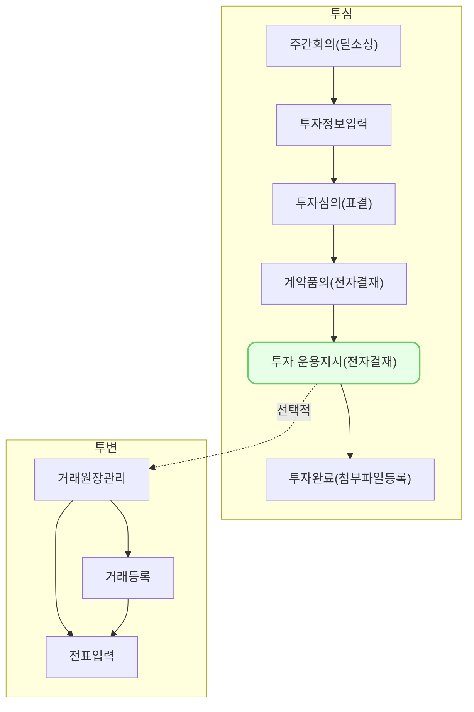

투자 운용지시는,
투자 계약서의 품의/결재를 통해 계약서 내용의 확정이 되어
수탁은행에게 투자금 납입을 위한 운용지시의 **전자 결재** 기능 입니다.
## 동영상



## 설명
> 투자 운용지시 기능을 사용하기 위해서는 아래의 사전 조건이 충족 되어야 합니다.
> 1. **계약품의 결재가 [승인] 상태 일 것**
> 2. **회사정보** 탭의 [표준산업분류코드] 입력
> 3. **[납입] 단계 일것**
> {: .prompt-tip }
#### 1. 운용지시서 등록 및 결재요청
위 조건이 충족된 경우, 아래의 과정을 통해
**운용지시서 품의 결재요청**이 가능합니다.

1. [운용지시서]탭으로 이동
2. 테이블에 표시된 내용을 확인 후, [운용지시서 등록↗] 클릭
3. 화면 이동 후, 운용지시서 개요 섹션의 [담당자], [운용지시일], [기타 기재사항] 확인 및 수정
4. 그 외 정보 확인 후, 스크롤을 내리고 **입출금 내역** 좌측 하단의 [+] 버튼 클릭
5. 행이 추가되었다면, 필수 입력 항목을 입력 후 [저장] 클릭
6. 저장이 완료 되었다면, 우측 상단의 [전자 결재] 클릭
7. 운용지시서 [제목] 입력
8. 표시 정보 확인 후, 이상 없는 경우 우측 상단의 [지정] 클릭
9. 화면 오른쪽 입력창내 조직도 리스트에서 결재자 선택 후, [결재 추가] 클릭
10. [반영]클릭
11. 반영이 완료 되었다면, 우측 상단의 [결재 요청] 클릭
12. **운용지시서 결재 요청 완료**

#### 2. 결재/합의
결재 요청이 완료된 후, 아래의 과정을 통해
**결재**가 가능합니다.

1. 결재자로 지정된 계정으로 로그인
2. 좌측 메뉴의 **전자 결재 > 받은 문서함 > [결재/합의]** 로 이동
3. 내용 확인 후 [결재합의필요] 문서 클릭
4. 문서의 상세 내용 확인 후, [승인] 클릭
5. 결재 승인 모달내 의견 등록 후 [확인] 클릭
6. **승인 완료**
#### 2-1. 참조/열람
결재 요청이 완료된 후, 아래의 과정을 통해
**참조/열람**가 가능합니다.

1. 참조/열람자로 지정된 계정으로 로그인
2. 좌측 메뉴의 **전자 결재 > 받은 문서함 > [참조/열람]** 으로 이동
3. 내용 확인 후 [확인필요] 문서 클릭
4. 문서의 상세 내용 확인
5. **참조/열람 완료**

#### 2-2. 처리
결재 요청이 완료된 후, 아래의 과정을 통해
**처리**가 가능합니다.

1. 처리자로 지정된 계정으로 로그인
2. 좌측 메뉴의 **전자 결재 > 받은 문서함 > [처리]** 로 이동
3. [처리 필요]탭내 [처라필요] 문서 클릭
4. 문서의 상세 내용 확인 및 [처리] 클릭
5. 처리 확인 모달내 [확인] 클릭
6. **처리 완료**

## 자주 묻는 질문

> 운용지시서 결재 요청중 브라우저가 꺼졌습니다. 다시 재 진입을 하려면 어떻게 해야하나요?
{: .prompt-tip }

- 아래의 경로를 통해 다시 운용지시서 결재 요청 화면으로 재 진입 하실 수 있습니다.
	1. 투자/회수 > 회수 > 운용 지시서 > [운용지시서 목록]에서 해당하는 운용지시서 클릭
	2. 투자/회수 > 투자심의 > 해당 카드 클릭 > 운용지시서 탭 클릭 > [운용지지서 상세↗] 클릭

> 재 진입은 했는데, 수정이 불가합니다.
{: .prompt-tip }

- 우측 상단의 […더보기] 를 클릭 하신 후, [수정]을 클릭 하시면, 수정이 가능해집니다.

> 결재가 반려되어 재 결재를 올려야 하는데 재 요청은 어떻게 진행하나요?
{: .prompt-tip }

- 운용지시서 메뉴, 또는 투자심의 메뉴를 통해, 운용지시서 상세에 진입 하신 수, [수정]을 누르셔서 동일한 과정을 거쳐, 재 요청이 가능 합니다.

## 선후행 구조도

