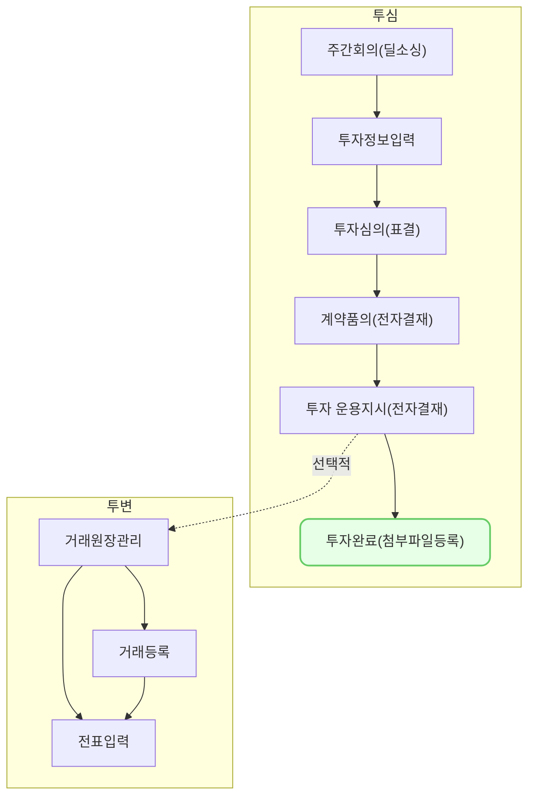

투자심의의 첨부파일 등록은,\
 IR자료, Term Sheet부터 투자 후 주주명부 등등
**투자심의 과정에서 필요한 파일들을 첨부, 보관**하기 위한 기능 입니다.

## 동영상



## 설명
> 첨부파일 기능은 특별한 조건없이 사용이 가능합니다. 
{: .prompt-tip }
### 1. 파일 첨부

1. [첨부파일]탭으로 이동
2. [수정]버튼 클릭
3. 첨부할 파일의 [파일 선택] 클릭
4. 로컬에서 파일 선택
5. **파일 첨부 완료**
## 자주 묻는 질문

> 한 개의 서류명에 여러 파일을 동시에 첨부가 가능한가요?
{: .prompt-tip }

- 동시 첨부는 어려우며, 최신 버전등으로 업데이트가 일어난 경우, 기존 파일을 삭제하시고 다시 첨부하시는 것이 가능합니다.

## 선후행 구조도

