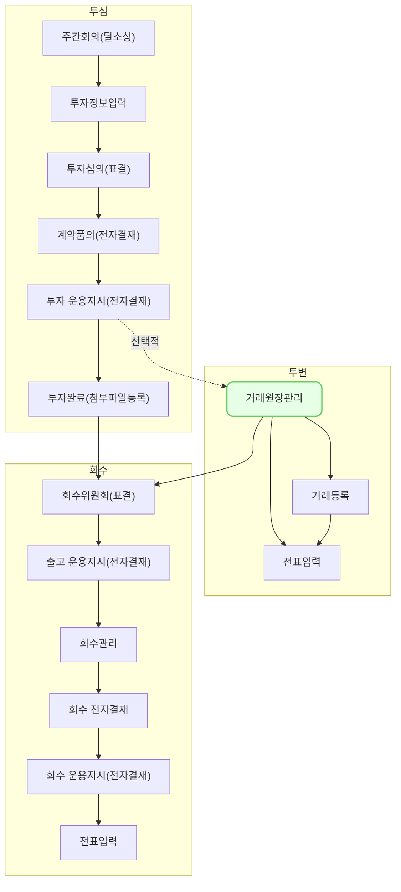

거래 원장 관리 (pm0001)에서는 포트폴리오 및 투자 내역에 발생한 모든 거래 내역을 조회하고, 거래로 인한 잔액 변동을 조회하는 방법을 설명합니다.

## 동영상



## 설명
- `투자/회수-거래 원장 관리`에서는 투자부터 회수까지 발생한 모든 거래 내역을 조회할 수 있습니다.
- 또한, 발생한 거래로 인해 발생한 투자 내역별 투자 잔액, 누적 손익, 보유주식 수, 현금흐름의 변동을 조회할 수 있습니다.
- 탭 변경을 통해 투자 거래와 관련된 내역을 다르게 조회할 수 있습니다.
	- `전체` 탭에서는 모든 투자 내역을 바탕으로 발생한 거래 내역을 조회할 수 있습니다.
	- `투자내역별` 탭에서는 투자 내역별 누적 잔액 및 손익 값 등을 조회할 수 있습니다.
- 등록한 거래내역을 바탕으로 운용지시서를 생성하는 기능은 추후 업그레이드 예정입니다.

#### 거래 원장 내역 조회

VCworks에서 발생한 모든 투자 거래 내역과 관련된 정보를 조회할 수 있습니다.

###### `거래 원장 관리-전체` 탭 조회
1. 투자 내역을 바탕으로 발생한 모든 거래 내역을 조회할 수 있습니다.
	- 주요 투자 조건 (포트폴리오, 재원, 투자유형) 틀 고정 기능을 통해 거래 내역의 투자 조건을 더 쉽게 식별할 수 있습니다.
2. `조합 통화로 보기`를 토글을 통해 발생한 모든 거래 내역을 각 조합에서 설정한 통화로 조회할 수 있습니다.
3. 표 타이틀 옆 정렬 버튼을 통해 거래 내역을 정렬할 수 있습니다.
4. 표 하단에 제공되는 필터를 통해 선택한 조건의 거래만 조회할 수 있습니다.

###### `거래 원장 관리-투자내역별` 탭 조회
1. 투자 내역에서 발생한 모든 거래를 바탕으로 조회 시점의 투자잔액, 회수원금, 누적손익 등을 조회할 수 있습니다.
	- 주요 투자 조건 (포트폴리오, 재원, 투자유형) 틀 고정 기능을 통해 거래 내역의 투자 조건을 더 쉽게 식별할 수 있습니다.
2. `조합 통화로 보기`를 토글을 통해 투자 내역별 현황 데이터를 각 조합에서 설정한 통화로 조회할 수 있습니다.
3. 표 타이틀 옆 정렬 버튼을 통해 거래 내역을 정렬할 수 있습니다.
4. 표 하단에 제공되는 필터를 통해 선택한 조건의 투자 조건만 조회할 수 있습니다.
5. 투자 내역 행을 클릭하면 해당 투자 내역으로 발생한 모든 거래 내역의 히스토리를 조회할 수 있습니다.
6. 합계 행을 통해 화면 상에 있는 모든 투자 조건의 투자 금액, 회수 원금, 누적 손익, 회수 총액, 투자 잔액의 합을 조회할 수 있습니다.

## 자주 묻는 질문

> 조합 통화가 뭔가요?
{: .prompt-tip }
- 조합원 출자 시, 출자금의 기준이 되는 통화입니다.
- 조합 통화와 투자 거래 시에 사용하는 거래 통화가 다른 경우, 기준 통화를 변경해서 조회할 수 있도록 토글을 제공하고 있습니다.

> 틀 고정 영역을 직접 설정할 수 있나요?
{: .prompt-tip }
- 틀 고정 영역을 직접 설정할 수 있는 기능은 현재 제공하고 있지 않습니다.
- 각종 그리드 커스텀 기능은 고객사의 수요를 파악하여 순차적으로 업데이트 할 예정입니다.
- 커스텀 필요한 영역이 있다면 we@dkdk.kr로 의견을 보내주세요.

> `투자내역별`탭에서 특정 투자 조건을 찾을 수 없습니다.
{: .prompt-tip }
- `투자내역별` 탭에서는 투자 금액 전액에 대해 전환권을 행사한 투자 조건을 표시하지 않습니다.
- 전환권 행사 이후의 투자 조건을 클릭하시면 관련 거래 내역을 조회할 수 있습니다.

> 필터를 걸었는데, 거래 상세 화면을 조회하고 나오면 필터가 해제되어있습니다. 직전에 설정했던 필터를 고정해둘 순 없나요?
{: .prompt-tip }
- 직전에 설정해두었던 필터를 고정해두는 기능은 현재 제공하고 있지 않습니다.
- 직전 필터 고정 기능, 필터 프리셋 기능은 고객사의 수요를 파악하여 순차적으로 업데이트 할 예정입니다.
- 필터와 관련해서 필요한 기능이 있다면 we@dkdk.kr로 의견을 보내주세요.

## 선후행 구조도

