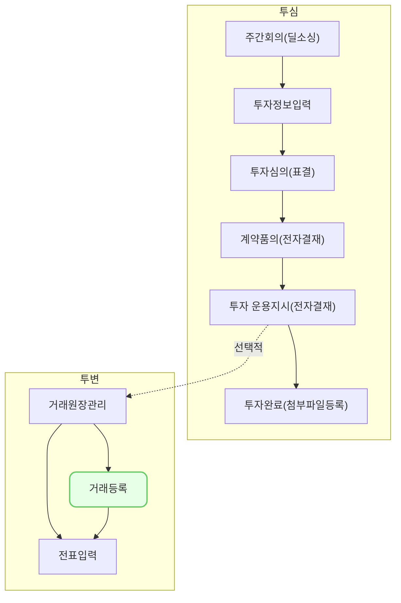

거래 원장 관리 (pm0001)에서는 포트폴리오 및 투자 내역에 발생한 거래를 VCworks에 등록하는 방법을 설명합니다.

## 동영상



## 설명
- `투자/회수-거래 원장 관리`에서는 투자부터 회수까지 발생한 거래를 등록할 수 있습니다.

#### 거래 등록 및 수정

VCworks에서 포트폴리오 및 투자 내역별로 발생한 거래를 등록 및 수정하는 방법은 다음과 같습니다.

###### 거래 등록
1. `투자/회수-거래 원장 관리`에서 `거래 등록` 버튼을 클릭해 주세요.
2. `거래 등록 모달`에서 등록하고자 하는 거래의 거래일, 거래유형, 포트폴리오를 선택해 주세요.
	- 포트폴리오를 선택하시면, 해당 포트폴리오로 투자한 내역이 `투자 내역` 섹션에 나타납니다.
	- 거래 등록이 필요한 투자 조건의 체크 박스를 전부 클릭해 주세요.
3. `다음`버튼을 클릭해 주세요.
	- `거래 등록 모달`에서 선택한 투자 조건에 대한 거래를 순차적으로 입력할 수 있는 화면이 제공됩니다.
		- `이전 문서`, `다음 문서` 버튼을 통해, 거래를 먼저 입력할 투자 조건을 선택할 수 있습니다.
4. 거래와 관련된 정보를 입력해 주세요.
	ⅰ. 거래를 통해 총발행주식수 또는 액면가의 변동이 있었다면, 발행 주식 내역 섹션에 거래일 기준의 값을 입력해 주세요.
	ⅱ. 거래를 통해 원금, 손익, 보유 주식 수의 변동이 있었다면, 거래 내역 섹션에 변동 사항을 입력해 주세요.
	ⅲ. (감액 손실 거래를 입력하는 경우) 감액 사유 및 조지사항을 입력해 주세요.
	ⅳ. 거래와 관련된 첨부파일이 있다면, `파일선택`을 통해 첨부할 수 있습니다.
	- 파일 개수 제한 없이 50MB까지 첨부할 수 있습니다.
5. `저장` 버튼을 클릭해 주세요.
	- 선택한 투자 조건으로 발생한 거래 내역이 저장됩니다.
	- 동시에 다음으로 선택한 투자 조건에 대한 거래 내역 등록 화면이 제공됩니다.
	- 만약 거래 등록이 필요 없는 투자 조건을 잘못 선택했다면, `내역에서 제외`버튼으로 다음 투자 조건의 거래 화면으로 넘어갈 수 있습니다.
6. `거래 등록 모달`에서 투자 조건을 2개 이상 선택했다면, 선택한 모든 투자 조건에 대해 1~5를 연속적으로 진행해 주세요.

###### 거래 수정

#### 전환 거래 등록 및 수정

VCworks에서 포트폴리오 및 투자 내역별로 발생한 전환 거래를 등록 및 수정하는 방법은 다음과 같습니다.

###### 거래 등록
1. `투자/회수-거래 원장 관리`에서 `전환 등록` 버튼을 클릭해 주세요.
2. `거래 등록 모달`에서 등록하고자 하는 거래의 거래일, 전환 거래유형, 포트폴리오를 선택해 주세요.
	- 포트폴리오를 선택하시면, 해당 포트폴리오로 투자한 내역이 `투자 내역` 섹션에 나타납니다.
	- 전환 거래 등록이 필요한 투자 조건의 체크 박스를 전부 클릭해 주세요.
		- 선택한 전환 거래 유형에 맞는 투자 조건만 전환 거래를 입력할 수 있습니다.
3. `다음`버튼을 클릭해 주세요.
	- `거래 등록 모달`에서 선택한 투자 조건에 대한 거래를 순차적으로 입력할 수 있는 화면이 제공됩니다.
	- `이전 문서`, `다음 문서` 버튼을 통해, 거래를 먼저 입력할 투자 조건을 선택할 수 있습니다.
4. 전환 거래와 관련된 정보를 입력해 주세요.
	ⅰ. 전환 거래를 통해 총발행주식수 또는 액면가의 변동이 있었다면, 발행 주식 내역 섹션에 거래일 기준의 값을 입력해 주세요.
	ⅱ. 전환 거래 섹션에서 전환권을 행사할 투자 조건(A)과 전환권 행사로 파생된 투자 조건(B)에서 발생한 거래 내역을 입력해 주세요.
	- 첫번째 행에는 (A)투자 조건에서 발생한 거래 내역을 입력합니다.
		- `거래 유형`이 `워런트 행사` 또는 `전환 사채 전환`인 경우, 전환권 행사 원금을 입력할 수 있습니다.
		- `거래 유형`이 `주식전환`인 경우, 전환권 행사 주식 수를 입력할 수 있습니다.
		- 전환권 행사로 인해 단주대금이 발생하는 경우 첫번째 행에 입력해 주세요.
			- 단주대금이 발생한 금액 만큼을 제외한 금액에 대해 전환권을 행사할 수 있도록 거래 총액이 자동 계산됩니다.
	- 두번째 행에는 (B)투자 조건에서 발생한 거래 내역을 입력합니다.
		- 투자유형을 먼저 선택해야 세부 투자유형을 선택할 수 있습니다.
		- 전환권 행사로 파생된 투자 조건이 `채권`인 경우, 전환권 행사 원금을 입력할 수 있습니다.
		- 전환권 행사로 파생된 투자 조건이 `주식`인 경우, 전환권 행사 주식 수를 입력할 수 있습니다.
	ⅲ. `투자조건 입력` 버튼을 클릭해 전환권 행사로 인해 파생된 투자 조건(B)의 투자 조건을 입력해 주세요.
	ⅳ.  거래와 관련된 첨부파일이 있다면, `파일선택`을 통해 첨부해 주세요.
5. `저장` 버튼을 클릭해 주세요.
	- 원장에 투자조건(A)와 투자조건(B)에 대한 전환 거래 내역이 등록됩니다.
6. `거래 등록 모달`에서 투자 조건을 2개 이상 선택했다면, 선택한 모든 투자 조건에 대해 1~5를 연속적으로 진행해 주세요.

## 자주 묻는 질문

> 거래 등록/수정이 안됩니다. (이전일자)
{: .prompt-tip }
- 투자 잔액 이상의 원금을 차감하는 거래는 등록할 수 없습니다.
- 이전에 등록한 거래를 수정하는 경우에도 마찬가지로 수정 사항이 투자 잔액 이상의 원금을 차감하는 경우 수정할 수 없습니다.
- 등록/수정 직전의 투자잔액을 확인해주세요.

> 다른 거래를 입력하고 싶은데, `거래 유형`에서 유형을 찾을 수 없어요.
{: .prompt-tip }
- 현재 거래 원장 관리에서 등록 가능한 거래 유형은 총 18개 입니다.
	- 감액손실, 감액손실환입, 무상감자, 기타수익, 무상증자, 액면분할, 유상감자, 이자, 총발행주식수 변경, 주식병합, 주식소각, 주식증여, 청산, 현금배당, 단주대금, 워런트행사, 전환사채전환, 주식전환 
	- [참고] 투자 거래는 `투자 심의`, 회수 거래는 `회수 관리`에서 등록할 수 있습니다.
- 지원하는 목록 이상의 거래 유형으로도 거래를 등록할 수 있도록 순차적으로 업그레이드 예정입니다.

> `거래 등록` 모달에서 포트폴리오를 선택해도 일부 투자 조건이 보이지 않습니다.
{: .prompt-tip }
- `거래 등록` 모달에서 선택한 거래일을 기준으로 회수 완료되거나 전환 거래로 인해 투자잔액이 0인 투자 조건은 목록에서 제공되지 않습니다.
- 거래일을 조정하거나, 거래 등록을 원하는 투자 조건의 거래 내역을 수정/삭제해 주세요.

> `거래 등록 모달`에서 투자 조건 선택이 안됩니다.
{: .prompt-tip }
- `거래유형`을 `총발행주식수 변경`으로 선택한 경우, 전체 투자 내역을 대상으로 거래가 등록되기 때문에 투자 내역을 선택할 수 없습니다.
- `거래일` 기준, 투자 잔액이 0미만인 투자 내역은 거래를 입력할 수 없습니다. (감액 손실로 인한 내역 제외) 거래 일을 조정하거나, 기존에 등록된 거래 내역을 수정해 주세요.

> 거래 등록 시에는 거래일, 거래유형, 포트폴리오, 투자 조건을 변경할 수 없나요?
{: .prompt-tip }
- `거래 등록` 모달에서 선택한 거래일, 거래 유형, 포트폴리오, 투자 조건은 등록 화면에서 수정이 불가능합니다.
- 해당 항목의 수정을 원하시면, 브라우저 새로고침 후, 거래 등록 프로세스를 재진행해 주세요.

> 거래일, 거래 유형, 포트폴리오, 투자 조건을 수정하고 싶습니다.
{: .prompt-tip }
- 이미 등록한 거래 내역의 거래일, 거래 유형, 포트폴리오, 투자 조건은 수정이 불가능합니다.
- 해당 항목의 수정을 원하시면, 삭제 후 신규 등록해 주세요.

> 전환 거래 내역 수정이 안됩니다.
{: .prompt-tip }
- 거래 금액을 수정하려는 경우
	- 투자 잔액 이상의 원금을 차감하려는 경우 수정할 수 없습니다.
	- 투자 잔액 이하의 원금을 입력해 주세요.
- 투자 유형을 수정하려는 경우
	- 전환 거래로 인해 파생된 투자 조건으로 1건 이상의 거래가 등록된 경우 전환 거래 내역 수정은 불가능합니다.
	- 파생된 투자 내역으로 등록된 거래를 전부 삭제하시면 투자 유형을 수정하실 수 있습니다.

> 전환거래로 인해 발생한 단주대금을 회수하고 싶어요.
{: .prompt-tip }
- 전환 거래 시 단주대금을 입력하셨다면, 전환권을 행사한 투자 조건(A)에 남아있는 투자잔액을 회수할 수 있습니다.
- 거래 유형을 `단주대금`으로 선택한 후, 해당 금액에 대한 회수 거래 내역을 등록해 주세요.

## 선후행 구조도

