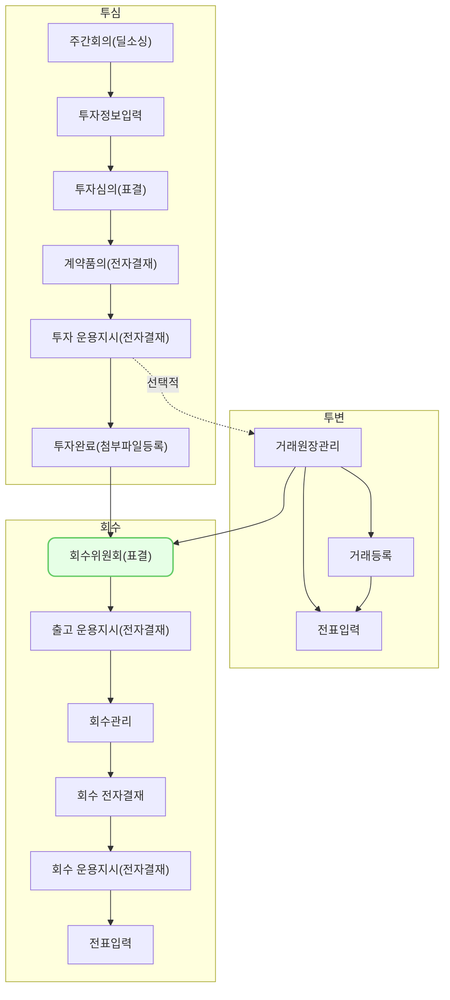

회수위원회 (ex0001)에서는 포트폴리오의 회수를 위해 필요한 전략 및 위원회 정보를 관리하는 방법을 설명합니다.

## 동영상



## 설명
- `투자/회수 > 회수 > 회수위원회`에서 포트폴리오 회수를 위해 필요한 전략 및 위원회 정보를 관리할 수 있습니다.

#### 회수 위원회 등록
1. `신규 등록` 버튼을 클릭해 주세요.
- 우측에서 `회수위원회 등록` 창이 열립니다.
2. 회수 예정 포트폴리오와 재원을 선택해 주세요.
	- 포트폴리오를 먼저 선택하시면, 해당 포트폴리오에 투자한 재원을 선택할 수 있습니다.
	- 같은 회수 전략으로 회수를 진행할 재원만 선택해 주세요.
3. `저장` 버튼을 클릭해 주세요.

#### 회수 전략 및 위원회 정보 입력
1. `회수위원회` 목록에서 `회수 위원회 등록` 으로 인해 추가된 행을 클릭해 주세요.
	- 포트폴리오별 회수 전략 및 위원회 정보를 입력할 수 있는 상세 화면으로 이동합니다.
2. 회사/투자 정보, 회수 계획, 회수위원회, 회수내역, 첨부파일 내역에서 회수 시 필요한 정보를 등록 및 관리할 수 있습니다.
	- 아래의 설명을 참고해서 회수 위원회 정보를 입력해 주세요.

##### 회사/투자 정보 탭
- VCworks에서 관리하고 있는 포트폴리오에 대한 영업 실적 및 투자/회수 현황 정보를 조회하고 수정할 수 있습니다.
	- 포트폴리오에 대한 정보는 `회수 위원회 등록` 시점의 정보를 바탕으로 생성됩니다.
- `수정` 버튼을 클릭해서 투자 라운드 정보, 영업 현황을 수정할 수 있습니다.

##### 회수 계획 탭
-  회수위원회 등록 시 선택한 재원에 대한 회수 전략을 입력할 수 있습니다.
1. `수정` 버튼을 클릭해 주세요.
2. 회수 전략 정보를 입력해 주세요.
	ⅰ. 회수 전략 섹션
	- 포트폴리오에 대한 전반적인 회수 전략을 입력할 수 있습니다.
	ⅱ. 투자 내역별 회수 전략 상세
	- 투자 내역별로 구체적인 회수 전략이 정해진 경우 선택적으로 입력할 수 있습니다.
	- `투자내역 불러오기` 버튼을 클릭해 주세요.
		- 회수위원회 등록 시 선택한 재원으로 투자한 투자 내역을 불러옵니다.
		- 불러온 투자내역 별로 회수 계획 상세 내용을 입력해 주세요.
			- 투자유형이 주식인 경우, 주당 거래단가와 매각 주식수를 입력하면 원금과 손익이 자동 계산됩니다.
			- 투자유형이 채권인 경우, 회수원금과 회수손익을 직접 입력해 주세요.
	- 불러온 정보와 입력한 내용을 바탕으로 투자와 회수 소계를 확인할 수 있습니다.
	ⅲ. 담당 심사역 의견
	- 입력한 회수 전략에 대한 담당 심사역의 의견을 입력할 수 있습니다.
3. `저장` 버튼을 눌러서 저장해 주세요.

[tip] 회수 계획 탭에서 입력한 정보를 바탕으로 회수 계획서를 출력할 수 있습니다.
1. 우측 상단 `더보기` 버튼을 클릭해 주세요.
2. `회수 계획서 프린트`를 클릭해 주세요.
3. 미리보기 내용에서 출력할 회수 계획서를 확인한 후, `인쇄`를 클릭해 주세요.

##### 회수 위원회 탭
- 회사/투자 정보, 회수 계획 탭에서 입력한 정보를 바탕으로 재원별 회수 위원회를 개최할 수 있습니다.

###### [회수 위원회 개최]
1. `수정` 버튼을 클릭해 주세요.
2. 각 재원별 회수 위원회 정보를 입력해 주세요.
	ⅰ. 개최일시, 장소, 안건명을 입력해 주세요.
	- [tip] 모든 재원별 회수위원회의 개최일시, 장소, 안건 정보가 동일하다면 `데이터 일괄 적용` 버튼을 클릭해 주세요.
	ⅱ.  재원별 회수위원회 참석자를 입력해 주세요.
	- (해당 조합의) 대표펀드매니저, 핵심운용인력, 담당심사역인 경우, 자동으로 지정됩니다.
	- 하단의 버튼을 통해 참석자 명단을 수정할 수 있습니다.
3. `저장` 버튼을 클릭해 주세요.
4. `표결요청` 버튼을 클릭해 주세요.
	- 우측에서 회수 위원회 개최 정보와 관련된 창이 열립니다.
	- 내용 확인 후, 우측 상단 `표결 요청` 버튼을 클릭해 주세요.
	- 요청 시, 재원별 회수위원회 참석자에게 요청 안내 메일이 전송됩니다.
	- 재원별 회수위원회 상태가 `투표중` 상태로 변경됩니다.
		- `투표중` 상태에서는 `의견 등록` 버튼을 통해 참석자 별로 재원별 회수위원회의 의견을 입력할 수 있습니다.
		- `투표중` 상태에서는 `표결 상세` 버튼을 통해 참석자 별로 입력한 의견을 조회할 수 있습니다.

###### [회수 위원회 의견 등록]
1. `의견 등록` 버튼을 클릭해 주세요.
	- 우측에서 회수 위원회 개최 정보 및 의견을 입력할 수 있는 창이 열립니다.
2. 의견을 등록하고자 하는 참석자를 클릭해 주세요
	- 찬성/반대를 선택해 주세요.
	- 의견이 있다면 입력해 주세요.
3. `저장` 버튼을 클릭해 주세요.

###### [회수 위원회 결과 등록]
1. 참석자 의견이 전부 수렴되면, `표결종료` 버튼을 클릭해 주세요.
	- 재원별 회수위원회 상태가 `투표종료` 상태로 변경됩니다.
	- `투표종료` 상태에서는 회수위원회 결과를 등록할 수 있습니다.
2. `결과 등록` 버튼을 클릭해 주세요.
3. 참석자 투표 결과를 바탕으로 `부결`, `가결`을 선택해 주세요.
	- 결과 선택 시, 재원별 회수위원회의 상태가 `부결` 또는 `가결`로 변경 됩니다.
	- `부결` 또는 `가결`인 재원별 회수위원회는 `결과 출력` 버튼을 통해 의사록을 출력할 수 있습니다.
	- `가결` 상태인 재원만 회수 관리 메뉴에서 회수 내역을 입력할 수 있습니다.

##### 회수내역 탭
- 해당 회수 위원회 전략으로 회수 관리 메뉴에 등록된 회수 내역을 조회할 수 있습니다.
- 행 클릭 시 회수 내역 상세 화면으로 이동합니다.

##### 첨부파일 탭
- 해당 회수 진행 시 필요한 첨부파일을 관리할 수 있습니다.
- `수정` 버튼을 클릭하여 라벨에 맞는 첨부파일을 첨부해 주세요.

#### 회수 전략 및 위원회 사용 종료
- 등록한 회수 위원회 전략으로 전액 회수가 이루어진 경우, 자동으로 종료됩니다.
- `회수위원회 종료` 버튼을 통해 재원별로 사용 상태를 관리할 수 있습니다.

## 자주 묻는 질문

> 회수위원회에서 회수를 하고자 하는 포트폴리오를 선택하려는데, 리스트에서 보이지 않습니다.
{: .prompt-tip }
- 투자 잔액이 0 이상인 기업만 선택할 수 있도록 제공하고 있습니다.
- `거래 원장 관리` 메뉴에서 해당 기업의 투자 잔액을 확인해 주세요.

> 회수위원회 정보를 수정하려는데, `수정` 버튼이 비활성화 되어있어요.
{: .prompt-tip }
- 회수위원회가 개최된 이후에는 회사/투자 정보를 비롯한 회수위원회 정보는 수정할 수 없습니다.
- 기입한 정보와 다른 전략으로 회수를 진행하시려면, 해당 회수위원회를 `종료` 후, 새로 생성해 주세요.

> 회수위원회 상세 화면에서 참석자별 의견을 조회하는 방법이 궁금합니다
- 회수위원회 표결이 진행중인 경우, `표결상세` 버튼을 통해 참석자별 의견을 조회할 수 있습니다.
- 투표가 종료된 경우, `결과 출력` 버튼을 통해 참석자별 의견을 조회할 수 있습니다.

## 자주 묻는 질문

> 질문1?
{: .prompt-tip }

- 답변1

## 선후행 구조도

