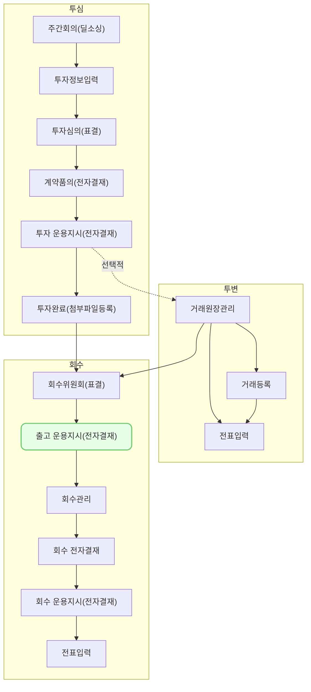

출고 운용지시 및 전자결재 (oi0001)에서는 포트폴리오 회수 전 수탁 은행에 전송할 운용지시서를 등록하는 방법과 등록한 운용지서서에 대한 전자결재를 상신하는 방법을 설명합니다.

## 동영상



## 설명
- `투자/회수 > 운용지시서`에서 기타 및 출고요청 운용지시서를 등록할 수 있습니다.

#### 출고요청 운용지시서 등록
1. `신규 등록` 버튼을 클릭해 주세요.
	- 우측에서 `운용지시서 등록` 창이 열립니다.
2. 운용지시 구분을 `출고요청`으로 선택해 주세요.
	- 출고요청 운용지시서를 등록한 조합, 요청 서류를 선택할 수 있습니다.
3. 계좌정보가 연결된 조합을 선택해 주세요.
4. 수탁은행에 출고를 요청할 서류를 선택해 주세요.
  - 주권 미발행 확인서, 증권카드, 증권카드 및 전표 날인 서류를 요청할 수 있습니다.
  - 선택한 서류의 종류에 따라 입력이 필요한 항목이 달라집니다.
  - 주권 미발행 확인서 서류 선택 시, 포트폴리오를 선택할 수 있습니다.
    - 증권카드 서류 선택 시, 포트폴리오 및 증권카드 번호를 선택할 수 있습니다.
    - 증권카드 및 전표 날인 서류 선택 시, 포트폴리오 및 증권카드 번호를 선택할 수 있습니다.
5. 각 서류에 필요한 항목을 선택해 주세요.
6. `다음`버튼을 클릭해 주세요.
	- 운용지시서 등록 화면으로 이동합니다.
7. 운용지시서 요청 시 필요한 항목을 입력해 주세요.
	- 담당자, 운용지시일, 기타 기재사항을 선택 및 입력할 수 있습니다.
		- 기타기재사항 항목에서는 각 요청 서류에 맞는 문구가 기본으로 제공됩니다.
		- 요청 내용에 맞게 수정해서 작성해 주세요.
	- 출고요청 운용지시서에 첨부해야 할 파일을 선택할 수 있습니다.
		- 첨부 파일은 개수 제한 없이 50MB까지 첨부할 수 있습니다.
8. `저장` 버튼을 클릭해 주세요.

#### 운용지시서 전자결재 상신
1. 품의를 상신할 운용지시서를 클릭해 주세요.
2. 운용지시서 상세 화면에서 `전자결재` 버튼을 클릭해 주세요.
3. 기안일, 제목 등 기안 시 필요한 정보를 입력해 주세요.
4. 결재선 `지정` 버튼을 클릭해 결재라인을 지정해 주세요.
5. `결재요청` 버튼을 클릭해 주세요.

## 자주 묻는 질문

> 증권카드를 선택하려는데, `데이터가 없습니다` 라고 뜹니다. 
{: .prompt-tip }
- `운용지시서 등록` 창에서 조합을 먼저 선택하셔야 증권카드 번호 리스트가 제공됩니다.
- 조합을 선택해도 여전히 선택할 수 있는 증권카드가 없다면, 새로고침 후 다시 시도해주세요.

## 선후행 구조도

