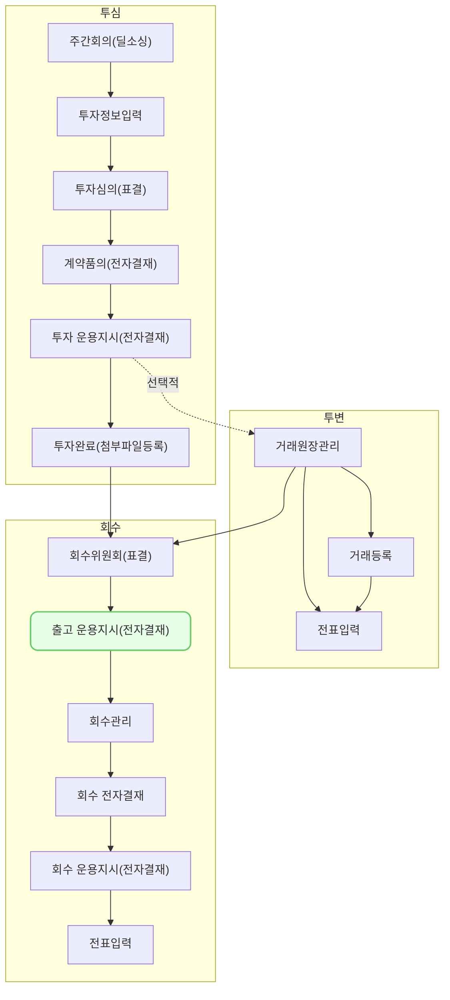

회수관리의 출고 운용지시는 전자결재의 

## 동영상



## 설명

## 자주 묻는 질문

> 질문1?
{: .prompt-tip }

- 답변1

## 선후행 구조도

```mermaid
flowchart TD


    subgraph 투자심의["투심"]
        wr0003["주간회의(딜소싱)"]
        vs0003["투자정보입력"]
        vs0006["투자심의(표결)"]
        ed0001a["계약품의(전자결재)"]
        oi0003["투자 운용지시(전자결재)"]
        vs0009["투자완료(첨부파일등록)"]

        
        
        wr0003 --> vs0003
        vs0003 --> vs0006
        vs0006 --> ed0001a
        ed0001a --> oi0003
        oi0003 --> vs0009

    end

    subgraph 투자변동관리["투변"]
        pm0001["거래원장관리"]
        pm0004["거래등록"]
        fm0002["전표입력"]

        oi0003 -.->|선택적| pm0001
        pm0001 --> fm0002
        pm0001 --> pm0004
        pm0004 --> fm0002
    end

    subgraph 회수관리["회수"]
        ex0001["회수위원회(표결)"]
        oi0001["출고 운용지시(전자결재)"]
        ex0007["회수관리"]
        ex0009["회수 전자결재"]
        ex0009a["회수 운용지시(전자결재)"]
        fm0002a["전표입력"]

        pm0001 --> ex0001
        ex0001 --> oi0001
        oi0001 --> ex0007
        ex0007 --> ex0009
        ex0009 --> ex0009a
        ex0009a --> fm0002a
        vs0009 --> ex0001


    end

    %% 셋팅 --> 결성
    
click hr0001 "{% post_url 2024-07-02-hr0001 %}" " "
click hr0002 "{% post_url 2024-07-02-hr0002 %}" " "
click hr0007 "{% post_url 2024-07-02-hr0007 %}" " "
click se0005 "{% post_url 2024-07-02-se0005 %}" " "
click se0003 "{% post_url 2024-07-03-se0003 %}" " "
click fd0001 "{% post_url 2024-07-04-fd0001 %}" " "
click fd0010 "{% post_url 2024-07-04-fd0010 %}" " "
click fd0011 "{% post_url 2024-07-04-fd0011 %}" " "
click fm0010 "{% post_url 2024-07-04-fm0010 %}" " "
click fd0009a "{% post_url 2024-07-05-fd0009a %}" " "
click fd0013 "{% post_url 2024-07-05-fd0013 %}" " "
click fd0012 "{% post_url 2024-07-06-fd0012 %}" " "
click fd0006 "{% post_url 2024-07-07-fd0006 %}" " "
click oi0002 "{% post_url 2024-07-07-oi0002 %}" " "
click wr0003 "{% post_url 2024-07-09-wr0003 %}" " "
click vs0003 "{% post_url 2024-07-10-vs0003 %}" " "
click vs0006 "{% post_url 2024-07-11-vs0006 %}" " "
click ed0001a "{% post_url 2024-07-12-ed0001a %}" " "
click oi0003 "{% post_url 2024-07-13-oi0003 %}" " "
click vs0009 "{% post_url 2024-07-14-vs0009 %}" " "
click pm0001 "{% post_url 2024-07-15-pm0001 %}" " "
click pm0004 "{% post_url 2024-07-16-pm0004 %}" " "
click fm0002 "{% post_url 2024-07-17-fm0002 %}" " "
click ex0001 "{% post_url 2024-07-18-ex0001 %}" " "
click oi0001 "{% post_url 2024-07-19-oi0001 %}" " "
click ex0007 "{% post_url 2024-07-20-ex0007 %}" " "
click ex0009 "{% post_url 2024-07-21-ex0009 %}" " "
click ex0009a "{% post_url 2024-07-22-ex0009a %}" " "
click fm0002a "{% post_url 2024-07-23-fm0002a %}" " "

style oi0001 fill:#e6ffe6,stroke:#66cc66,stroke-width:2px,rx:10,ry:10,color:#333333,fontColor:#333333

```
