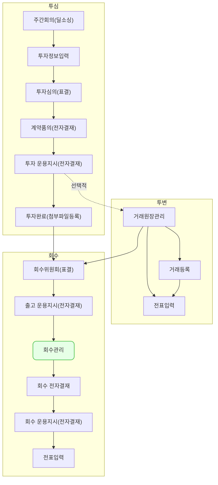

회수 관리 (ex0007)에서는 투자 내역별로 발생한 회수 거래를 VCworks에 등록하는 방법을 설명합니다.

## 동영상



## 설명
- `투자/회수-회수 관리`에서는 회수위원회를 바탕으로 발생한 거래를 등록할 수 있습니다.
	- [tip] 회수위원회가 `가결`된 포트폴리오의 투자 내역만 회수 관리에서 거래 내역을 등록할 수 있습니다.
- 투자 내역을 2개 이상 선택한 경우, 선택한 투자 내역에 대한 거래를 연달아서 입력할 수 있습니다.

#### 회수 거래 등록 및 수정

VCworks에서 포트폴리오 및 투자 내역별로 발생한 거래를 등록 및 수정하는 방법은 다음과 같습니다.

##### 회수 거래 등록
1. `투자/회수-회수 관리`에서 `신규 등록` 버튼을 클릭해 주세요.
2. `거래 등록 모달`에서 등록하고자 하는 거래의 거래일, 포트폴리오를 선택해 주세요.
	- 포트폴리오를 선택하시면, 해당 포트폴리오로 투자한 내역이 `투자 내역` 섹션에 나타납니다.
	- 거래 등록이 필요한 투자 조건의 체크 박스를 전부 클릭해 주세요.
		- 회수 내역을 입력하기 전에 `회수위원회` 메뉴에서 위원회 개최해 주세요.
		- 회수위원회가 `가결`된 투자 내역만 회수 거래를 입력할 수 있습니다.
3. `다음`버튼을 클릭해 주세요.
	- `거래 등록 모달`에서 선택한 투자 조건에 대한 거래를 순차적으로 입력할 수 있는 화면이 제공됩니다.
		- `이전 문서`, `다음 문서` 버튼을 통해, 거래를 먼저 입력할 투자 조건을 선택할 수 있습니다.
4. 거래와 관련된 정보를 입력해 주세요.
	- 회수 방법, 매수자 정보를 처분구분 및 매수자 섹션에 입력해 주세요.
	- 회수 원금, 손익, 거래 주식 수 등 주요 거래 정보를 회수 내역 섹션에 입력해 주세요.
	- LP보고를 위한 처분구분 항목을 선택해 주세요.
5. `저장` 버튼을 클릭해 주세요.
	- 선택한 투자 조건으로 발생한 회수 거래 내역이 저장됩니다.
	- 동시에 다음으로 선택한 투자 조건에 대한 거래 내역 등록 화면이 제공됩니다.
	- 만약 거래 등록이 필요 없는 투자 조건을 잘못 선택했다면, `내역에서 제외`버튼으로 다음 투자 조건의 거래 화면으로 넘어갈 수 있습니다.
6. `거래 등록 모달`에서 투자 조건을 2개 이상 선택했다면, 선택한 모든 투자 조건에 대해 1~5를 연속적으로 진행해 주세요.

##### 회수 거래 내역 수정
1. `투자/회수-회수 관리`에서 수정을 원하는 행을 클릭해 주세요.
2. 우측 상단 `더보기` > `수정`을 클릭해 주세요.
3. 수정을 원하는 정보를 입력하신 후, `저장`버튼을 클릭해 주세요.

## 자주 묻는 질문

> 회수 거래 등록/수정이 안됩니다.
{: .prompt-tip }
- 등록/수정 직전의 투자잔액을 확인해주세요.
- 투자 잔액 이상의 원금을 차감하는 거래는 등록할 수 없습니다.
- 이전에 등록한 거래를 수정하는 경우에도 마찬가지로 수정 사항이 투자 잔액 이상의 원금을 차감하는 경우 수정할 수 없습니다.

> 회수 거래 등록 시에는 거래일, 포트폴리오, 투자 조건을 변경할 수 없나요?
{: .prompt-tip }
- `거래 등록` 모달에서 선택한 거래일, 거래 유형, 포트폴리오, 투자 조건은 등록 화면에서 수정이 불가능합니다.
- 해당 항목의 수정을 원하시면, 브라우저 새로고침 후, 거래 등록 프로세스를 재진행해 주세요.

> 회수 거래일, 포트폴리오, 투자 조건을 수정하고 싶습니다.
{: .prompt-tip }
- 이미 등록한 거래 내역의 거래일, 거래 유형, 포트폴리오, 투자 조건은 수정이 불가능합니다.
- 해당 항목의 수정을 원하시면, 삭제 후 신규 등록해 주세요.

## 선후행 구조도

