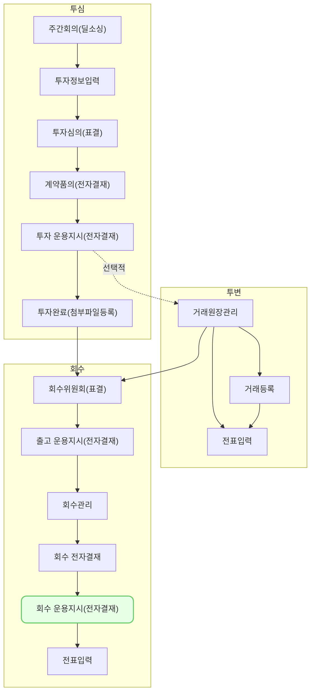

회수 운용지시 및 전자결재 (ex0009)에서는 작성한 회수 거래 내역을 바탕으로 회수 운용지시서(매각대금 운용지시서)를 등록하는 방법과 등록한 운용지시서에 대한 전자결재를 상신하는 방법을 설명합니다.

## 동영상



## 설명
- `투자/회수 > 회수 관리`에서 기 작성한 회수 거래내역에 대한 회수 운용지시서를 등록할 수 있습니다.

#### 회수 운용지시서(매각대금 운용지시서) 등록
1. `투자/회수-회수 관리`에서 운용지시서 생성을 원하는 회수 내역을 선택해 주세요.
2. 우측 상단 `운용지시서` 버튼을 클릭해 주세요.
	- [tip] 결재 상태가 `승인`인 회수 거래 내역만 운용지시서를 생성할 수 있습니다.
3. 운용지시서를 생성할 방식을 선택해 주세요.
	- 개별로 생성 생성 시, 선택한 회수 거래 내역 개수 만큼의 운용지시서가 생성됩니다.
	- 하나로 생성 선택 시, 선택한 회수 거래 내역에 대한 운용지시서가 생성됩니다.
		- 단, 동일한 재원으로 작성된 회수 거래내역을 선택한 경우에만 `하나로 생성`이 가능합니다.
4. 담당자, 운용지시일, 기타 기재사항, 입출금 내역 등 운용지시서 작성에 필요한 정보를 입력해 주세요.
5. 필요 시 첨부파일을 첨부해 주세요.
	- 첨부 파일은 개수 제한 없이 50MB까지 첨부할 수 있습니다.
7. `저장`버튼을 클릭해 주세요.

#### 회수 운용지시서 전자결재 상신
1. 운용지시서 상세 화면에서 `전자결재` 버튼을 클릭해 주세요.
3. 기안일, 제목 등 기안 시 필요한 정보를 입력해 주세요.
4. 결재선 `지정` 버튼을 클릭해 결재라인을 지정해 주세요.
5. `결재요청` 버튼을 클릭해 주세요.

## 자주 묻는 질문

> 꼭 회수 내역을 결재 해야만 운용지시서를 생성할 수 있나요?
{: .prompt-tip }
- 현재는 결재 승인된 회수 내역인 경우에만 운용지시서를 생성할 수 있습니다.
- VC별 프로세스에 맞게 프로세스를 수정할 수 있는 기능은 우선순위에 맞춰 업데이트 할 예정입니다.
- 기타 불편 사항이 있으시다면 [we@dkdk.kr](mailto:we@dkdk.kr)로 문의를 남겨주세요.

## 선후행 구조도

