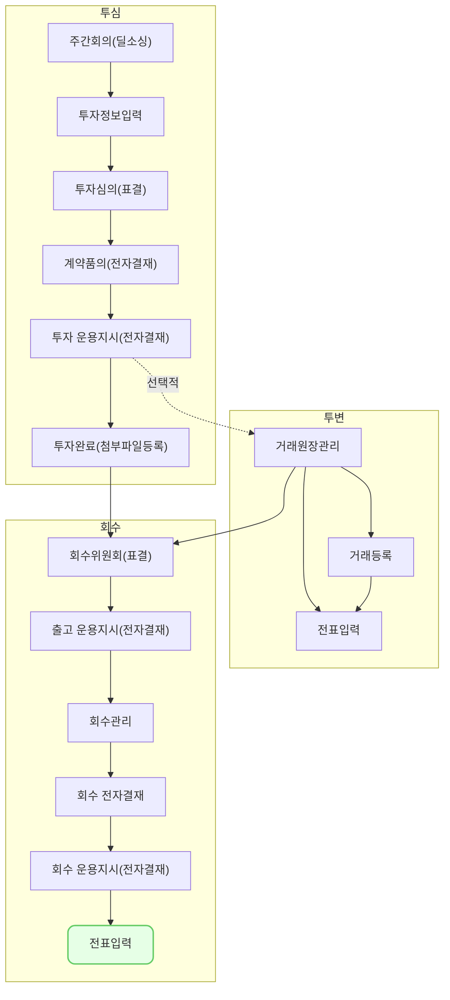

전표 입력(fm0002)에서는 새로운 전표를 생성 할 수 있습니다. 

> 회수관리의 자동전표는 추후 운용지시서 메뉴에서 제공 될 예정입니다.
{: .prompt-info }
## 동영상



## 설명

- 전표 입력(fm0002)은 `회계/재무 > 전표 > 전표 입력` 을 통해서 접근 가능합니다.
- 전표는 재원 내 회계원장별로 작성할 수 있습니다.
- 회계원장별로 기존에 설정된 계정과목 중 선택하여 입력할 수 있습니다.
- 관리항목이 사전에 설정된 계정과목에 대해서는 관리항목을 입력할 수 있습니다.

> 전표 입력(fm0002)을 하기 위해서는 아래의 사전 조건이 충족 되어야 합니다.
> 1. **재원**이 등록되어 있을 것
> 2. **회계기준 및 회계원장**이 등록되어 있을 것
> 3. **재원별 회계원장**이 등록되어 있을 것
> 4. **계정과목**이 등록되어 있을 것
{: .prompt-tip }

1. 전표를 입력합니다.
	- 전표 정보
		- **회계일**: 전표의 내용이 실제 일어난 날짜 입력 (등록일이 아닌 거래일)
		* 기표자: 전표를 작성한 사람
			* 현재 로그인 된 사용자가 자동으로 보여집니다. (수정불가)
		* 발행부서: 전표를 작성한 사람의 소속 부서
			* 현재 로그인 된 사용자의 부서정보가 자동으로 보여집니다. (수정불가)
		- **재원**: 전표를 기표할 재원 선택
		- **회계원장**: 위에서 선택한 재원 내 전표를 기표할 회계원장 선택
			- [재원별 회계원장 등록(fm0010)](https://guide.vcworks.kr/posts/fm0010/)에서 `여`로 등록된 회계원장만 나옵니다.
		- 전표분개유형: 추후 자동전표와 분류하기 위해 사용되는 유형
			- 직접 입력하는 전표는 모두 `일반분개`유형입니다.
		- 결재상태: 현재 전표의 결재상태
			- 아직 저장되지 않은 전표이므로 모두 `미결재` 상태입니다.
	- 전표 내용
		- **계정코드**: 선택한 계정과목의 코드
		- **계정과목**: 거래 내용에 해당하는 계정과목을 모달에서 선택
		- **차변/대변**: 거래 금액 전부 또는 일부를 계정과목에 맞게 입력
			- 계정과목의 설정값에 따라 차/대 중 한 칸만 활성화 됩니다.
		- **적요**: 거래 내용 별로 메모 입력
		- 관리항목: 계정과목에 따라 거래처 또는 계좌번호 입력
2. 전표 입력을 완료 했으면 [저장] 버튼을 클릭합니다.
3. 전표 입력을 완료했습니다.

## 자주 묻는 질문

> 관리항목을 추가하고 싶으면 어떻게 해야하나요?
{: .prompt-tip }

- 현재는 거래처와 계좌번호만 제공하고 있으나, 추후 기능 업그레이드를 통해 유저가 자유롭게 설정한 관리항목을 입력하는 기능을 제공 할 예정에 있습니다.
- 기능의 빠른 개발을 원하시면 정리된 요구사항과 함께 we@dkdk.kr 로 연락 부탁드립니다.

## 선후행 구조도

