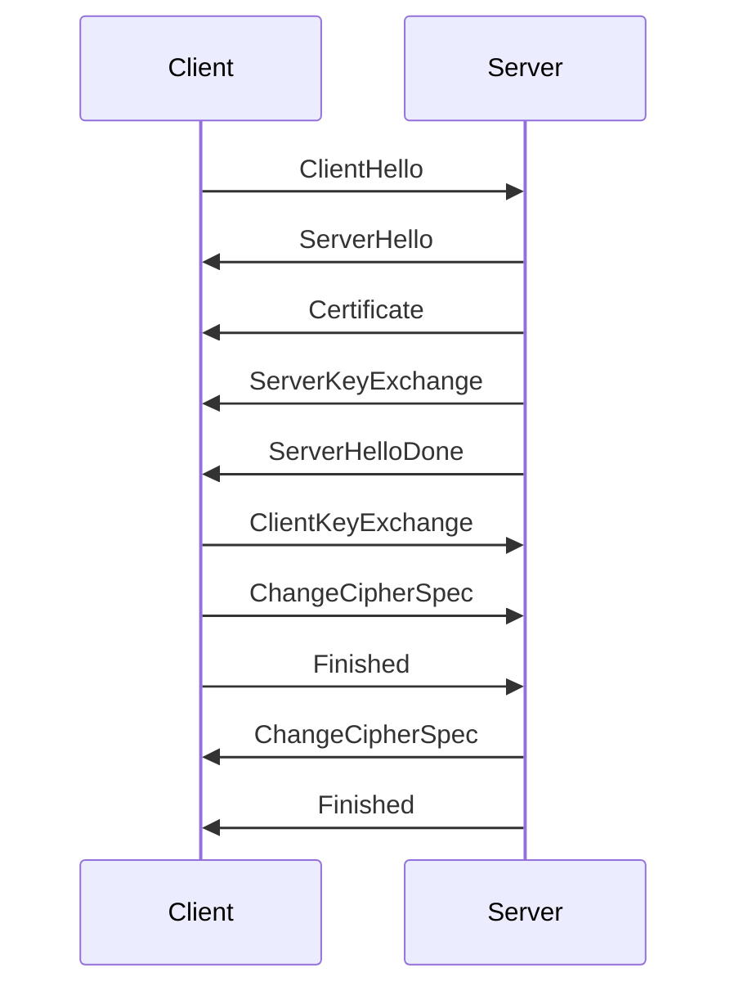
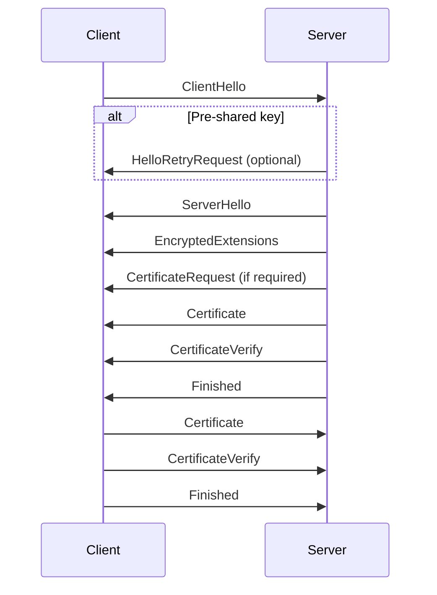
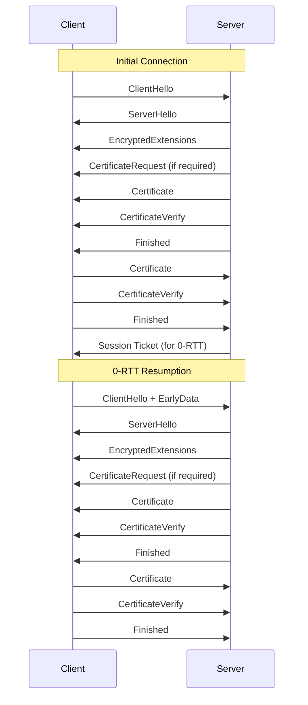

## TLS 버전 별 차이점

---
TLS (Transport Layer Security)는 인터넷 상에서 보안을 제공하는 프로토콜입니다. 
각 버전은 이전 버전의 보안 취약점을 보완하고, 성능을 향상시키기 위해 다양한 개선 사항을 확인할 수 있습니다. 

### TLS 1.0 (1999년)
TLS 1.0은 SSL 3.0의 후속 버전으로, SSL 3.0의 보안 취약점을 보완.

1. **클라이언트 헬로 (ClientHello)**: 클라이언트가 서버에 연결을 요청하며, 지원 가능한 암호화 방식과 프로토콜 버전을 제안합니다.
2. **서버 헬로 (ServerHello)**: 서버가 클라이언트의 제안을 받아들이고, 사용할 암호화 방식과 프로토콜 버전을 결정해 클라이언트에게 알립니다.
3. **서버 인증 및 키 교환**: 서버가 자신의 인증서를 클라이언트에게 전송하고, 선택된 암호화 방식에 따라 키 교환을 수행합니다.
4. **클라이언트 인증 및 키 교환**: (선택적) 클라이언트가 인증서를 전송하고 키 교환을 수행합니다.
5. **마스터 시크릿 생성**: 클라이언트와 서버가 프리마스터 시크릿을 사용해 마스터 시크릿을 생성합니다.
6. **암호화 설정 완료**: 클라이언트와 서버가 암호화 설정을 완료하고, 암호화된 통신을 시작합니다.

### TLS 1.1 (2006년)
TLS 1.0의 보안 취약점을 보완.

1. **암호화 방식 강화**: CBC 모드 암호화에 대한 공격(예: 패딩 오라클 공격)에 대한 보호가 강화되었습니다.
2. **초기화 벡터 (IV)**: 각 메시지마다 고유의 초기화 벡터를 사용하여 보안을 강화했습니다.
3. **재전송 보호**: 메시지 인티그리티 체크를 통해 재전송 공격을 방지하는 기능이 추가되었습니다.

### TLS 1.2 (2008년)
TLS 1.2는 TLS 1.1대비, 성능과 보안을 개선.

1. **해시 함수의 유연성**: SHA-256과 같은 더 안전한 해시 함수를 사용할 수 있도록 해시 함수의 선택 범위를 확장했습니다.
2. **HMAC**: HMAC-SHA256을 기본 HMAC 알고리즘으로 채택하여 메시지 인증의 보안을 강화했습니다.
3. **암호화 방식의 유연성**: AES를 비롯한 다양한 암호화 방식을 지원하여 보안성을 향상시켰습니다.
4. **고정된 구조**: 핸드쉐이크 메시지 구조를 더욱 엄격하게 정의하여 보안성을 강화했습니다.

### TLS 1.0,1.1,1.2 핸드쉐이크

### TLS 1.3 (2018년)
TLS 1.3은 보안성과 성능을 크게 향상.

1. **핸드쉐이크 간소화**: 핸드쉐이크 단계가 단축되어 연결 설정 시간이 크게 단축되었습니다. 특히, 0-RTT (Zero Round-Trip Time) 기능이 추가되어 이전에 연결된 세션을 재사용할 때 핸드쉐이크를 생략할 수 있습니다.
2. **암호화 방식 단순화**: 많은 구식 암호화 방식이 제거되고, 보안성이 높은 암호화 방식만 지원됩니다.
3. **포워드 시큐리티 강화**: 모든 세션에서 Diffie-Hellman 키 교환을 사용하여 포워드 시큐리티를 강화했습니다.
4. **프라이버시 보호**: 다양한 개인 정보 보호 기능이 추가되어, 핸드쉐이크 메시지를 암호화하고 메타데이터를 보호합니다.

### TLS 1.3 핸드쉐이크

### 버전별 변경 사항 요약
- **TLS 1.0**: SSL 3.0에서 개선된 첫 번째 TLS 버전.
- **TLS 1.1**: CBC 모드 암호화에 대한 보호 강화 및 재전송 보호 기능 추가.
- **TLS 1.2**: 해시 함수 유연성 확대, AES 지원, HMAC-SHA256 도입.
- **TLS 1.3**: 핸드쉐이크 간소화, 암호화 방식 단순화, 포워드 시큐리티 및 프라이버시 보호 강화.

{:.prompt-tip}
> SSL 인증서는 더 이상 사용되지 않으며, TLS 인증서가 업계 표준입니다.
> 그러나 보통 용어를 SSL인증서, TLS인증서라고 혼용해서 사용되고 있습니다.
> SSL 1.0, 2.0, 3.0 은 이미 오래전에 EOS 되었고, TLS 1.0, 1.1 (2021년 EOS) 도 공식적으로 지원 중단 되었습니다.
> TLS 1.2, 1.3 버전이 현재 사용되고 있습니다. 

---

## TLS 1.3의 0-RTT (Zero Round-Trip Time)
이전에 세션을 설정했던 클라이언트와 서버 간에 재 연결을 할 때, 핸드쉐이크 지연 시간을 줄이기 위해 도입된 기능 
이 기능을 통해 클라이언트는 초기 핸드쉐이크 요청과 함께 애플리케이션 데이터를 즉시 전송할 수 있다.

---
### 0-RTT의 작동 원리

**초기 연결 (Initial Connection)**
   - 클라이언트가 서버와 처음 연결을 시도할 때, 일반적인 TLS 1.3 핸드쉐이크 과정이 이루어집니다.
   - 이 과정에서 서버는 클라이언트에게 0-RTT 재연결을 허용하기 위해 "PSK (Pre-Shared Key)"와 "세션 티켓 (Session Ticket)"을 제공합니다.

**세션 티켓 저장 (Session Ticket Storage)**
   - 클라이언트는 세션 티켓과 PSK를 저장합니다. 이 정보는 이후 재연결 시 사용됩니다.

**0-RTT 재연결 (0-RTT Resumption)**
   - 클라이언트가 서버와 다시 연결을 시도할 때, 저장된 세션 티켓과 PSK를 사용하여 0-RTT 핸드쉐이크를 시작합니다.
   - 클라이언트는 `ClientHello` 메시지를 서버로 전송할 때, PSK를 포함하여 암호화된 애플리케이션 데이터를 함께 전송할 수 있습니다.

**서버의 응답 (Server's Response)**
   - 서버는 클라이언트가 전송한 PSK를 확인하여 해당 세션을 복원할 수 있음을 확인합니다.
   - 서버가 0-RTT 데이터를 수락하면, 서버는 `ServerHello` 메시지를 클라이언트에게 전송하여 핸드쉐이크 과정을 완료합니다.

### 0-RTT의 보안 고려 사항

- **Replay Attack**: 0-RTT는 재전송 공격(replay attack)에 취약할 수 있습니다. 재전송 공격은 악의적인 사용자가 0-RTT 데이터를 반복하여 보낼 때 발생할 수 있습니다. 이를 방지하기 위해, 서버는 각 0-RTT 데이터에 대해 고유한 nonce(일회용 값)를 요구하거나 제한된 시간 동안만 0-RTT 데이터를 허용하는 등의 메커니즘을 사용할 수 있습니다.
- **완전한 보안 보장 불가**: 0-RTT 데이터는 완전히 인증된 것이 아니기 때문에, 민감한 데이터 전송 시에는 주의가 필요합니다. 중요한 데이터는 1-RTT 이후에 전송하는 것이 안전합니다.

### 0-RTT 핸드쉐이크 다이어그램
초기 연결과 0-RTT 재연결 과정을 보여줍니다. 
0-RTT를 사용하면 클라이언트와 서버 간의 핸드쉐이크 과정에서 발생하는 지연을 줄일 수 있으므로, 애플리케이션 데이터를 더 빨리 전송할 수 있습니다. 
이는 특히 웹 브라우징이나 여러 번 재 연결이 필요한 애플리케이션에서 유용합니다. HTTPS 웹사이트 로드 속도가 빨라질 수 있습니다. 

