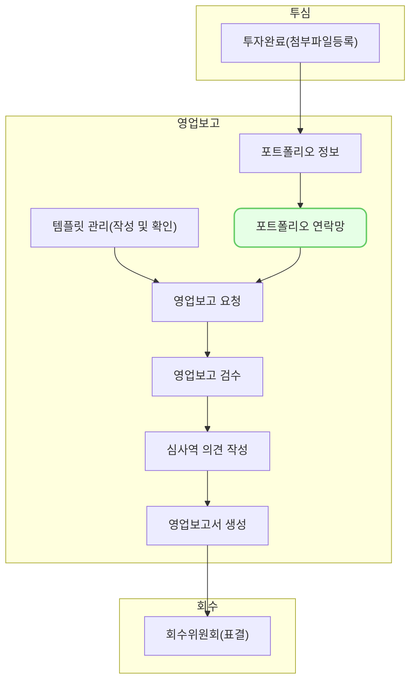

포트폴리오 연락망은 포트폴리오의 연락처를 관리하는 기능입니다.

## 동영상



## 설명

### 연락처 조회
- 연락망 화면에서는 기업별 담당자의 **연락처**를 저장하고 조회할 수 있습니다.
- 담당자 별로 성명, 직책, 이메일, 핸드폰번호, 전화번호, 메모를 입력할 수 있습니다.
- 항목별 필터를 사용하여 원하는 항목만 조회할 수 있습니다.

### 연락처 등록
1. 우측 상단의 **[신규 등록]** 버튼을 클릭하여 연락처를 등록할 수 있습니다.
2. 클릭 후 나오는 창에서 [기업명]을 선택합니다. 담당심사역이 함께 선택됩니다.
3. [담당자명], [직책], [이메일], [휴대폰번호], [전화번호], [메모]를 입력합니다. 
4. 우측 상단의 [저장] 버튼을 클릭하여 등록합니다.

### 연락처 수정
1. 수정하려는 연락처를 선택합니다.
2. 선택 후 나오는 창에서 [수정] 버튼을 클릭합니다.
3. 정보를 수정하고[저장] 버튼을 클릭합니다.

### 연락처 미사용
1. 사용하지 않으려는 연락처를 체크 표시합니다.
2. 우측 상단의 [연락망 미사용] 버튼을 클릭합니다.
3. 해당 연락처를 VC works에서 볼 수 없습니다.

## 자주 묻는 질문

> 미사용 처리한 연락처를 다시 사용할 수 없나요?
{: .prompt-tip }

- 미사용 처리한 연락처는 동일한 기업명, 담당자명, 이메일을 입력하면 다시 사용할 수 있습니다. 

>연락망은 단순 저장용인가요? 언제 주로 사용하나요?
{: .prompt-tip }

- 영업보고 요청을 메일로 전송할 때에 사용됩니다. 

>이메일을 모르면 등록할 수 없나요?
{: .prompt-tip }

- 네, 이메일을 모르는 담당자는 등록할 수 없습니다.

## 선후행 구조도

