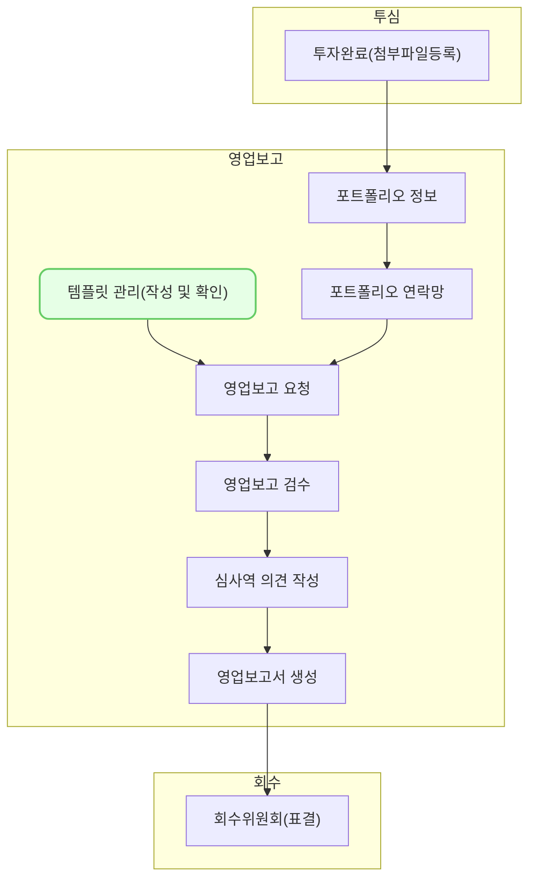

템플릿 관리는 투자 기업에게 영업보고를 요청하고 받아볼 수 있도록 템플릿을 생성하고 관리하는 기능입니다.

## 동영상



## 설명
### 템플릿 유형
- 템플릿은 **[분기보고], [월보고], [일반보고]** 3가지 유형이 있습니다.
- 템플릿 유형은 사용자의 편의를 위한 구분이지만, [분기보고]만 영업보고서를 생성할 수 있습니다.
### 템플릿 구조
- VC works의 영업보고 템플릿은 [탭], [섹션], [항목]의 3단 구조로 이루어져 있습니다. 템플릿 구조는 보고자가 입력해야 할 항목들을 쉽게 구조화할 수 있도록 지원합니다.
- [항목]은 영업보고의 최소 단위로, [섹션]을 구성합니다.
	- [항목]은 항목명, 입력 방법, 입력 방법 상세, 작성 도움 글, 필수 여부를 설정할 수 있습니다.
		- 입력 방법은 문자, 숫자, 날짜, 단일선택, 여부, 비율, 기간, 첨부파일, 편집기, 긴글, 재무상태표, 손익계산서 중 선택할 수 있습니다.
		- 입력 방법으로 단일선택을 선택하면, 입력 방법 상세 칸에 선택지를 추가할 수 있습니다.
		- [섹션]의 구조에 따라 선택할 수 있는 입력방법이 상이합니다.
- [섹션]은 항목들의 묶음으로 [탭]을 구성합니다.
	- [섹션]의 종류는 정보안내표, 표, 재무상태표, 손익계산서, 긴글, 첨부파일이 있습니다. 
		- 정보안내표는 단순 정보들을 4열 표로 보여주는 양식입니다. 
		- 재무상태표와 손익계산서 섹션 구조는 필요한 회계 계정항목들을 미리 묶은 양식입니다.
			- 재무상태표와 손익계산서의 항목은 [분기]로 사용되고, YY/Q 양식으로만 입력가능합니다.
		- 현금성자산과 차입금현황의 항목도 [분기]로 작동합니다. 
		- 표 섹션에 작성하는 항목은 표의 [열]로 사용됩니다. [행]은 영업보고 보고자가 입력합니다.
		- 긴글, 첨부파일은 일반적인 의미로 사용되었습니다.
- [탭]은 템플릿의 가장 상위 단위입니다.
### 기본항목
- VC works는 자주 쓰는 항목을 기본 항목으로 제공합니다. 
	- 기본 항목을 이용하여 쉽게 템플릿을 구성할 수 있습니다.
- 기본 항목을 포함하고 있는 탭으로 [기업 기본정보], [재무현황], [지분현황], [사업현황], [첨부파일]을 제공합니다. 
### 템플릿 생성
1. 우측 상단의 [템플릿 생성] 버튼을 클릭합니다.
2. **템플릿 명칭**과 **템플릿 유형**을 입력합니다.
3. 탬플릿에 사용할 탭을 선택합니다.  신규 탭을 신설할 수 있습니다.
4. 우측 상단의 [생성] 버튼을 클릭합니다.
5. 화면이 전환되고 [탭], [섹션], [항목]을 설정할 수 있습니다. 기본적으로 제공되는 [탭]을 선택했다면, 기본항목이 화면에 표시됩니다. 신규 탭을 선택했다면, [섹션]부터 생성해야 합니다.
6. 우측에는 탭 목록이 있습니다. 각 [탭]을 선택하여 [섹션]을 편집할 수 있습니다. 탭 목록 아래의 [탭 편집]버튼을 사용하여 [탭]을 생성 및 삭제하고 순서를 바꿀 수 있습니다.
7. 화면 중앙에는 [섹션]이 순서대로 표시됩니다. 우측 [섹션 편집]버튼을 사용하여 [섹션]을 생성 및 삭제하고 순서를 바꿀 수 있습니다. 또한, [섹션 구조]를 정할 수 있습니다. 
8. [섹션]에는 안내문을 작성할 수 있습니다. [안내문 사용]버튼을 클릭 후 안내문 영역에 안내문을 작성할 수 있습니다. 
9. 안내문 아래에는[항목]이 나열되어 있습니다. 표 아래의 버튼을 클릭하여 [항목]을 추가하고 삭제하고 순서를 변경할 수 있습니다.
10. [항목]은 보고자로부터 보고받기를 원하는 내용입니다. 
11. 우측 상단의 [미리보기]버튼을 클릭하여 보고자에게 전달되는 화면을 실시간으로 확인할 수 있습니다. 
12. 각 [섹션]별로 최소 한 개 이상의 [항목]이 있어야 합니다. 또한, 각 [항목]들은 반드시 입력방법을 선택해야 합니다.
13. 우측 상단의 [저장]버튼을 클릭하면 템플릿이 저장됩니다. 
### 템플릿 수정
1. 목록에서 수정하려는 템플릿을 선택합니다.
2. 우측 상단의 [수정]버튼을 클릭합니다.
3. 생성할 때와 동일한 화면으로 전환됩니다.
4. 템플릿을 수정한 후, 우측 상단의 [저장]버튼을 클릭하여 수정한 내용을 저장합니다.
### 템플릿 미사용
1. 템플릿을 미사용 처리할 수 있습니다.
2. 목록에서 미사용 처리하려는 템플릿을 선택합니다.
3. 우측 상단의 [미사용]버튼을 클릭합니다.
4. 미사용된 템플릿은 사용할 수 없습니다.
## 자주 묻는 질문
> 영업보고 요청을 보냈는데, 템플릿을 잘못 만들었어요. 템플릿을 수정하면 될까요?
{: .prompt-tip }
- 템플릿 수정은 이미 보낸 영업보고에 영향을 미치지 않습니다. 영업보고를 회수하고 새로운 영업보고를 요청하세요. 

> 재무상태표와 손익계산서의 항목은 설정할 수 없나요?
{: .prompt-tip }
- 현재는 별도의 설정 기능을 제공하고 있지 않습니다. 추후 보완될 예정입니다.

> 재무 현황에 [계정항목명]이란 항목은 무엇인가요?
{: .prompt-tip }
- 해당 섹션의 1열을 표시하기 위한 장치입니다. [계정항목명] 항목을 삭제하면 1열에 값을 입력할 수 없습니다. 

> 현금성자산에 YY/Q 형식으로 입력했는데, 재무상태표와 달리 20YY년 Q분기로 변하지 않습니다.
{: .prompt-tip }
- 현금성자산과 차입금현황 섹션에서는 해당 기능을 지원하지 않습니다. 

## 선후행 구조도
