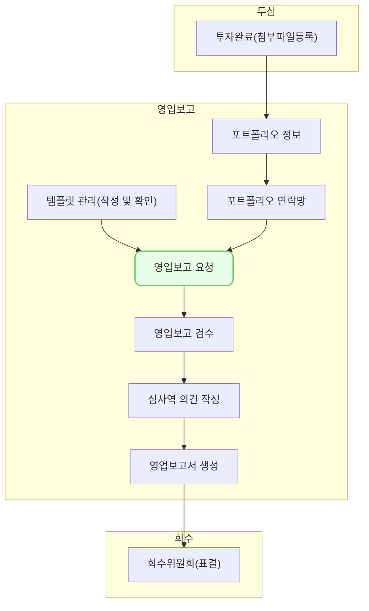

투자기업에 영업보고를 요청하는 기능입니다.

## 동영상



## 설명

### 영업보고 요청 전송
1. 영업보고 요청 화면에서 우측 상단의 [신규요청]버튼을 클릭합니다.
2. [보고서명], [템플릿 선택], [기준일], [마감일]을 입력합니다.
	- 템플릿은 저장한 템플릿 중에서 선택할 수 있습니다.
	- 기준일은 영업보고의 기준이 되는 날짜입니다.
	- 마감일은 영업보고의 마감이 되는 날짜입니다.
	- 분기보고 템플릿을 선택하면 기준일에 따라서 [분기보고 구분]값이 자동으로 부여됩니다.
3. 아래에서 요청을 보낼 기업을 선택합니다.
	- 투자 중인 기업이 목록에서 표시됩니다. 담당 심사역과 ST works 가입 여부도 확인할 수 있습니다. 메모를 통해 요청을 보낼 기업을 구별할 수 있습니다.
4. 우측 상단의 [담당자 선택]버튼을 클릭합니다. 
	- 선택된 기업의 담당자들이 목록에 표시됩니다. 
	- 영업보고를 요청하려면 [포트폴리오 연락망], [포트폴리오 정보]에 연락처를 미리 등록해야 합니다.
5. 목록에서 담당자를 선택합니다.
6. 우측 상단의 [영업보고 요청]버튼을 클릭합니다.
7. 영업보고 요청은 **투자 기업의 ST works와 담당자의 이메일**로 전송됩니다.
### 영업보고 요청 조회
- 영업보고 요청 화면에서 전송한 영업보고를 조회할 수 있습니다.
- 영업보고 요청은 [전송중], [전송완료], [마감], [회수]의 상태 값을 가질 수 있습니다.
	- [전송중]은 담당자들에게 이메일을 전송하고 있는 상태입니다.
	- 이메일 전송이 완료되면 [전송 완료] 상태가 됩니다.
	- 마감일이 지나면 [마감]처리 됩니다. 
	- 요청을 회수하면 [회수] 상태로 변합니다.
- 요청 별로 전송한 기업 수, 담당자 수, 기준일, 전송완료 일시를 확인할 수 있습니다.
### 영업보고 요청 수정
- 전송한 영업보고의 요청을 수정할 수 있습니다.
- 수정하려는 영업보고를 선택하고 우측의 [요청 수정] 버튼을 클릭합니다.
- [보고서 명]과 [마감일]을 수정할 수 있습니다. 
- [저장]버튼을 클릭하면 요청이 수정됩니다.
### 영업보고 추가 요청
- 요청을 누락한 기업 또는 담당자에게 추가로 요청을 보낼 수 있습니다. 
- 목록에서 영업보고를 선택하고 우측의 [추가요청] 버튼을 클릭합니다.
- 하단의 [요청 기업 선택] 목록에 요청을 보내지 않은 기업들이 표시됩니다. 
- 추가로 요청을 보낼 기업을 선택하고 우측의 [담당자 선택] 버튼을 선택합니다.
- 기존에 선택했던 기업과 현재 선택한 기업의 담당자가 모두 목록에 표시됩니다.
- 추가로 요청을 보낼 담당자를 선택한 후 [영어보고 요청] 버튼을 클릭합니다. 
### 영업보고 회수
- 기업별로 전송한 영업보고를 회수할 수 있습니다.
- 회수할 영업보고를 선택합니다.
- 하단의 [보고 요청 기업] 목록에서 회수할 기업을 체크한 후 [회수 요청]버튼을 클릭합니다.
- 해당 기업으로 전송한 영업보고가 회수됩니다.
- 해당 기업은 영업보고를 제출할 수 없습니다. 
### 영업보고 재요청 
- 영업보고 요청한 담당자에게 이메일를 추가로 전송할 수 있습니다.
- 영업보고를 요청했으나 리마인드 목적으로 메일을 다시 보낼 수 있습니다.
- 재요청하려는 영업보고를 선택합니다. 
- 화면 중앙에 [영업보고 담당자]를 선택합니다. 
- [요청 기업 담당자] 목록에서 담당자를 선택하고 [재요청]버튼을 클릭합니다. 
### 담당자 이메일 복사
- 영업보고 요청을 보낸 담당자에게 더 자세한 이메일을 보낼 때 사용하는 기능입니다.
- 영업보고를 선택한 후 화면 중앙의 [영업보고 담당자]를 선택합니다.
- [요청 기업 담당자] 목록에서 담당자를 선택하고 [이메일 복사]버튼을 클릭합니다.
- 클립보드에 선택된 담당자의 이메일이 [;]로 구별되어 복사됩니다.
- 이메일을 작성하고 받는 사람 영역에 붙여넣기를 하여 사용합니다.

## 자주 묻는 질문

> 영업보고는 언제 전송완료 처리가 되나요?
{: .prompt-tip }

- 사용자의 네트워크 환경과 선택한 담당자의 수에 따라 다릅니다. 

## 선후행 구조도
