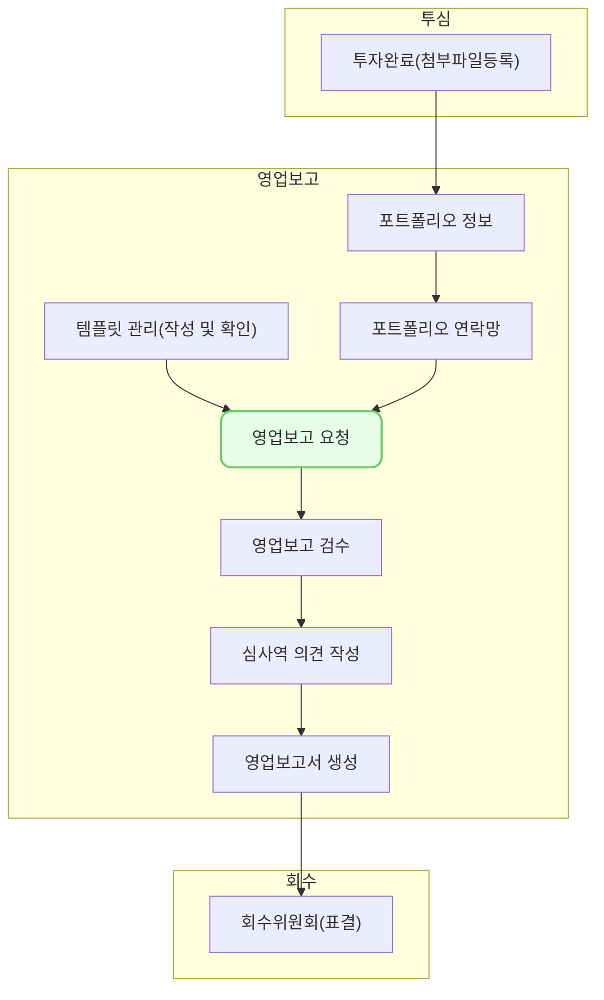

한줄 요약

## 동영상



## 설명

- 설명 작성

## 자주 묻는 질문

> 질문작성
{: .prompt-tip }

- 답변작성

## 선후행 구조도

```mermaid
flowchart TD

    subgraph 투자심의["투심"]
        vs0009["투자완료(첨부파일등록)"]
    end

    subgraph 영업보고["영업보고"]
        pm0100["포트폴리오 정보"]
        br0001["템플릿 관리(작성 및 확인)"]
        br0012["포트폴리오 연락망"]
        br0004["영업보고 요청"]
        br0007["영업보고 검수"]
        br0009["심사역 의견 작성"]
        br0011["영업보고서 생성"]

        vs0009 --> pm0100
        pm0100 --> br0012
        br0001 --> br0004
        br0012 --> br0004
        br0004 --> br0007
        br0007 --> br0009
        br0009 --> br0011
    end

    subgraph 회수관리["회수"]
        ex0001["회수위원회(표결)"]
        br0011 --> ex0001
    end

click hr0001 "{% post_url 2024-07-02-hr0001 %}" " "
click hr0002 "{% post_url 2024-07-02-hr0002 %}" " "
click hr0007 "{% post_url 2024-07-02-hr0007 %}" " "
click se0005 "{% post_url 2024-07-02-se0005 %}" " "
click se0003 "{% post_url 2024-07-03-se0003 %}" " "
click fd0001 "{% post_url 2024-07-04-fd0001 %}" " "
click fd0010 "{% post_url 2024-07-04-fd0010 %}" " "
click fd0011 "{% post_url 2024-07-04-fd0011 %}" " "
click fm0010 "{% post_url 2024-07-04-fm0010 %}" " "
click fd0009a "{% post_url 2024-07-05-fd0009a %}" " "
click fd0013 "{% post_url 2024-07-05-fd0013 %}" " "
click fd0012 "{% post_url 2024-07-06-fd0012 %}" " "
click fd0006 "{% post_url 2024-07-07-fd0006 %}" " "
click oi0002 "{% post_url 2024-07-07-oi0002 %}" " "
click wr0003 "{% post_url 2024-07-09-wr0003 %}" " "
click vs0003 "{% post_url 2024-07-10-vs0003 %}" " "
click vs0006 "{% post_url 2024-07-11-vs0006 %}" " "
click ed0001a "{% post_url 2024-07-12-ed0001a %}" " "
click oi0003 "{% post_url 2024-07-13-oi0003 %}" " "
click vs0009 "{% post_url 2024-07-14-vs0009 %}" " "
click pm0001 "{% post_url 2024-07-15-pm0001 %}" " "
click pm0004 "{% post_url 2024-07-16-pm0004 %}" " "
click fm0002 "{% post_url 2024-07-17-fm0002 %}" " "
click ex0001 "{% post_url 2024-07-18-ex0001 %}" " "
click oi0001 "{% post_url 2024-07-19-oi0001 %}" " "
click ex0007 "{% post_url 2024-07-20-ex0007 %}" " "
click ex0009 "{% post_url 2024-07-21-ex0009 %}" " "
click ex0009a "{% post_url 2024-07-22-ex0009a %}" " "
click fm0002a "{% post_url 2024-07-23-fm0002a %}" " "
click br0012 "{% post_url 2024-08-22-br0012 %}" " "
click br0001 "{% post_url 2024-08-23-br0001 %}" " "
click br0004 "{% post_url 2024-08-24-br0004 %}" " "
click br0007 "{% post_url 2024-08-25-br0007 %}" " "
click br0009 "{% post_url 2024-08-26-br0009 %}" " "
click br0011 "{% post_url 2024-08-27-br0011 %}" " "

style br0004 fill:#e6ffe6,stroke:#66cc66,stroke-width:2px,rx:10,ry:10,color:#333333,fontColor:#333333


```