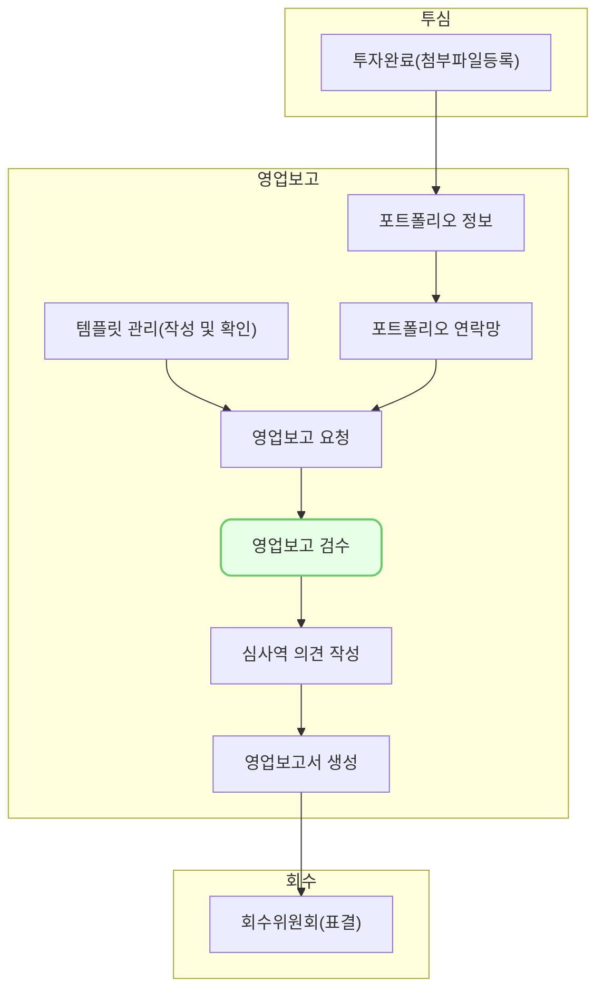

영업보고 검수는 투자기업이 제출한 영업보고를 검토하고 수정하는 기능입니다.

## 동영상



## 설명
### 제출상태
- VC works 검수 기능은 [미제출], [제출완료], [수정요청], [검수완료], [재제출], [검수확정] 6가지 상태를 지원합니다.
	- [미제출]은 요청을 보냈으나 제출하지 않은 보고입니다.
	- [제출완료]는 ST works를 통해 제출된 보고입니다.
	- [수정요청]은 제출하였으나 ST works로 내용 수정을 요청한 보고입니다.
	- [검수완료]는 제출 후 검수를 완료한 보고입니다. 
	- [재제출]은 검수완료 후 투자기업이 다시 제출한 보고입니다.
	- [검수확정]은 검수가 확정된 보고입니다. 투자기업이 보고를 제출할 수 없습니다.

### 조회
- 검수를 하려면 대상을 조회해야 합니다. [조회]버튼을 클릭하여 영업보고 목록을 불러옵니다. 
- [조회]는 2가지 분류를 지원합니다.
	- [분기보고]는 분기별 보고를 조회합니다. 단, 템플릿 유형이 [분기보고]로 지정되어 있어야 합니다.
	- [영업보고]는 보고명을 기준으로 조회합니다. 한 번에 다수의 보고명을 선택할 수 있습니다.
- 조회를 하면 선택된 보고의 제출 통계를 지원합니다. 
- 각 보고 별로 [제출 상태], [마감일], [수령일], [담당심사역], [최근 추가 알림일], [입력 연장일], [데이터 복사], [메모]를 제공합니다.
	- [최근 추가 알림일]은 [수정요청], [리마인드] 등 검수 과정에서 투자기업에 보낸 최근 알림 날짜를 의미합니다.
	- [입력 연장일]은 우측의 [연장] 버튼을 클릭하여 입력한 날짜를 의미합니다. 
	- [데이터 복사]는 검수한 데이터를 VC works에 덮어쓴 보고를 의미합니다. 
	- [메모]는 영업보고 요청에서 입력했던 메모를 보여줍니다.

### 검수
- 검수는 투자기업의 보고 단위로 할 수 있습니다.
- [조회]된 보고 중에서 검수할 보고를 클릭합니다. 
- [제출 상태]에 따라서 검수의 기능이 달라집니다.
- [미제출] 상태에서는 보고 내용을 [직접 입력]할 수 있습니다.
	- 우측 상단의 [직접 입력]버튼을 클릭하면 수정모드로 변합니다. 
	- 보고 내용을 입력하거나 우측 상단의 [과거 보고 불러오기] 기능을 이용하여 과거 보고를 불러온 후 내용을 수정합니다.
	- 내용을 완성한 후 우측 상단의 [저장] 버튼을 클릭하면 [검수 완료] 상태로 변합니다.
-  [제출 완료] 상태에서는 제출된 보고를 확인할 수 있습니다.
	- 좌측의 [수정]버튼을 이용하여 내용을 일부 수정할 수 있습니다.
	- 우측 상단의 [수정 요청] 기능을 이용하여 투자 기업에 내용 수정을 요청할 수 있습니다. [수정 요청] 기능을 이용하면, 보고의 상태가 [수정 요청]으로 변경됩니다. 
	- [수정 요청]을 보낸 내용은 [요청 이력] 버튼을 클릭하여 확인할 수 있습니다. 
	- 검수 후 우측 상단의 [검수 완료] 버튼을 클릭하면 보고가 [검수 완료] 상태로 변합니다. 
- [수정 요청]은 투자기업에 수정 요청을 보낸 보고입니다.
	- [수정 요청]을 추가로 더 보낼 수 있고, [수정] 기능을 사용해 내용을 일부 수정할 수 있습니다.
	- [요청 이력] 버튼을 클릭하여 수정 요청 이력을 확인할 수 있습니다.
	- 우측 상단의 [검수 완료]버튼을 클릭하여 검수 완료처리할 수 있습니다. 
- [검수완료]는 검수작업을 진행한 보고입니다.
	- 검수 완료 상태에서는 보고를 수정할 수 없습니다. 수정을 하려면 [재검수] 버튼을 클릭하여 제출 상태를 [제출 완료]로 변경해야 합니다.
	- [검수 완료] 상태일 때는 투자기업이 보고를 다시 제출할 수 있습니다. 이 경우에는 [제출 완료] 단계부터 다시 진행해야 합니다. 
	- 투자 기업의 보고 제출을 막으려면 [검수 확정] 버튼을 클릭하여 검수를 확정해야 합니다.
- [재제출]은 검수가 완료되었으나 투자기업이 보고를 다시 제출한 상태입니다.
	- [제출완료]와 동일한 기능을 제공합니다. 수정을 요청할 수 있고, 검수를 완료할 수 있습니다.
- [확정]은 검수가 최종적으로 확정되어 사용자와 투자기업 모두 수정이 불가능한 보고입니다.

### 추가 기능
- [연장]은 개별 투자기업의 마감일을 연장하는 기능입니다.
	- 조회목록에서 투자기업을 체크한 후 우측 상단의 [연장]버튼을 클릭합니다. 
	- 클릭 후 나오는 창에서 마감일을 입력합니다. 
	- 목록의 입력 연장일 칸에 입력한 날짜가 기입되고, 기업은 날짜까지 보고를 작성할 수 있습니다.
	- [연장]은 [미제출]상태인 보고만 사용할 수 있습니다.
- [리마인드]는 투자기업에 요청을 다시 상기하는 알림을 보내는 기능입니다. 
	- 요청을 발신한 담당자에게 이메일을 발송하고, ST works에 재알림을 보냅니다. 
	- [리마인드]는 [미제출]상태인 보고만 사용할 수 있습니다.
- [데이터 복사]는 투자기업으로 부터 받은 정보를 VC works로 옮기는 기능입니다.
	- [데이터 복사]는 [검수완료], [확정]인 보고만 사용할 수 있습니다.
	- 검수한 보고의 데이터를 VC works의 포트폴리오 정보로 복사합니다.
	- 복사된 정보는 다른 문서나 기능에 사용됩니다.
	- 보고받은 정보를 개별적으로 업데이트하지 않고 일괄적으로 업데이트하는 기능입니다.
	- [데이터 복사]는 기본 항목만 가능합니다. 현재 [회사 개요], [이사회], [재무상태표], [손익계산서]를 포트폴리오 정보에 복사합니다.

## 자주 묻는 질문

> 수정요청을 보낸 기업에게는 리마인드를 못하나요?
{: .prompt-tip }

- 추후 개발 예정입니다.

## 선후행 구조도
