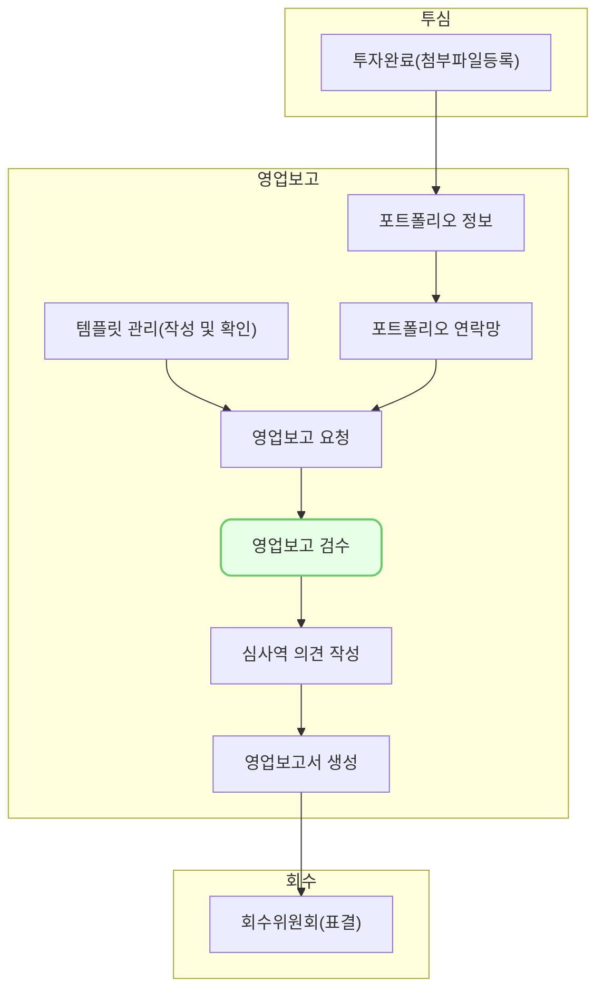

AI 검수 기능을 통해 재무제표 첨부파일과 영업보고 입력 값의 일치 여부를 확인할 수 있습니다.
## 설명

### AI 검수

- 목록에서 기업을 선택한 뒤, 영업보고 검수 목록 화면에서 [AI 검수] 버튼을 클릭하면 AI 검수가 시작됩니다.

- AI 검수는 재무현황 탭 재무상태표, 손익계산서표에 입력된 값과 재무제표 첨부파일을 비교합니다. 재무제표 첨부파일은 해당하는 분기의 날짜로 생성된 것이어야 합니다.

- AI 검수는 제출 상태가 제출 완료, 재제출, 수정 요청일 때만 가능합니다. 미제출, 검수 완료, 검수 확정일 때는 검수가 불가능합니다.
- AI 검수 결과가 이미 있는 경우는 AI 검수가 불가능하며, AI 검수 결과가 '수동 확인'인 경우에만 AI 검수 재실시가 가능합니다. 

- 한꺼번에 여러 기업의 검수를 시행하면, 시간이 다소 소요될 수 있습니다. 검수가 모두 완료된 후 알림이 전송되니 알림을 확인해주세요.

- 재무제표 첨부파일과 실제 입력한 값이 일치하면 AI 검수 결과에 '통과'로 표시됩니다.
- 재무제표 첨부파일과 실제 입력한 값이 일치하지 않으면 AI 검수 결과에 '확인 필요'로 표시됩니다.
- 첨부파일에 이상이 있는 경우 '검수 실패'로 표시됩니다.
## AI 검수 결과

- 재무제표 입력값과 첨부파일 값이 모두 일치하면 AI 검수 결과가 '통과'가 됩니다.

-  재무제표 입력값과 첨부파일 값이 불일치 하는 경우 AI 검수 결과가 '확인 필요'가 됩니다. AI 검수 결과가 '확인 필요'인 경우, 영업보고 검수 상세 화면에서 입력 값이 잘못되었는지 확인하고 수정할 수 있습니다.

- 값을 수정 후 저장하면 AI 검수 결과가 '수동 확인'으로 변경됩니다.
- '수동 확인'일 때 다시 AI 검수를 실시하여 검수에 통과하는지 확인할 수 있습니다.

- '검수 실패'가 뜬 경우, 첨부파일에 문제가 있는 경우이기 때문에 수동으로 검수해주세요.

- AI 검수 결과가 '확인필요', '검수 실패'일 때 [검수 완료]를 하면 '수동 확인' 상태로 변경됩니다.

- 기업에서 영업보고를 재제출하면 기존에 AI 검수를 실시한 내역이 있어도 검수 결과가 삭제되기 때문에 재검수해주세요.

## AI 검수 가능한 조건

- 상태 조건
1. 제출 상태 : 제출 완료, 재제출, 수정 요청
2. AI 검수 결과 : 없음, 수동 확인

- 첨부파일 조건
1. 형식 : pdf, excel
2. 10페이지 이내일 것
3. 한국어로 작성되었을 것

- 첨부파일 조건이 맞지 않는 경우 AI 검수 결과가 '검수 실패'로 표시될 수 있습니다. 첨부파일 내에서 유효한 표나 계정과목 명을 찾지 못한 경우 또는 날짜 확인이 불가능한 경우 등도 검수 실패의 원인이 될 수 있습니다.

## 자주 묻는 질문

> AI 검수를 실시했는데 AI 검수 결과가 없어졌어요.
{: .prompt-tip }

- 기업에서 영업보고를 재제출했거나, 영업보고 검수 상세 화면에서 첨부파일을 변경/제거 했을 경우에는 AI 검수 결과가 초기화됩니다. AI 검수를 재실시해주세요.

> 첨부파일과 입력값이 일치하는데 계속 AI 검수 불일치(확인 필요)로 표시됩니다.
{: .prompt-tip }

- 첨부파일에 도장이 찍혀 글자가 겹쳐 있는 경우에는 글자를 잘못 인식했을 가능성이 있습니다. 값을 확인하고 검수 완료로 변경해주세요. AI 검수 결과는 '수동 확인'으로 자동 변경됩니다

## 선후행 구조도

