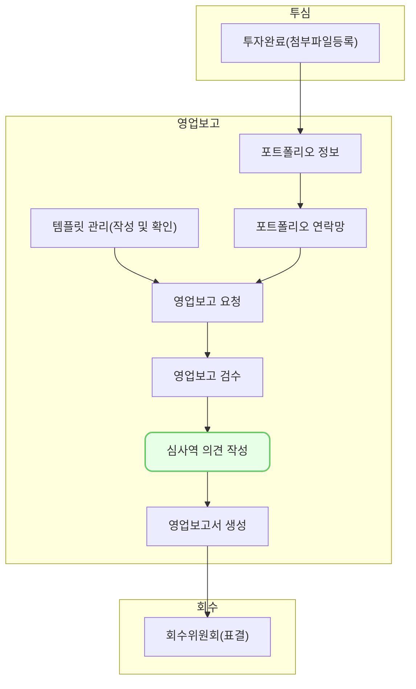

영업보고서 작성을 위해 투자기업에 대한 심사역 의견을 작성할 수 있는 기능입니다. 

## 동영상



## 설명

### 조회
- 심사역 의견을 작성하기 위해 대상 기업을 조회할 수 있습니다.
- 상단에서 작성하고자 하는 [분기보고]를 선택한 후 [조회] 버튼을 클릭합니다.
- 작성하려는 보고서의 기업별 [제출 상태]와 [작성 상태]를 조회할 수 있습니다.
	- 기업에 투자한 펀드와 담당심사역, 최초 투자일을 함께 확인할 수 있습니다.

### 의견 작성
- 목록에서 의견을 작성하려는 기업을 선택합니다.
- 의견을 작성해야 하는 영역이 표시됩니다. 
- 우측 상단에 [스타트업 제출본 보기] 버튼을 클릭하여 스타트업의 제출본을 참고하면서 작성할 수 있습니다.
	- 버튼을 클릭하면 상단에 스타트업의 제출본이 표시됩니다. 
	- 상단의 제출본을 보면서 의견을 작성할 수 있습니다. 
- [저장] 기능을 사용하여 의견을 저장할 수 있습니다. 
	- 우측 상단의 [저장] 버튼을 클릭하면 저장됩니다.
- [작성완료] 버튼을 클릭하여 상태를 완료로 변경할 수 있습니다.
	- [저장]과 [작성완료]는 수시로 변경할 수 있습니다.

### 투자기업 현황 다운로드
- 심사역 의견을 작성했던 투자기업 현황 문서를 다운로드 받을 수 있습니다.
- 목록 화면에서 기업을 선택한 후 우측 상단의 [투자기업 현황 다운로드] 버튼을 클릭하거나 기업별 작성화면에서 우측 상단의 [투자기업 현황 다운로드] 버튼을 클릭하면 파일이 다운로드 됩니다. 

## 자주 묻는 질문

> 완료와 저장은 어떤 차이가 있나요?
{: .prompt-tip }

- 기능적인 차이점은 없습니다. [완료]는 동료들에게 의견 작성이 완료되었음을 알려주는 상태입니다.

## 선후행 구조도
