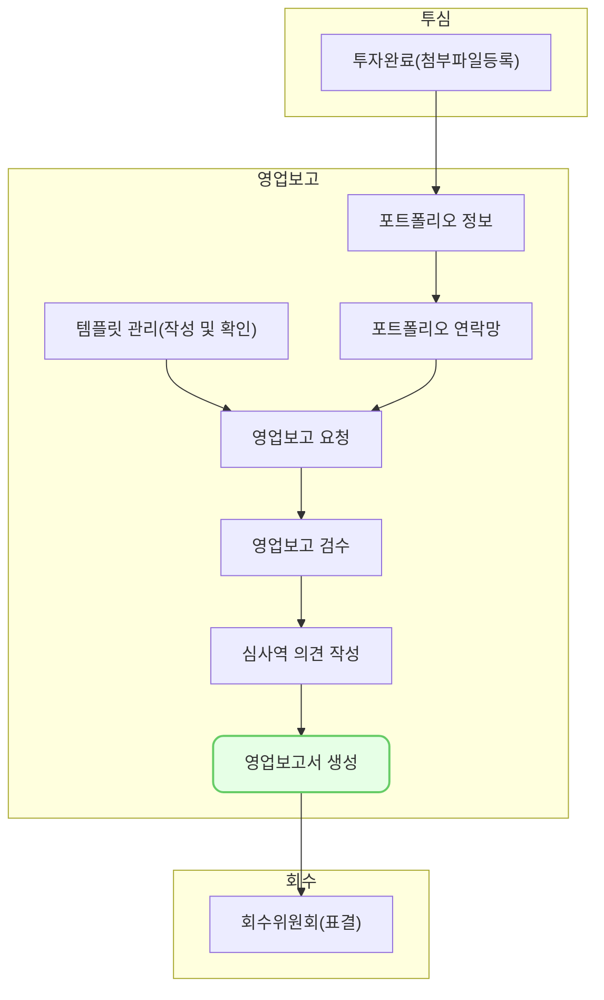

편드별 영업보고서를 생성하는 기능입니다. 

## 동영상



## 설명

### 조회
- 영업보고서를 생성할 수 있는 기업을 조회할 수 있습니다.
- 상단에서 영업보고 요청을 보낸 [분기보고]를 선택한 후 [조회]를 클릭합니다.
- 펀드별로 요청을 보낸 기업의 상태가 목록에 표시됩니다. 
	- 요청 > 검수 > 의견 저장 > 의견 작성 완료의 순서대로 완성도를 확인할 수 있습니다.
### 영업보고서 생성
- 준비된 영업보고서를 선택한 후 우측 상단의 [영업보고서 생성] 버튼을 클릭합니다.
- [바로 다운로드]와 [순서 변경 후 다운로드]를 선택할 수 있습니다.
	- [순서 변경 후 다운로드]는 기업의 순서를 변경한 후 다운로드하는 기능입니다. 담당 심사역에 따라 보고서에 표시되는 기업의 순서를 바꿀 수 있습니다.
	- [바로 다운로드]는 시스템에서 정한 순서에 따라 보고서를 다운받는 기능입니다. 
- 영업보고서는 **한글 파일(hwp) 확장자**로 생성됩니다.
### 첨부파일 다운로드
- 영업보고에 포함된 첨부파일을 일괄적으로 다운받을 수 있는 기능입니다.
- 영업보고서를 선택한 후 [첨부파일 다운로드] 버튼을 클릭합니다. 
- 팝업된 창에서 다운로드할 **첨부파일 유형**을 선택합니다.
- 영업보고서를 구성한 영업보고에 포함된 첨부파일이 **압축파일**로 제공됩니다.

## 자주 묻는 질문

> 목록에서 [요청 기업], [검수 기업], [의견 저장기업], [의견 작성 완료 기업]의 수 외에 구체적인 기업을 확인할 수 있나요?
{: .prompt-tip }

- 아직은 기업의 수만 확인할 수 있습니다. 추후 보완 예정입니다.

> 영업보고서를 한글 파일이 아니라 다른 파일로 생성할 수 있나요?
{: .prompt-tip }

- 별도의 문의 주시면 도와드리겠습니다.

## 선후행 구조도
