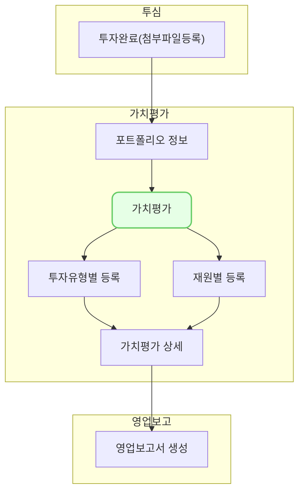

포트폴리오의 가치평가를 조회하는 화면입니다. 

## 설명
- 포트폴리오의 가치평가를 투자 별로 조회할 수 있습니다.
- [조회]를 클릭하면 투자별 최신 가치평가를 확인할 수 있습니다.
### 기준일 선택
- 가치를 평가한 [기준일]을 선택할 수 있습니다.
- 선택한 날짜를 기준으로, 최신 등록된 평가들을 조회합니다.
	- 12월 31일을 검색하면 투자별로 12월 31일 이전에 등록한 최근 평가를 조회합니다.
	- 6월 30일과 12월 31일 평가가 있을 때, 9월 30일로 검색하면 6월 30일 평가만 조회합니다. 
### 평가 주체 선택
- 투자의 가치를 [평가 주체]별로 선택하여 조회할 수 있습니다. 
- 평가 주체는 자체평가, 평가사 등이 있습니다. 
- 투자별 복수의 평가 중에서 선택된 평가사가 한 평가만 조회합니다. 
### 평가 등록
- 우측 상단의 [신규 등록]을 클릭하면 투자 유형별 또는 재원별로 평가를 등록할 수 있습니다.

## 자주 묻는 질문

> 기준일과 평가 주체를 반드시 선택해야 하나요?
{: .prompt-tip }

- 기준일과 평가 주체를 선택하지 않아도 조회할 수 있습니다. 이 경우 투자 건별 가장 최신 평가를 조회합니다.  

> 첨부파일이나 관련 품의서는 어디서 확인할 수 있나요?
{: .prompt-tip }

- 각 투자건을 클릭하시면, 상세 화면에서 확인할 수 있습니다. 
  

## 선후행 구조도
