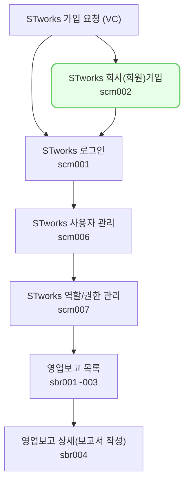

여기에 한줄 요약 내용을 작성합니다. 

## 신규 계정 등록하기

- STworks 신규 계정 등록 안내 메일의 [계정등록] 버튼을 클릭하여 계정 등록을 진행합니다.
1. 법인등록번호를 입력합니다. 
2. 영문 소문자로 회사코드 입력합니다. 회사명과 대표자명이 정확한지 확인하고 입력합니다. 
3. 아이디, 비밀번호를 설정합니다.
- 설정한 회사코드, 아이디, 비밀번호는 로그인에 사용됩니다.
- 최초로 생성한 아이디는 관리자 계정입니다. 관리자 계정으로 최초 로그인한 뒤, STworks를 사용할 아이디를 추가적으로 생성합니다. 

## 투자자 보고 업무의 일반 흐름

