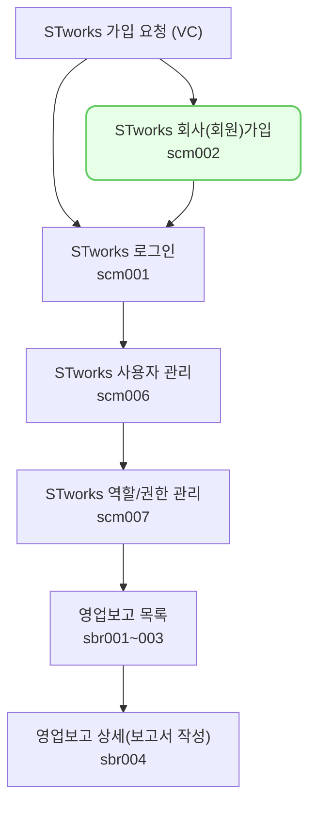

스타트업의 투자 관련 데이터를 효율적으로 입력·관리하는 통합 소프트웨어 솔루션 스타트업 웍스에 가입하는 절차를 소개합니다.
(자사에 투자한 투자사에서 VCworks를 사용하는 경우, 투자사의 스타트업 웍스 가입 요청 메일을 통해서만 가입이 가능한 서비스 입니다.)

## 동영상



## 신규 계정 등록하기

- STworks 신규 계정 등록 안내 메일의 [계정등록] 버튼을 클릭하여 계정 등록을 진행합니다.
1. 법인등록번호를 입력하신 후, [다음]을 클릭해주세요.
- 기존에 동일한 법인등록번호로 스타트업 웍스에 가입한 이력이 있는 경우 추가 가입이 어렵습니다.
2. 회사 코드, 회사명, 대표자명, 기업 규모를 입력한 후 [다음]을 클릭해주세요.
- 회사코드는 영문 소문자로 입력해주세요.
- 해당 단계에서 등록한 회사코드는 앞으로 스타트업 웍스 로그인 시 항상 사용하는 코드입니다. 신중하게 결정해주세요.
3. 최초로 생성될 아이디, 비밀번호를 입력한 후, [등록 완료]를 클릭해주세요.
- 설정한 회사코드, 아이디, 비밀번호는 로그인에 사용됩니다.
- 최초로 생성한 아이디는 관리자 계정입니다. 관리자 계정으로 최초 로그인한 뒤, STworks를 사용할 아이디를 추가적으로 생성합니다. 
  

## 투자자 보고 업무의 일반 흐름

