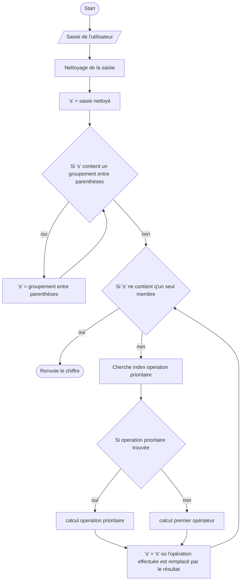

Ce projet est un projet d'entraînement au langage Rust. Je voulais apprendre Rust afin de me familiariser avec les langages bas-niveaux.

Pourquoi Rust précisément ? Tout simplement car c'est un langage prometteur dans lequel Google a investi 1 million de dollars et que Linus Torvalds, créateur du noyau Linux, a affirmé que Rust va être de plus en plus utilisé dans le noyau Linux.

## Fonctionnement
***

### Fonctionnement très peu détaillé du programme
***

1. Recherche de groupements entre parenthèses
2. Si on en trouve, on revient au début pour calculer le groupement
3. Si non, on recherche l'opération prioritaire : la multiplication ou la division la plus à gauche
4. Si on trouve, on effectue le calcul avec le membre de droite et de gauche
5. Si non, on effectue l'opération la plus à gauche

### Fonctionnement présenté sous forme de logigramme
***

*Ce diagramme sera prochainement amélioré*

## Task List

- [x] Gérer les parenthèses consécutives : (\<calcul\>)(\<calcul\>)
- [ ] Gérer les formes de calcul suivantes : (8+2)2
