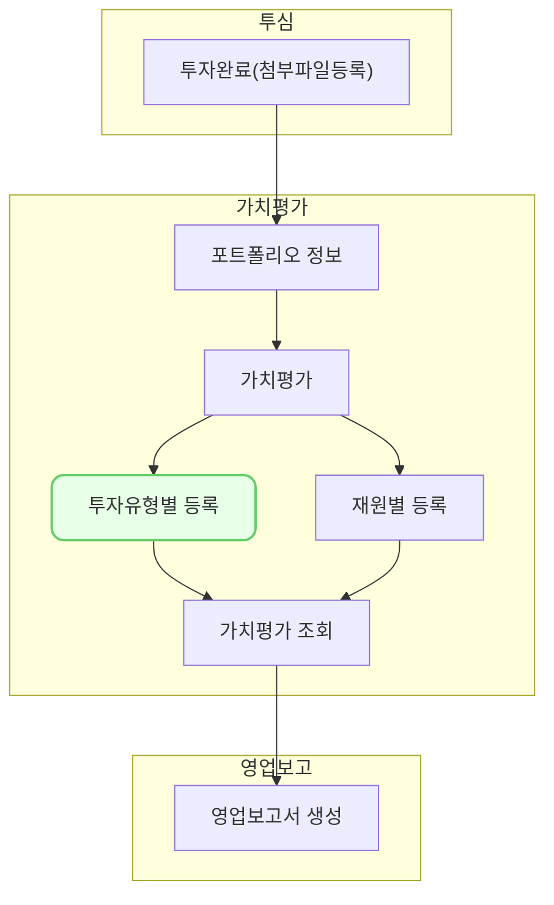

포트폴리오의 투자 유형별로 가치평가를 등록하는 화면입니다.

## 설명
-  
- 투자유형별로 가치평가를 등록할 수 있습니다. 
- 가치평가 화면에서 우측 상단의 [신규등록]-[투자유형별 등록]을 클릭합니다.-
### 투자 건 선택
- 
- 좌측 [평가 등록 조회] 버튼을 클릭하여 투자유형을 검색합니다.
	- 회사명을 입력하면 , 회사에 투자한 투자유형을 선택할 수 있습니다.
	- 기준일은 평가의 기준이 되는 날짜입니다. 
	- 회사명, 투자 유형, 기준일을 입력한 후 [조회]를 클릭합니다.	- 
- 조건에 맞는 투자들이 화면에 표시됩니다.
	- [조합 통화로 보기]를 클릭하면 투자조건이 조합통화로 표시됩니다.
- 평가를 입력할 투자에 체크한 후 [다음]을 클릭합니다.
### 가치평가 입력
- 
- #### 가치 평가 정보
	- 평가 주체는 평가를 한 주체입니다. 자체평가, 평가사를 입력할 수 있습니다.
	- 평가 기준은 평가를 한 기준(방법)입니다.
		- 시장가, 취득가, 3자거래가, 이항모형 등을 선택할 수 있습니다.
	- 평가 통화는 평가의 통화입니다.
	- 평가 단가는 주당 평가 단가를 의미합니다.
		- [시장가 조회]를 클릭하면 평가 기준일의 종가를 조회합니다. [포트폴리오 정보]에 [상장정보]가 등록되어 있어야 합니다.
	- 평가 기준 상세칸에 평가 기준에 대한 상세한 내용을 추가할 수 있습니다.
	- 가치산출근거에는 평가기준일과 평가 기준 상세가 함께 표시됩니다. 
- #### 조합 통화별 평가 단가
	- 평가 통화와 조합 통화가 다를 경우 환율을 입력할 수 있습니다.
	- 평가 통화가 1일 때, 조합통화의 금액을 입력합니다.
	- [환율 조회]를 클릭하면 평가기준일의 최초고시환율(매매기준율)을 불러옵니다.
- #### 첨부파일
	- 파일을 첨부할 수 있습니다.
- #### 품의서 첨부
	- 품의서를 등록할 수 있습니다.
### 가치평가 확인
- 
- 등록한 가치평가를 확인할 수 있습니다.
- [평가 가치] = [평가 단가] X [보유 주식수] 입니다.
- [저장]을 클릭하면 평가가 등록됩니다.  

## 자주 묻는 질문

> [평가 주체]와 [평가 기준]을 변경하고 싶어요. 어떻게 할 수 있나요?
{: .prompt-tip }

- 고객센터를 통해 연락주시길 바랍니다. 추후에 직접 설정할 수 있도록 변경 예정입니다. 

> 환율을 입력하지 않으면 어떻게 되나요?
{: .prompt-tip }

- 조합 통화와 평가 통화가 다른데, 환율을 입력하지 않으면 평가 단가가 그대로 적용됩니다. 
  
> 평가 통화와 조합 통화가 같을 때에도 환율을 입력할 수 있나요?
{: .prompt-tip }

- 입력할 수 있지만 반영되지 않습니다.

> 등록한 평가의 수정/삭제는 어떻게 하나요?
{: .prompt-tip }

- 투자별 평가 상세 화면([pm0303]())에서 등록한 평가를 수정/삭제할 수 있습니다.

## 선후행 구조도
