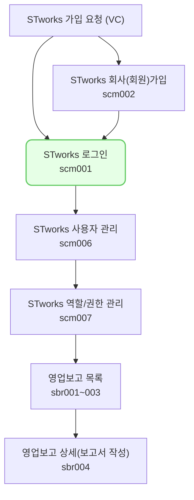

여기에 한줄 요약 내용을 작성합니다. 

## 동영상



## 설명

## 투자자 보고 업무의 일반 흐름

```mermaid
flowchart TD
    n1["STworks 가입 요청 (VC)"]
    n2["STworks 회사(회원)가입<br>scm002"]
    n3["STworks 로그인<br>scm001"]
    n4["STworks 사용자 관리<br>scm006"]
    n5["STworks 역할/권한 관리<br>scm007"]
    n6["영업보고 목록<br>sbr001~003"]
    n7["영업보고 상세(보고서 작성)<br>sbr004"]
    
    n1 --> n2
    n1 --> n3
    n2 --> n3
    n3 --> n4
    n4 --> n5
    n5 --> n6
    n6 --> n7

    click n2 "{% post_url 2024-09-01-scm002 %}" " "
    click n3 "{% post_url 2024-09-02-scm001 %}" " "
    click n4 "{% post_url 2024-09-03-scm006 %}" " "
    click n5 "{% post_url 2024-09-04-scm007 %}" " "
    click n6 "{% post_url 2024-09-05-sbr001 %}" " "
    click n7 "{% post_url 2024-09-06-sbr004 %}" " "

    style n3 fill:#e6ffe6,stroke:#66cc66,stroke-width:2px,rx:10,ry:10,color:#333333,fontColor:#333333
```
