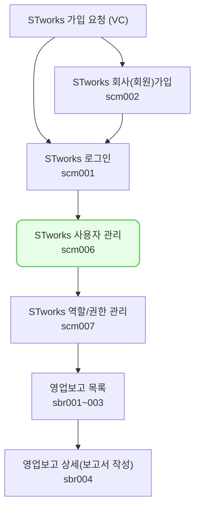

스타트업 웍스를 사용할 계정을 추가/삭제할 수 있는 메뉴입니다.

## 동영상



## 사용자 등록하기

- `설정 > 사용자관리` 메뉴에서 스타트업 웍스를 사용할 아이디를 추가할 수 있습니다.

#### 사용자 계정(ID) 생성

스타트업 웍스에서 사용할 계정을 생성하는 방법은 다음과 같습니다.

1. 사용자 관리 화면에서 [신규등록] 버튼을 클릭합니다.
  - 사용자 등록 드로어가 열립니다.

1. 아이디, 비밀번호, 이름, 이메일, 역할을 입력 또는 선택해주세요.
	- '역할'의 경우 `설정 > 역할/권한 관리`에서 설정할 수 있습니다.
  - 계정 하나에 여러 개의 역할을 부여할 수 있으며, 역할에 설정된 권한은 합집합으로 적용됩니다.
    [저장]을 클릭해주세요.
- 신규 계정 등록시 설정한 회사코드와 아이디, 비밀번호를 이용해 로그인이 가능합니다.

#### 사용자 계정 정보 수정

최초 생성 시 설정한 아이디, 비밀번호 정보 외의 항목들을 수정할 수 있습니다.
사용자 계정 정보를 수정하는 방법은 다음과 같습니다.

1. 수정이 필요한 계정을 클릭해 주세요.
	- 사용자 상세 드로어가 열립니다. 

2. [수정]을 클릭해 주세요.
	- 사용자 정보를 수정할 수 있는 모드로 변경됩니다.

3. 수정하고자 하는 정보를 입력 또는 선택해 주세요.
	- 비밀번호는 해당 계정으로 로그인 후, `좌측 하단 프로필 영역 클릭 > 비밀번호 재설정`에서 변경하실 수 있습니다.
	- 비밀번호를 잃어버린 경우 `로그인 페이지-비밀번호 찾기`에서 비밀번호를 변경해주세요.
	- 비밀번호 찾기, 비밀번호 재설정은 계정에 등록된 이메일을 통해 진행되므로, 인증 메일을 수신 할 수 있는 이메일을 설정해주셔야 합니다.
4. `저장` 버튼을 클릭해 주세요.
	- 수정한 정보가 계정 정보에 반영됩니다.

## [사용자 관리] 자주 묻는 질문

> `설정`에서 `사용자 관리` 메뉴가 안보여요.
{: .prompt-tip }
- 로그인 한 계정에 `관리자` 역할이 부여된 경우에만 `사용자 관리`메뉴에서 VCworks 계정 정보를 생성하고, 수정하실 수 있습니다.

> 역할이 뭔가요? 
{: .prompt-tip }
- 권한을 설정하는 단위입니다.
- `설정-역할/권한 관리`에서 역할을 생성하거나, 역할에 설정된 권한을 수정할 수 있습니다.

> 사용하지 않는 ID를 삭제하고 싶어요.
{: .prompt-tip }
- 사용하지 않는 ID의 `사용여부`를 `부`로 설정시면, 해당 ID로 로그인이 불가능합니다.
- ID를 화면 상에서 영구적으로 삭제하는 기능은 현재 제공하고 있지 않습니다.
- 사용 시 많은 불편함이 느껴지신다면 스타트업 웍스 > 좌측 하단 프로필 클릭 > [문의하기]를 통해 의견을 남겨주세요!

## 투자자 보고 업무의 일반 흐름

